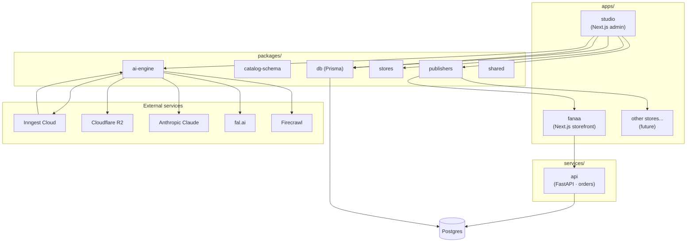
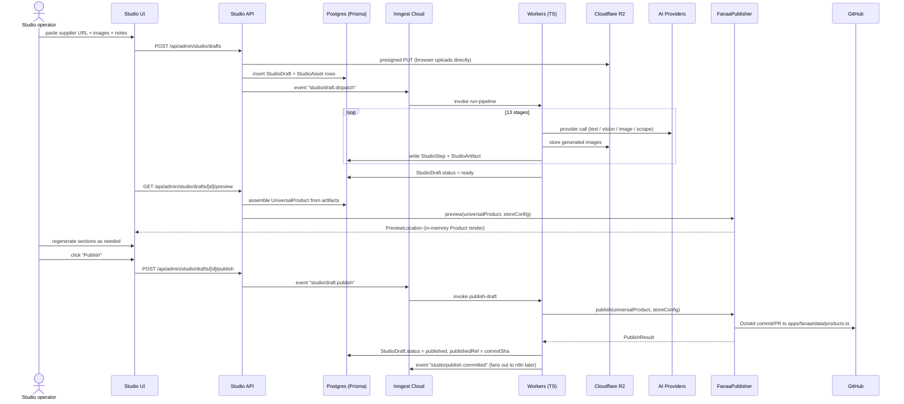
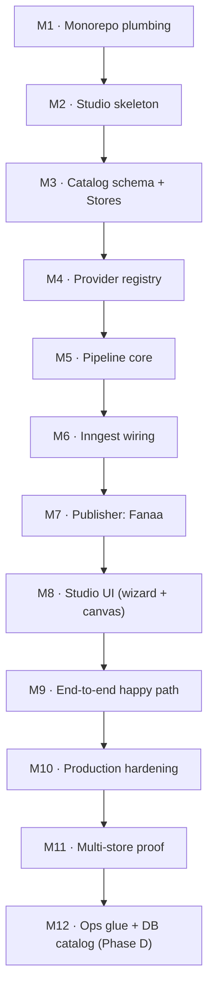

# Platform Architecture — Master Document

> **Status**: Authoritative · **Version**: 1.1 · **Last revised**: 2026-05-31
> **Scope**: Internal multi-store AI ecommerce production platform.
> **Audience**: Anyone implementing, operating, reviewing, or extending the platform.
>
> This document is the **single source of truth** for the platform's
> architecture. Every implementation task references it. When an
> implementation contradicts this document, the document wins — fix the
> implementation OR open a `docs/architecture/decisions/` ADR to amend
> the document. Do not silently diverge.

---

## Table of contents

1. [Executive summary](#1-executive-summary)
2. [Architectural principles](#2-architectural-principles)
3. [Glossary](#3-glossary)
4. [Current state — frozen snapshot](#4-current-state--frozen-snapshot)
5. [Target architecture — one paragraph](#5-target-architecture--one-paragraph)
6. [Monorepo strategy](#6-monorepo-strategy)
7. [Folder structure](#7-folder-structure)
8. [Store model — multi-store from day one](#8-store-model--multi-store-from-day-one)
9. [Universal Product schema](#9-universal-product-schema)
10. [Publisher abstraction](#10-publisher-abstraction)
11. [AI generation pipeline](#11-ai-generation-pipeline)
12. [Provider system](#12-provider-system)
13. [Database & schema strategy](#13-database--schema-strategy)
14. [Storage strategy](#14-storage-strategy)
15. [Queue & worker strategy](#15-queue--worker-strategy)
16. [Security strategy](#16-security-strategy)
17. [Scaling strategy](#17-scaling-strategy)
18. [Deployment strategy](#18-deployment-strategy)
19. [Draft / preview / publish flow](#19-draft--preview--publish-flow)
20. [Anti-patterns — explicit non-goals](#20-anti-patterns--explicit-non-goals)
21. [Migration phases](#21-migration-phases)
22. [Implementation roadmap](#22-implementation-roadmap)
23. [Decision log](#23-decision-log)
24. [Future extensibility](#24-future-extensibility)
25. [Appendix — open questions](#25-appendix--open-questions)
26. [Execution roadmap & live project memory (Steps 1–4)](#26-execution-roadmap--live-project-memory-steps-14)

---

## 1. Executive summary

We are building an **internal multi-store AI ecommerce production
platform**. From day one the codebase is a **monorepo** that hosts
multiple storefronts (`apps/fanaa/`, future `apps/<store>/`) and a
**central AI Studio** (`apps/studio/`) that generates structured product
content and publishes it into each store through a **publisher
abstraction**.

The AI Studio is **niche-aware** and **store-aware**: it takes a
supplier URL, 1–5 supplier images, and optional positioning notes, and
produces a publish-ready, Arabic-first product object tuned to the
target store's brand, niche, and templates. The same Studio can publish
to Fanaa today, to a sibling beauty/wellness store tomorrow, and — when
the publisher interface is implemented — to Shopify, TikTok Shop, or
any external system later.

**The existing Fanaa storefront is sacred.** All migration work is
**infrastructure-first**: code moves into the monorepo verbatim, no
business logic is rewritten, no PDP / checkout / thank-you / analytics
/ tracking / order behaviour changes. The monorepo migration must be
indistinguishable to Saudi end-users.

**Infrastructure decisions (final):**

- **Monorepo tooling**: `pnpm` workspaces + Turborepo
- **AI Studio runtime**: Next.js App Router (separate app from Fanaa)
- **Queue**: Inngest Cloud (durable step functions)
- **Object storage**: Cloudflare R2 (zero egress, S3-compatible)
- **Database**: PostgreSQL via Prisma (admin) + SQLAlchemy (orders) —
  single instance, multi-schema
- **Reasoning + Arabic copywriting**: Anthropic Claude 3.5 Sonnet
- **Image generation**: fal.ai (Flux Pro 1.1 + Recraft v3 for Arabic
  text in image)
- **URL scraping**: Firecrawl
- **OpenAI**: fallback only, never primary

---

## 2. Architectural principles

These are **non-negotiable**. Every implementation decision must satisfy
all eight. If a decision can't, escalate it as an ADR before
implementing.

1. **Production storefront is sacred.** Fanaa's storefront, checkout,
   upsell, thank-you, tracking, pixels, webhooks, Sheets sync, and
   admin analytics behave **identically** before and after every
   platform change. End-to-end smoke tests pass at every phase
   boundary.
2. **Infrastructure-first migration.** Code moves into the monorepo
   structure unchanged. Refactors, rewrites, and "while we're in
   there" cleanups are explicitly forbidden during migration phases.
3. **Multi-store from day one.** No code references Fanaa by name in
   the AI engine, providers, publishers, schemas, prompts, or worker
   logic. The Fanaa store is a **config**, not a special case.
4. **Universal output, store-specific rendering.** The AI generates a
   **Universal Product** — a normalized, store-agnostic shape.
   Publishers transform Universal Product into store-native shapes.
5. **Provider lock-in is a defect.** No code outside
   `packages/ai-engine/providers/` ever imports an AI vendor SDK
   directly. All provider calls go through the registry.
6. **Durable workflows over fire-and-forget.** Every generation step is
   a retryable, replayable Inngest step. No `asyncio.create_task`-style
   ghosts for anything that must succeed.
7. **Drafts and preview gate every publish.** No content goes live
   without preview + human approval. Auto-publish is a footgun.
8. **Cost ceilings are first-class.** Every draft has a hard cost
   budget. A misbehaving prompt cannot run up a $50 image bill
   overnight.

---

## 3. Glossary

| Term | Meaning |
|------|---------|
| **Platform** | The full monorepo: apps + services + packages. |
| **Storefront** | A customer-facing site (e.g. `apps/fanaa/`). |
| **Studio** | The internal AI production app (`apps/studio/`). |
| **Store** | A logical brand (Fanaa, Trendora, …) with its own niche, brand, templates, R2 bucket, and publisher. Storefront ↔ Store is 1:1. |
| **StoreConfig** | The single object describing a store — id, niche, brand, locale, currency, publisher, R2 bucket. |
| **BrandProfile** | Visual + tonal brand attributes (palette, fonts, voice). |
| **NicheProfile** | Category-specific tuning (beauty/wellness vs. fashion vs. electronics). |
| **Universal Product** | The canonical AI output schema. Store-agnostic. |
| **Publisher** | Adapter that materialises a Universal Product into a store-native shape. |
| **Pipeline** | The 13-stage AI generation process. |
| **Run** | One execution of the pipeline against one draft. |
| **Step** | One stage of a run (research, copy, image-gen, etc.). |
| **Artifact** | The output of a step — versioned, regeneratable. |
| **Asset** | A binary in R2 — uploaded supplier image OR generated image. |
| **Draft** | A `StudioDraft` row aggregating runs, artifacts, and assets. |
| **PR-publish** | Publishing by committing to `apps/<store>/data/products.ts` via the GitHub API (Octokit). |

---

## 4. Current state — frozen snapshot

Captured 2026-05-21. Use as the "before" boundary for migration.

### Repository layout (today)

```
mystores/                                     monorepo root (single repo)
├─ app/                                       Next.js 15 storefront (App Router)
│  ├─ admin/                                  Admin analytics (JWT-gated)
│  ├─ products/[slug]/                        Generic PDP
│  ├─ sugarbear/                              Bespoke landing for p_004
│  └─ thank-you/[orderId]/                    COD confirmation
├─ backend/                                   FastAPI orders service
│  └─ app/api/routes/{health,orders,geo,diagnostics}.py
├─ components/                                React UI
├─ data/products.ts                           Static catalog (4 SKUs)
├─ lib/                                       Storefront utilities (i18n, types, …)
├─ prisma/schema.prisma                       Admin analytics models
├─ docker-compose.yml                         3 services: web · api · postgres
└─ README.md
```

### Running services (today)

| Service | Container | Role |
|---------|-----------|------|
| `elfanaa_web` | Next.js 15 | Storefront + admin |
| `elfanaa_api` | FastAPI | Orders, pricing, pixels server-side |
| `elfanaa_database` | Postgres 16 | Both Prisma (admin) and SQLAlchemy (orders) |

### Not provisioned today

- ❌ Redis / queue
- ❌ Object storage (S3 / R2)
- ❌ AI provider keys
- ❌ Inngest
- ❌ Background workers
- ❌ DB-backed catalog (catalog is a TS file)

### Existing Prisma models (untouched by this migration)

`Visitor`, `Session`, `Event`, `OrderMirror`, `OrderMirrorItem`,
`TrafficQuality`, `AdminAudit`.

### Existing FastAPI SQLAlchemy models (untouched)

`Order`, `OrderItem`, `OrderEvent`.

### Existing admin nav (untouched)

```ts
[Overview, Orders, Funnel, Products, Geo, Traffic Quality, Settings]
```

---

## 5. Target architecture — one paragraph

A pnpm + Turborepo monorepo with **two app types** (storefronts at
`apps/<store>/` and a single Studio at `apps/studio/`), **two service
types** (`services/api/` FastAPI for orders, future workers if split),
and a **shared package layer** (`packages/`) that hosts the catalog
schema, AI engine, store registry, publisher registry, Prisma client,
and shared utilities. The AI Studio dispatches generation runs to
Inngest Cloud; workers call AI providers through a registry; outputs
are versioned in Postgres and stored in store-scoped R2 buckets. On
publish, the relevant **Publisher adapter** materialises the Universal
Product into the store's native shape (FanaaPublisher commits to
`apps/fanaa/data/products.ts`; future ShopifyPublisher posts to the
Shopify Admin API). The current Fanaa storefront is migrated into
`apps/fanaa/` byte-for-byte during phase A — no logic changes, only
moves.

### High-level system topology



---

## 6. Monorepo strategy

### Tooling

| Choice | Picked | Rejected | Reason |
|--------|--------|----------|--------|
| Package manager / workspaces | **pnpm** | npm, yarn | Fastest install, strictest dedup, best workspace ergonomics. |
| Task runner / caching | **Turborepo** | Nx, none | Free remote cache on Vercel; minimal config; first-class Next.js. |
| TypeScript config | **shared `tsconfig.base.json`** | per-package configs from scratch | Single strictness baseline; each package extends. |
| Lint / format | **shared ESLint + Prettier config in `packages/config/`** | per-package | Consistency. |
| Versioning | **fixed workspace versions, no Changesets yet** | Changesets, semver | We don't publish packages externally; internal-only. |

### Workspace boundaries

- **`apps/*`** — Deployable Next.js or static apps. May depend on any
  `packages/*`. **Never** depend on another `apps/*`.
- **`services/*`** — Non-Next.js services (FastAPI, future workers).
  Independent build/deploy.
- **`packages/*`** — Shared libraries. May depend on other
  `packages/*` but never on `apps/*` or `services/*`.
- **`infra/*`** — Dockerfiles, EasyPanel manifests, Inngest configs,
  R2 bucket policies. No application code.
- **`docs/*`** — This document and its companions. No code.
- **`scripts/*`** — One-off operational scripts (catalog seeding,
  embedding backfills, migrations).

### Cross-app dependency rules

- A storefront (e.g. `apps/fanaa/`) **must not** depend on the Studio
  package surface for runtime — only on its publisher's *output*
  (committed `data/products.ts`).
- The Studio **may** depend on `packages/stores/` to know how to
  generate for a given store, but **never** imports from
  `apps/<store>/` directly.
- This keeps each storefront deployable independently of Studio
  changes.

---

## 7. Folder structure

The full target structure after Phase A migration. Paths marked
`(NEW)` do not exist today; `(MOVED)` exists today and is relocated
verbatim; `(KEPT)` exists today and stays where it is.

```
mystores/
├─ apps/
│  ├─ fanaa/                            (MOVED — current Next.js storefront + admin)
│  │  ├─ app/                           ↳ today's app/ folder verbatim
│  │  ├─ components/                    ↳ today's components/
│  │  ├─ data/products.ts               ↳ today's catalog file
│  │  ├─ lib/                           ↳ today's lib/
│  │  ├─ public/                        ↳ today's public/
│  │  ├─ middleware.ts                  ↳ today's middleware
│  │  ├─ next.config.mjs                ↳ today's config (paths updated)
│  │  ├─ package.json                   ↳ depends on @platform/* packages
│  │  └─ tsconfig.json                  ↳ extends ../../tsconfig.base.json
│  │
│  └─ studio/                           (NEW — multi-store AI production app)
│     ├─ app/
│     │  ├─ (auth)/                     ↳ login flow
│     │  ├─ drafts/                     ↳ list + create
│     │  ├─ drafts/[draftId]/
│     │  │  ├─ page.tsx                 ↳ canvas (sections + regen)
│     │  │  ├─ preview/page.tsx         ↳ live preview iframe
│     │  │  ├─ publish/page.tsx         ↳ publish confirmation
│     │  │  └─ runs/[runId]/page.tsx    ↳ run timeline + step logs
│     │  ├─ stores/                     ↳ store registry view
│     │  ├─ assets/                     ↳ R2 asset browser
│     │  ├─ providers/                  ↳ provider health + cost view
│     │  └─ settings/
│     ├─ api/
│     │  └─ admin/studio/               ↳ wizard + run + publish endpoints
│     ├─ components/                    ↳ Studio-only UI
│     ├─ middleware.ts                  ↳ JWT gate (mirrors fanaa pattern)
│     ├─ next.config.mjs
│     └─ package.json
│
├─ services/
│  ├─ api/                              (MOVED — FastAPI orders, formerly backend/)
│  │  ├─ app/
│  │  ├─ requirements.txt
│  │  ├─ Dockerfile
│  │  └─ pyproject.toml
│  │
│  └─ workers/                          (OPTIONAL · phase D — split-out Inngest workers)
│
├─ packages/
│  ├─ catalog-schema/                   (NEW — Universal Product + extensions)
│  │  ├─ src/
│  │  │  ├─ universal.ts                ↳ UniversalProduct type
│  │  │  ├─ extensions/                 ↳ per-store extension types
│  │  │  ├─ niches/                     ↳ niche-specific shape additions
│  │  │  ├─ locales.ts                  ↳ LocalizedString helpers (lifted from lib/types.ts)
│  │  │  └─ index.ts
│  │  └─ package.json                   ↳ @platform/catalog-schema
│  │
│  ├─ ai-engine/                        (NEW — provider-agnostic pipeline)
│  │  ├─ src/
│  │  │  ├─ providers/
│  │  │  │  ├─ contracts.ts             ↳ TextProvider, ImageProvider, …
│  │  │  │  ├─ registry.ts              ↳ env-driven resolver + chain
│  │  │  │  ├─ anthropic.ts
│  │  │  │  ├─ openai.ts                ↳ fallback only
│  │  │  │  ├─ fal.ts
│  │  │  │  ├─ firecrawl.ts
│  │  │  │  └─ index.ts
│  │  │  ├─ pipeline/
│  │  │  │  ├─ research.ts
│  │  │  │  ├─ vision.ts
│  │  │  │  ├─ strategy.ts
│  │  │  │  ├─ structure.ts
│  │  │  │  ├─ copy.ts
│  │  │  │  ├─ creative-prompts.ts
│  │  │  │  ├─ image-gen.ts
│  │  │  │  ├─ image-post.ts
│  │  │  │  ├─ social-proof.ts
│  │  │  │  ├─ upsell-match.ts
│  │  │  │  └─ assemble.ts              ↳ → UniversalProduct
│  │  │  ├─ schemas/                    ↳ Zod schemas per stage output
│  │  │  ├─ prompts/
│  │  │  │  ├─ system/                  ↳ system prompts (parameterized by NicheProfile)
│  │  │  │  └─ user/                    ↳ per-stage builders
│  │  │  └─ index.ts
│  │  └─ package.json                   ↳ @platform/ai-engine
│  │
│  ├─ publishers/                       (NEW — publisher adapters)
│  │  ├─ src/
│  │  │  ├─ contracts.ts                ↳ Publisher interface
│  │  │  ├─ registry.ts                 ↳ resolve by storeId
│  │  │  ├─ fanaa/
│  │  │  │  ├─ index.ts                 ↳ FanaaPublisher
│  │  │  │  ├─ to-fanaa-product.ts      ↳ UniversalProduct → fanaa Product
│  │  │  │  └─ commit-products-ts.ts    ↳ Octokit write to apps/fanaa/data/products.ts
│  │  │  ├─ shopify/                    (PLACEHOLDER · phase D)
│  │  │  └─ tiktok-shop/                (PLACEHOLDER · phase D)
│  │  └─ package.json                   ↳ @platform/publishers
│  │
│  ├─ stores/                           (NEW — store config registry)
│  │  ├─ src/
│  │  │  ├─ contracts.ts                ↳ StoreConfig, BrandProfile, NicheProfile, Templates
│  │  │  ├─ registry.ts                 ↳ getStore(id) + listStores()
│  │  │  ├─ niches/
│  │  │  │  ├─ beauty-wellness.ts
│  │  │  │  ├─ fashion.ts                  (future)
│  │  │  │  └─ electronics.ts              (future)
│  │  │  └─ stores/
│  │  │     └─ fanaa.ts                 ↳ Fanaa StoreConfig instance
│  │  └─ package.json                   ↳ @platform/stores
│  │
│  ├─ workers/                          (NEW — Inngest functions)
│  │  ├─ src/
│  │  │  ├─ client.ts                   ↳ new Inngest({ id: "platform" })
│  │  │  ├─ functions/
│  │  │  │  ├─ run-pipeline.ts          ↳ orchestrator
│  │  │  │  ├─ regenerate-section.ts
│  │  │  │  ├─ retry-failed-step.ts
│  │  │  │  └─ publish-draft.ts
│  │  │  └─ middleware/
│  │  │     ├─ with-draft-lock.ts
│  │  │     ├─ with-cost-ceiling.ts
│  │  │     └─ with-store-context.ts
│  │  └─ package.json                   ↳ @platform/workers
│  │
│  ├─ prompts/                          (NEW — reusable prompt fragments)
│  │  ├─ src/
│  │  │  ├─ voice/                      ↳ tone + style fragments per BrandProfile
│  │  │  ├─ guardrails/                 ↳ safety, factuality, no-claims fragments
│  │  │  └─ contexts/                   ↳ Saudi cultural pack, GCC dialect notes
│  │  └─ package.json                   ↳ @platform/prompts
│  │
│  ├─ ui/                               (NEW — minimal shared admin primitives, OPTIONAL)
│  │  └─ src/                           ↳ Studio-shared only — storefront keeps its own
│  │
│  ├─ db/                               (MOVED — Prisma schema + client)
│  │  ├─ prisma/schema.prisma           ↳ today's prisma/schema.prisma
│  │  ├─ src/
│  │  │  ├─ client.ts                   ↳ PrismaClient singleton export
│  │  │  └─ types.ts                    ↳ re-exports for type ergonomics
│  │  └─ package.json                   ↳ @platform/db
│  │
│  ├─ shared/                           (NEW — small utilities)
│  │  ├─ src/
│  │  │  ├─ id/                         ↳ cuid / ulid helpers
│  │  │  ├─ logger/                     ↳ structured logger
│  │  │  ├─ env/                        ↳ Zod-validated env loader
│  │  │  ├─ result/                     ↳ Result<T,E> helpers
│  │  │  └─ index.ts
│  │  └─ package.json                   ↳ @platform/shared
│  │
│  └─ config/                           (NEW — shared eslint/prettier/tsconfig presets)
│     ├─ eslint/
│     ├─ prettier/
│     └─ tsconfig/
│
├─ infra/
│  ├─ docker/                           (MOVED — Dockerfiles per app/service)
│  │  ├─ fanaa.Dockerfile
│  │  ├─ studio.Dockerfile
│  │  └─ api.Dockerfile
│  ├─ docker-compose.yml                (MOVED — paths updated)
│  ├─ easypanel/                        (NEW — manifests per service)
│  ├─ inngest/                          (NEW — local dev config)
│  └─ r2/                               (NEW — bucket policy specs)
│
├─ docs/
│  └─ architecture/
│     ├─ PLATFORM.md                    (THIS DOCUMENT)
│     ├─ RUNBOOK.md                     (future)
│     ├─ MIGRATION-LOG.md               (future — append-only)
│     └─ decisions/                     (future — ADRs)
│
├─ scripts/                             (KEPT — top-level operational scripts)
├─ pnpm-workspace.yaml                  (NEW)
├─ turbo.json                           (NEW)
├─ tsconfig.base.json                   (NEW)
├─ package.json                         (root — workspace orchestration)
├─ README.md                            (KEPT — points to docs/architecture/PLATFORM.md)
└─ .env.example                         (KEPT — extended with new platform vars)
```

### Package naming convention

All shared packages use the `@platform/*` namespace:
`@platform/catalog-schema`, `@platform/ai-engine`, `@platform/publishers`,
etc. Apps depend on these by name in their `package.json`.

---

## 8. Store model — multi-store from day one

The Studio NEVER hardcodes Fanaa. A store is a config:

### `StoreConfig` (contract sketch, lives in `packages/stores/`)

```ts
type StoreId = string;          // "fanaa" | "trendora" | …
type NicheId =
  | "beauty_wellness"
  | "fashion"
  | "electronics"
  | "home"
  | "fitness"
  | string;                     // open string for future niches

type PublisherId =
  | "fanaa"
  | "shopify"
  | "tiktok_shop"
  | string;

type StoreStatus = "live" | "incubating" | "archived";

interface StoreConfig {
  id: StoreId;
  displayName: LocalizedString;

  status: StoreStatus;

  // Catalog character
  niche: NicheId;
  defaultLocale: Locale;          // "ar"
  supportedLocales: Locale[];     // ["ar", "en"]
  currency: string;               // "SAR"
  market: string;                 // "SA" (ISO 3166-1)

  // Branding + tone
  brand: BrandProfile;
  nicheProfile: NicheProfile;

  // Generation templates available for this store
  templates: StoreTemplates;

  // Publisher binding
  publisher: PublisherId;

  // Storage scope
  r2Bucket: string;               // "fanaa-assets"
  r2PublicBaseUrl: string;        // "https://cdn.elfanaa.com"

  // Routing
  domains: string[];              // ["elfanaa.com"]
  appWorkspace: string;           // "apps/fanaa"

  // Operational
  costCeilingPerDraftUsd: number; // default 5
  approvedProviders?: Partial<ProviderAllowlist>;  // override defaults
}
```

### `BrandProfile`

```ts
interface BrandProfile {
  name: LocalizedString;
  tagline: LocalizedString;
  palette: {
    bg: string;          // hex
    surface: string;
    ink: string;
    accent: string;
    accentSoft: string;
    success: string;
  };
  typography: {
    sans: string;
    display: string;
    arabic: string;
    arabicDisplay: string;
  };
  voice: {
    register: "luxury" | "playful" | "clinical" | "youthful" | "premium-utility";
    dialect: "MSA" | "Saudi" | "Khaleeji" | "Egyptian" | "Levantine";
    forbidden_words: string[];          // claims, superlatives, etc.
    house_style_notes: string;          // free-text "always do / never do"
  };
}
```

### `NicheProfile`

```ts
interface NicheProfile {
  id: NicheId;
  /** Section taxonomy this niche supports */
  sections: SectionKind[];
  /** Niche-specific Universal Product extensions (e.g. ingredients) */
  productExtensions: ProductExtensionKind[];
  /** Claims/legal guardrails — system prompt fragment */
  legalGuardrails: string;
  /** Realistic results-window for "when do results appear?" copy */
  expectationsModel: ExpectationsModel;
  /** Default ad-hook angles for this niche */
  defaultAngles: string[];
}
```

### `StoreTemplates`

```ts
interface StoreTemplates {
  /** Generic PDP route — store-specific template ID */
  defaultPdp: "fanaa.generic_pdp" | "fanaa.bespoke_landing" | string;
  /** Which sections are available */
  sectionLibrary: SectionKind[];
  /** Section ordering preferences per template */
  orderings: Record<string, SectionKind[]>;
}
```

### How Fanaa becomes a config

Fanaa today has:
- Generic PDP at `app/products/[slug]/page.tsx`
- Bespoke landing at `app/sugarbear/page.tsx`
- Arabic copy in `lib/i18n/dictionaries.ts` + `app/sugarbear/copy.ts`
- Brand palette in `styles/tokens.css`

These become **inputs** to a `StoreConfig` instance for Fanaa. Nothing
in `apps/fanaa/` reads from the Studio; nothing in the Studio reads
from `apps/fanaa/` (only its config in `packages/stores/`).

---

## 9. Universal Product schema

The single most important contract in the platform.

### Why universal?

If the AI engine outputs a Fanaa-shaped object, adding a second store
requires rewriting the engine. If the AI engine outputs a universal
shape, adding a second store requires writing a new **publisher**.
Publishers are small and replaceable; engines are large and not.

### Shape (canonical, lives in `packages/catalog-schema/`)

```ts
import type { LocalizedString, Money, Locale } from "./locales";

export interface UniversalProduct {
  // ── Identity ────────────────────────────────────────────────────
  /** Stable, generated. Format: `up_<cuid>`. */
  id: string;
  /** SEO slug generated from title. Store publishers may override. */
  slug: string;
  /** Niche this product was generated for. */
  niche: NicheId;
  /** Generating store context (for provenance, not store-coupling). */
  storeContext: StoreId;
  generationRunId: string;
  generatedAt: string;            // ISO-8601

  // ── Customer-facing core ───────────────────────────────────────
  title: LocalizedString;
  description: LocalizedString;
  headline?: LocalizedString;
  subheadline?: LocalizedString;

  // ── Value content ──────────────────────────────────────────────
  benefits: ProductBenefit[];        // 4–6 typical
  features?: ProductFeature[];       // optional, niche-specific
  ingredients?: ProductIngredient[]; // beauty/wellness niche
  specifications?: ProductSpec[];    // electronics/fashion niche
  certifications?: ProductCert[];    // SFDA, CE, …

  // ── Visual ─────────────────────────────────────────────────────
  images: ProductImage[];            // hero first, then gallery
  lifestyleImages?: ProductImage[];

  // ── Social proof ──────────────────────────────────────────────
  reviews: ProductReview[];          // 3–6 generated, realistic
  rating?: { value: number; count: number };

  // ── Conversion ────────────────────────────────────────────────
  faq: ProductFaq[];                 // 5–7 COD-objection-tuned

  // ── Pricing hints (publisher decides offers) ─────────────────
  priceHint: Money;                  // suggested unit price
  marginNotes?: string;              // internal: "supplier $X, ship $Y"

  // ── Ad / paid marketing ──────────────────────────────────────
  hooks: AdHook[];                   // 5 hooks for Meta/TikTok

  // ── Cross-sell suggestions ────────────────────────────────────
  upsellSuggestions?: string[];      // universal product IDs

  // ── Provenance ────────────────────────────────────────────────
  sources: {
    supplierUrl: string;
    scrapedAt: string;
    uploadedImages: string[];       // r2 keys
  };
}
```

Supporting types (`ProductBenefit`, `ProductFaq`, `ProductReview`, etc.)
mirror the current Fanaa `lib/types.ts` shapes but with `LocalizedString`
fields for every customer-facing string. Fanaa-specific fields (e.g.
`offerTiers`, `landingPath`, `stockLeft`) live in **publisher-specific
extensions**, not in the universal shape.

### Niche extensions

Each niche can extend the universal shape:

```ts
// packages/catalog-schema/src/niches/beauty-wellness.ts
export interface BeautyWellnessExtension {
  skinTypes?: ("oily" | "dry" | "combination" | "sensitive")[];
  concerns?: ("aging" | "hydration" | "pigmentation")[];
  routineSuggestion?: RoutineStep[];
}
```

The Studio runs niche-specific pipeline stages that populate these.
Publishers may or may not consume them.

---

## 10. Publisher abstraction

### Why a publisher abstraction?

Different stores live in different worlds. Fanaa stores its catalog in
a TypeScript file. A future Shopify store will use the Shopify Admin
API. A future TikTok Shop will use TikTok's catalog API. The
**Publisher** abstracts away "where does the live product live?".

### Contract (`packages/publishers/src/contracts.ts`)

```ts
export interface Publisher {
  /** Stable identifier — matches StoreConfig.publisher */
  id: PublisherId;

  /** Pre-flight validation. Catches schema mismatches before commit. */
  validate(opts: {
    universalProduct: UniversalProduct;
    storeConfig: StoreConfig;
  }): Promise<ValidationResult>;

  /**
   * Materialise the universal product into the store's native shape
   * and write/commit/post it to wherever the store reads from.
   */
  publish(opts: {
    draftId: string;
    universalProduct: UniversalProduct;
    storeConfig: StoreConfig;
    actor: string;            // admin email — for audit
  }): Promise<PublishResult>;

  /** Remove or hide a previously-published product. */
  unpublish(opts: {
    productId: string;
    storeConfig: StoreConfig;
    actor: string;
  }): Promise<UnpublishResult>;

  /** Render a preview in the store's actual chrome. */
  preview(opts: {
    universalProduct: UniversalProduct;
    storeConfig: StoreConfig;
  }): Promise<PreviewLocation>;
}

export interface PublishResult {
  storeId: StoreId;
  storeProductId: string;     // slug for Fanaa, gid for Shopify, etc.
  liveUrl: string;
  /** Git SHA for PR-publishers; null for API-publishers. */
  commitSha?: string;
  /** External system reference (Shopify product ID, etc.). */
  externalRef?: string;
  publishedAt: string;
}
```

### Reference implementation: `FanaaPublisher`

- **Materialise**: `UniversalProduct → Fanaa Product (lib/types.ts)`.
  Adds `landingPath` only if the chosen template is bespoke; computes
  `offerTiers` from `priceHint` via Fanaa's existing pricing rules;
  uses `LocalizedString` directly.
- **Write**: append/update the entry in `apps/fanaa/data/products.ts`
  via the Octokit REST API. Opens a PR if `STORE_PUBLISH_MODE=pr`,
  commits to main directly if `=direct`. Default is `pr` for safety.
- **Preview**: returns a Studio-internal URL that renders the actual
  `apps/fanaa/` PDP component tree against a `Product` object held in
  memory (no temporary commit).

### Future publishers (placeholders, not implemented yet)

| Publisher | Mechanism | Trigger |
|-----------|-----------|---------|
| `ShopifyPublisher` | Shopify Admin GraphQL `productCreate` | When the first Shopify-backed store is added. |
| `TikTokShopPublisher` | TikTok Shop Catalog API | Future. |
| `MetaCatalogPublisher` | Meta Commerce Catalog feed | Future — likely paired alongside a primary publisher rather than as a sole publisher. |

A store may have **one primary publisher** + N **broadcast publishers**
(future). The primary publisher owns the live URL; broadcast publishers
mirror the product to ad-platform catalogs.

---

## 11. AI generation pipeline

13 stages. Every stage is a typed Inngest `step.run()`. Every stage's
output is validated by a Zod schema. Every stage receives the
`StoreConfig` as context so prompts adapt automatically.

### Pipeline overview


### Stage-by-stage contract

| # | Stage | Lives in | Provider | Latency | Failure mode |
|---|-------|----------|----------|---------|--------------|
| 01 | Intake | `apps/studio/api/admin/studio/drafts/route.ts` | none (sync) | <800ms | Zod-reject on submit |
| 02 | Research / scrape | `ai-engine/pipeline/research.ts` | Firecrawl → Browserless fallback | 10–30s | If both fail, mark skipped; downstream uses only vision |
| 03 | Vision analysis | `ai-engine/pipeline/vision.ts` | Claude 3.5 vision (primary) | 8–15s | retry-once-higher-temp; skip on second fail |
| 04 | Strategy synthesis | `ai-engine/pipeline/strategy.ts` | Claude 3.5 | 12–20s | Zod-validated; auto-retry with "fix JSON" reprompt |
| 05 | Section structure | `ai-engine/pipeline/structure.ts` | Claude 3.5 | 6–10s | Fallback to `StoreConfig.templates.orderings.default` |
| 06 | Arabic copywriting | `ai-engine/pipeline/copy.ts` | Claude 3.5 (Arabic system prompt + BrandProfile.voice) | 25–45s | Validate AR codepoint coverage; rewrite if mixed-locale bleeds |
| 07 | Creative prompts | `ai-engine/pipeline/creative-prompts.ts` | Claude 3.5 | 5–10s | Always emits hero prompt; lifestyle prompts optional |
| 08 | Image generation | `ai-engine/pipeline/image-gen.ts` | fal.ai Flux Pro 1.1 (primary), Recraft v3 (text-in-image) | 20–60s parallel | Per-prompt 3× retry + provider fallback; partial success accepted |
| 09 | Image post-process | `ai-engine/pipeline/image-post.ts` | Sharp (in-worker) + optional fal.ai upscale | 3–8s | Skip variant on Sharp throw |
| 10 | Social proof + FAQ + hooks | `ai-engine/pipeline/social-proof.ts` | Claude 3.5 | 10–18s | Realistic-name + dialect validation; reject if generic |
| 11 | Upsell match | `ai-engine/pipeline/upsell-match.ts` | pgvector cosine over `StudioAsset.embedding` | <2s | Fallback to store best-sellers |
| 12 | Assembly | `ai-engine/pipeline/assemble.ts` | pure TS | <500ms | Validate against `UniversalProduct` schema |
| 13 | Ready | `workers/run-pipeline.ts` terminal step | DB transition | <200ms | terminal |

### Pipeline kernel (sketch)

```ts
export const runPipeline = inngest.createFunction(
  {
    id: "studio/run-pipeline",
    concurrency: { key: "event.data.draftId", limit: 1 },
    onFailure: notifyStudioEvent,
  },
  { event: "studio/draft.dispatch" },
  async ({ event, step }) => {
    const storeConfig = await step.run("load-store", () =>
      stores.get(event.data.storeId)
    );

    const research = await step.run("research", () =>
      pipeline.research(event.data.supplierUrl, storeConfig)
    );
    const vision = await step.run("vision", () =>
      pipeline.vision(event.data.uploadedAssetKeys, storeConfig)
    );
    const strategy = await step.run("strategy", () =>
      pipeline.strategy({ research, vision, storeConfig })
    );
    const structure = await step.run("structure", () =>
      pipeline.structure({ strategy, storeConfig })
    );
    const copy = await step.run("copy", () =>
      pipeline.copy({ strategy, structure, storeConfig })
    );
    const prompts = await step.run("creative-prompts", () =>
      pipeline.creativePrompts({ strategy, structure, storeConfig })
    );
    const images = await Promise.all(
      prompts.images.map((p, i) =>
        step.run(`image-${i}`, () => pipeline.imageGen(p, storeConfig))
      )
    );
    const processed = await step.run("image-post", () =>
      pipeline.imagePost({ images, storeConfig })
    );
    const social = await step.run("social-proof", () =>
      pipeline.socialProof({ strategy, storeConfig })
    );
    const upsells = await step.run("upsell-match", () =>
      pipeline.upsellMatch({ strategy, storeConfig })
    );
    const universal = await step.run("assemble", () =>
      pipeline.assemble({
        research, vision, strategy, structure, copy, prompts,
        images: processed, social, upsells, storeConfig,
      })
    );

    await step.run("mark-ready", () =>
      drafts.markReady(event.data.draftId, universal)
    );
  }
);
```

### Per-section regeneration

Each section is also exposed as a standalone Inngest function (e.g.
`regenerateCopy`, `regenerateImages`). The Studio UI shows a
"regenerate" button per section. The function runs the stage in
isolation, writes a new `StudioArtifact` version, and the draft's
preview rebuilds.

---

## 12. Provider system

### Contracts (`packages/ai-engine/src/providers/contracts.ts`)

```ts
export interface TextProvider {
  id: ProviderId;
  generate<T>(opts: {
    system: string;
    prompt: string;
    schema?: ZodSchema<T>;      // structured output when set
    temperature?: number;
    maxTokens?: number;
    storeId: StoreId;           // for cost attribution
    runId?: string;
  }): Promise<TextResult<T>>;
}

export interface VisionProvider {
  id: ProviderId;
  analyze<T>(opts: {
    images: ImageRef[];         // R2 keys or absolute URLs
    instructions: string;
    schema?: ZodSchema<T>;
    storeId: StoreId;
    runId?: string;
  }): Promise<VisionResult<T>>;
}

export interface ImageProvider {
  id: ProviderId;
  cost: { perImageUsd: number };
  generate(opts: {
    prompt: string;
    negative?: string;
    size: { w: number; h: number };
    referenceImages?: ImageRef[];
    storeId: StoreId;
    runId?: string;
  }): Promise<ImageResult>;     // { r2Key, bytes, seed, durationMs }
}

export interface ScraperProvider {
  id: ProviderId;
  fetch(url: string, opts?: ScrapeOptions): Promise<ScrapeResult>;
}

export interface EmbeddingProvider {
  id: ProviderId;
  embed(opts: { input: string; storeId: StoreId }): Promise<number[]>;
}
```

### Registry (`packages/ai-engine/src/providers/registry.ts`)

```ts
type ProviderChain<T> = {
  primary: T;
  fallbacks: T[];
};

export const registry = {
  text: resolveChain<TextProvider>("STUDIO_TEXT_PROVIDERS"),
  vision: resolveChain<VisionProvider>("STUDIO_VISION_PROVIDERS"),
  image: resolveChain<ImageProvider>("STUDIO_IMAGE_PROVIDERS"),
  scraper: resolveChain<ScraperProvider>("STUDIO_SCRAPER_PROVIDERS"),
  embedding: resolveChain<EmbeddingProvider>("STUDIO_EMBED_PROVIDERS"),
};
```

Each env var is a comma-separated chain: `anthropic,openai` means
Anthropic primary, OpenAI fallback. A `StoreConfig` can override the
chain via `approvedProviders`.

### Adapter table

| Capability | Adapter | Vendor | Status | Env keys |
|-----------|---------|--------|--------|----------|
| Text — reasoning + Arabic | `anthropic.ts` | Anthropic | Required | `ANTHROPIC_API_KEY` |
| Text — fallback | `openai.ts` | OpenAI | Fallback only | `OPENAI_API_KEY` |
| Vision | `anthropic.ts` (vision) | Anthropic | Required | (same) |
| Vision — fallback | `openai.ts` (vision) | OpenAI | Fallback only | (same) |
| Image — photo | `fal.ts` (Flux Pro 1.1) | fal.ai | Required | `FAL_KEY` |
| Image — Arabic text in image | `fal.ts` (Recraft v3) | fal.ai | Required | (same) |
| Scraper | `firecrawl.ts` | Firecrawl | Required | `FIRECRAWL_API_KEY` |
| Embedding | `openai.ts` (text-embedding-3-small) | OpenAI | Required | `OPENAI_API_KEY` |

OpenAI is **fallback only** for text and vision, **primary** for
embeddings (cheap, stable, multilingual enough). No other vendor
relationships are part of v1.

### Provider observability

Every provider call writes to `StudioStep`:

- `providerId` — which adapter
- `tokensIn`, `tokensOut` — billing
- `costCents` — pre-computed via adapter's price table
- `latencyMs`
- `attemptCount`
- `errorMessage` on fail

A `/admin/studio/providers` dashboard rolls these up.

---

## 13. Database & schema strategy

### One Postgres instance, two ORMs (unchanged)

- **Prisma** owns the admin/analytics schema and the new Studio schema.
- **SQLAlchemy** (FastAPI) owns the orders schema.
- They share the same Postgres database; tables are namespaced by
  prefix (`Studio*`, `Order*`, `Visitor`/`Session`/`Event`).

### New Studio tables (added to `packages/db/prisma/schema.prisma`)

```prisma
model StudioStore {
  id              String   @id              // matches StoreId in code
  displayName     String
  status          StudioStoreStatus
  configHash      String                    // SHA of last applied StoreConfig
  createdAt       DateTime @default(now())
  updatedAt       DateTime @updatedAt
  drafts          StudioDraft[]
  events          StudioEvent[]
  @@index([status])
}

enum StudioStoreStatus { live incubating archived }

model StudioDraft {
  id              String   @id @default(cuid())
  storeId         String
  store           StudioStore @relation(fields: [storeId], references: [id])
  slug            String                    // generated, unique per store
  title           String
  supplierUrl     String?
  notes           String?
  positioning     String?
  status          StudioDraftStatus @default(intake)
  template        String                    // matches StoreTemplates entry
  costCents       Int      @default(0)
  publishedAt     DateTime?
  publishedRef    String?                   // commitSha or externalRef
  createdBy       String                    // admin email
  createdAt       DateTime @default(now())
  updatedAt       DateTime @updatedAt
  runs            StudioRun[]
  assets          StudioAsset[]
  artifacts       StudioArtifact[]
  @@unique([storeId, slug])
  @@index([storeId, status])
  @@index([createdAt])
}

enum StudioDraftStatus {
  intake generating ready publishing published archived failed
}

model StudioRun {
  id              String   @id @default(cuid())
  draftId         String
  draft           StudioDraft @relation(fields: [draftId], references: [id])
  inngestRunId    String?                   // for replay deep-link
  status          StudioRunStatus @default(queued)
  costCents       Int      @default(0)
  startedAt       DateTime?
  finishedAt      DateTime?
  errorMessage    String?
  inputSnapshot   Json                      // for deterministic replay
  steps           StudioStep[]
  @@index([draftId])
  @@index([status])
}

enum StudioRunStatus { queued running succeeded failed cancelled }

model StudioStep {
  id              String   @id @default(cuid())
  runId           String
  run             StudioRun @relation(fields: [runId], references: [id])
  kind            String                    // "research" | "strategy" | …
  status          StudioStepStatus @default(pending)
  providerId      String?
  inputHash       String?                   // for content-addressed caching
  attemptCount    Int      @default(0)
  costCents       Int      @default(0)
  tokensIn        Int?
  tokensOut       Int?
  latencyMs       Int?
  startedAt       DateTime?
  finishedAt      DateTime?
  errorMessage    String?
  output          Json?
  @@index([runId, kind])
}

enum StudioStepStatus { pending running succeeded failed skipped }

model StudioArtifact {
  id                String   @id @default(cuid())
  draftId           String
  draft             StudioDraft @relation(fields: [draftId], references: [id])
  kind              String                  // section identifier
  locale            String?                 // "ar" | "en" | null
  version           Int      @default(1)
  isCurrent         Boolean  @default(true)
  payload           Json                    // structured output
  generatedByStepId String?
  createdAt         DateTime @default(now())
  @@unique([draftId, kind, locale, version])
  @@index([draftId, isCurrent])
}

model StudioAsset {
  id          String   @id @default(cuid())
  draftId     String
  draft       StudioDraft @relation(fields: [draftId], references: [id])
  source      StudioAssetSource
  r2Bucket    String                        // store-scoped bucket
  r2Key       String   @unique
  contentType String
  bytes       Int
  width       Int?
  height      Int?
  altAr       String?
  altEn       String?
  embedding   Unsupported("vector(1536)")?  // pgvector
  createdAt   DateTime @default(now())
  @@index([draftId, source])
}

enum StudioAssetSource { upload scraped generated }

model StudioEvent {
  id          String   @id @default(cuid())
  storeId     String?
  store       StudioStore? @relation(fields: [storeId], references: [id])
  draftId     String?
  kind        String                        // "draft.created" | "publish.committed" | …
  actor       String                        // email or "system"
  payload     Json?
  createdAt   DateTime @default(now())
  @@index([storeId, kind, createdAt])
  @@index([draftId, createdAt])
}
```

### Migration discipline

- Studio schema lands as an **additive** Prisma migration. Zero changes
  to existing analytics tables.
- FastAPI's SQLAlchemy schema is untouched.
- pgvector extension is added on the same Postgres instance.

---

## 14. Storage strategy

### Cloudflare R2

| Concern | Decision |
|---------|----------|
| Bucket per store | `<storeId>-assets` (e.g. `fanaa-assets`) |
| Bucket access | Private origin + public CDN on a store-owned subdomain |
| Public URL pattern | `https://cdn.<store>.com/<r2Key>` |
| Upload mode | Browser → presigned PUT (no bytes through Studio server) |
| Key naming | `studio/<draftId>/<sourceKind>/<ulid>.<ext>` |
| Lifecycle | Drafts archived >180 days → R2 lifecycle rule deletes assets |

### Why R2 not S3

- $0 egress (every `next/image` variant rewrite is free).
- S3-compatible API — every existing tool/SDK works.
- Single-org billing alongside the storefront's Cloudflare presence.

---

## 15. Queue & worker strategy

### Inngest Cloud (final)

- **Why Cloud and not self-hosted**: zero ops, free tier covers months
  of internal use, observability UI included.
- **Function organisation**: one `Inngest({ id: "platform" })` client in
  `packages/workers/src/client.ts`. Functions are imported by both:
  - `apps/studio/api/admin/inngest/route.ts` (webhook receiver)
  - Any future split-out worker app (Phase D)

### Concurrency rules

| Function | Concurrency key | Limit |
|----------|----------------|-------|
| `run-pipeline` | `draftId` | 1 (no parallel runs per draft) |
| `regenerate-section` | `draftId + sectionKind` | 1 |
| `image-gen` (sub-step) | `storeId` | 8 (per-store image fan-out cap) |
| `publish-draft` | `draftId` | 1 |

### Retries

| Step kind | Max attempts | Backoff |
|-----------|-------------|---------|
| Provider call (text/vision/image) | 3 | 1s → 5s → 25s |
| Sharp post-processing | 2 | linear |
| Octokit publish | 5 | exponential, jittered |
| Assemble | 1 | n/a (deterministic) |

### Replay

A failed run's UI exposes "Replay from step X" — Inngest's native
feature. Replaying is free if the step is a pure function of its
inputs (true for all stages except image gen, which is intentionally
non-deterministic and uses cached `seed` for partial determinism).

### Cost ceilings

`packages/workers/src/middleware/with-cost-ceiling.ts` wraps the
pipeline orchestrator. After each step it checks
`draft.costCents > storeConfig.costCeilingPerDraftUsd * 100` and
cancels with a `cost_exceeded` failure if so. Default `$5`.

### Why not pg-boss / graphile-worker

Initial recommendation included these as "zero new infra" options.
**Final decision is Inngest Cloud** because (a) the platform is already
adding Cloudflare R2 and AI vendor accounts so "zero new accounts" is
no longer a tiebreaker, and (b) Inngest's step-function model is a
direct match for the pipeline shape; graphile-worker would force us
to rebuild orchestration plumbing the team would otherwise spend on
prompts.

---

## 16. Security strategy

### Identity & auth

| Surface | Mechanism |
|---------|-----------|
| Fanaa admin | Existing JWT cookie (`ADMIN_AUTH_COOKIE` / `_fa_admin`). Unchanged. |
| Studio admin | Same JWT cookie scheme, separate cookie name (`_studio_session`) to allow simultaneous sessions across apps. |
| Inngest webhook → Studio | Inngest signing key in env (`INNGEST_SIGNING_KEY`) |
| Studio → providers | Per-provider API keys in env; no per-user credentials |
| Publish via PR | Single bot GitHub PAT with `repo` scope on this repository only |
| R2 uploads | Browser-side presigned PUTs; presign endpoint requires Studio JWT |

### Role separation

Studio defines roles in `StudioEvent.actor`. Initial role set:

- `studio:owner` — full publish, draft delete, provider config
- `studio:editor` — draft create + regenerate, no publish
- `studio:viewer` — read-only

Roles encoded in the JWT payload as `studio_role`. Middleware enforces
on every Studio API route.

### Provider key vault

Provider keys live **only** in env, **never** in DB. Studio operators
do not see keys; they see a `providers/` health page listing
configured providers and recent error rates.

### Audit log

`StudioEvent` is the audit trail. Every state transition (`draft.*`,
`run.*`, `step.*`, `publish.*`) writes an event with `actor`. Events
are immutable.

### Secrets in transit

- All inter-service HTTPS in prod (EasyPanel handles cert termination).
- No secrets in URLs, query strings, or logs (logger redacts
  `Authorization`, `set-cookie`, `apiKey` patterns by default).

---

## 17. Scaling strategy

| Resource | Today | At 10× | Mitigation |
|----------|-------|--------|-----------|
| Inngest concurrency | Default 200 | 1000+ | Configure per-function caps; throttle image-gen to 8 parallel per store |
| Provider RPS | Anthropic 50 RPS · fal.ai 10 RPS | Throttled | Adapter-level token-bucket; auto-degrade to fallback chain |
| Postgres writes | Analytics dominates | StudioEvent + StudioStep heavy | Partition `StudioEvent` at 1M rows; archive runs > 90 days |
| R2 bandwidth | $0 egress | Same | None needed — R2 chosen for this |
| Bundle size | Provider SDKs heavy | Bigger | Workers server-only; tree-shake adapters; never ship to client |
| `data/products.ts` line count | 4 SKUs / 800 LoC | 50 SKUs / 10000 LoC | Phase B → C: migrate Fanaa to DB-backed catalog (deferred) |
| Number of stores | 1 (Fanaa) | 5+ | Multi-store from day 1 — no scaling step needed for "add store" |

### Vertical limits

- **Single Postgres instance** is fine up to ~1M Studio events and
  ~50k drafts. Beyond that, move `Studio*` schema to a separate
  database within the same cluster (Prisma supports it via separate
  schemas).
- **Single Inngest project** holds many functions; no scaling action
  required.
- **Studio app** is stateless; horizontal scale by adding instances.

---

## 18. Deployment strategy

### EasyPanel (current platform)

Today: 3 containers (`web`, `api`, `database`). After Phase A: 4 (split
`web` → `fanaa` + `studio`). After Phase C: N storefronts + 1 studio +
1 api.

### Container plan

| Container | Source | Build |
|-----------|--------|-------|
| `fanaa` | `apps/fanaa/` | `infra/docker/fanaa.Dockerfile` |
| `studio` | `apps/studio/` | `infra/docker/studio.Dockerfile` |
| `api` | `services/api/` | `infra/docker/api.Dockerfile` |
| `database` | Postgres image | unchanged |
| Future store | `apps/<store>/` | per-store Dockerfile |

### Image build

Turborepo's remote cache speeds CI on shared package changes. Each
container's Dockerfile builds only the relevant workspace using
`pnpm deploy` semantics (or `pnpm --filter <app> deploy` to a thin
output folder).

### Per-deploy boundaries

- **Storefront changes** (`apps/fanaa/`) → deploy only `fanaa` container.
- **Studio changes** (`apps/studio/`) → deploy only `studio` container.
- **Shared package changes** (`packages/*`) → deploy all dependent
  containers (Turborepo's `--filter` graph gives the list).
- **API changes** (`services/api/`) → deploy only `api` container.
- **Schema changes** (`packages/db/prisma/`) → migration runs as part
  of `studio` container start (Studio owns the schema).

### Environment

- **Local dev**: pnpm at root; `pnpm dev` runs everything via Turborepo;
  Inngest dev server runs locally in a separate terminal.
- **Staging**: optional separate EasyPanel project pointing to a
  separate Postgres + R2 bucket; same Inngest project with `STUDIO_ENV=staging`.
- **Production**: current EasyPanel project, extended with new
  containers.

### Storefront-deploy invariance

Phase A's success criterion: changing **anything** in `apps/studio/`,
`packages/ai-engine/`, `packages/publishers/`, `packages/workers/`
**must not require a Fanaa storefront redeploy**. This is the firewall
that keeps the production storefront safe.

---

## 19. Draft / preview / publish flow



### Key invariants

- Preview never writes to disk in the storefront repo.
- Publish always writes via the publisher's mechanism (PR or API), never
  directly to a storefront app's filesystem at runtime.
- Status transitions: `intake → generating → ready → publishing →
  published`. `failed` is reachable from `generating` or `publishing`.
  No reverse transitions.
- An archived draft can never be republished — clone it instead.

### Regeneration semantics

- **Full re-run**: dispatch a new `studio/draft.dispatch`. Creates a
  new `StudioRun` row. All previous artifacts remain (versioned).
- **Section re-run**: dispatch `studio/section.regenerate` with the
  section kind. Creates one new artifact version; marks previous
  versions as `isCurrent = false`.

### Publish modes per store

`StoreConfig` exposes:

```ts
publishMode: "pr" | "direct";   // PR creates a GitHub PR; direct commits to main
publishBranchPrefix?: string;   // e.g. "studio/" for PR mode
publishAutoMerge?: boolean;     // PR mode only
```

Fanaa defaults to `pr` with `publishAutoMerge: false` — human review
remains a gate.

---

## 20. Anti-patterns — explicit non-goals

These are **not** decisions to revisit — they are commitments to
refuse. If anyone proposes one, point them at this section.

1. **Multi-app coupling**. `apps/fanaa/` and `apps/studio/` never
   import from each other at runtime. Cross-app contracts live only in
   `packages/*`.
2. **Hardcoded "Fanaa" anywhere outside `packages/stores/stores/fanaa.ts`
   and `apps/fanaa/`**. The engine, publishers, schemas, prompts, and
   workers all read from `StoreConfig`. No `if (storeId === "fanaa")`
   branches.
3. **n8n as the generation pipeline**. n8n is allowed for outbound ops
   glue only (Slack on publish, future Sheets sync). The 13-stage
   pipeline is TypeScript code in `packages/ai-engine/`.
4. **Direct vendor SDK imports in pipeline files**. `pipeline/copy.ts`
   never imports `@anthropic-ai/sdk`. All vendor calls go through the
   registry.
5. **Image bytes in Postgres**. Always R2 + foreign-key `r2Key`.
6. **A new Python worker service**. AI orchestration stays in
   TypeScript. FastAPI stays focused on orders.
7. **Auto-publish without preview**. Even on a confident draft, the
   publish button is a human click.
8. **Storefront writes to its own filesystem at runtime**. The
   storefront serves static (or ISR) content. All catalog mutations go
   through a publisher commit + redeploy.
9. **Cross-store data leakage**. R2 buckets, embeddings, and prompt
   logs are store-scoped. Studio never trains or re-uses one store's
   data on another store without explicit operator action.
10. **"Temporary" Fanaa-shaped fields in `UniversalProduct`**. If
    Fanaa needs a field universal doesn't have, it goes in the
    publisher's extension layer, not the universal shape.

---

## 21. Migration phases

Four phases, executed in strict order. **No phase begins until the
previous one is verified green.**

### Phase A — Monorepo skeleton (infrastructure-first, non-destructive)

**Goal**: Codebase reorganised into the target monorepo structure with
zero behavioural change.

**Scope**:
- Set up pnpm workspaces, Turborepo, `tsconfig.base.json`.
- Move `app/`, `components/`, `data/`, `lib/`, `public/`, `prisma/`,
  `middleware.ts`, `next.config.mjs`, etc. into `apps/fanaa/`.
- Move `backend/` into `services/api/`.
- Create empty `apps/studio/` Next.js scaffold (login + empty
  dashboard, JWT-protected).
- Create empty `packages/{catalog-schema, ai-engine, publishers,
  stores, workers, prompts, db, shared, config}` with stub exports.
- Update `infra/docker/*.Dockerfile` paths.
- Update EasyPanel manifests to point at new container builds.
- Update `.env.example` with new platform env vars.
- README points to `docs/architecture/PLATFORM.md`.

**Out of scope** (explicitly):
- Any storefront behaviour changes.
- Any Studio business logic.
- Any AI integration.

**Verification gate**:
- Storefront smoke test: every PDP loads identically; checkout flow
  unchanged; thank-you page renders; admin login + analytics work.
- API smoke test: orders endpoint unchanged.
- No new errors in logs.
- `pnpm install` and `pnpm build` complete cleanly.
- `pnpm dev` runs every workspace successfully.

### Phase B — Studio MVP (single store: Fanaa)

**Goal**: Generate one Fanaa product end-to-end through the pipeline,
preview it, publish it as a PR.

**Scope**:
- `packages/catalog-schema/`: `UniversalProduct` + Fanaa extension.
- `packages/stores/`: Fanaa `StoreConfig` complete.
- `packages/ai-engine/`: provider registry + Anthropic, fal.ai,
  Firecrawl, OpenAI adapters; full 13-stage pipeline.
- `packages/workers/`: `run-pipeline`, `regenerate-section`,
  `publish-draft` functions wired to Inngest Cloud.
- `packages/publishers/fanaa/`: `FanaaPublisher` with PR-mode publish.
- `apps/studio/`: intake wizard, draft list, draft canvas,
  per-section regenerate, preview route, publish action.
- R2 bucket `fanaa-assets` provisioned + CDN subdomain set up.
- Inngest Cloud project created + signing key in env.
- Provider keys provisioned in env.
- Prisma migration applied: all `Studio*` tables created.

**Verification gate**:
- Generate one supplier URL → live Fanaa SKU (manually approved PR).
- All 13 stages complete in < 5 minutes.
- Total cost per draft < $1 (target $0.40).
- Per-section regenerate works for at least: copy, images, FAQ.
- Preview renders against the actual Fanaa PDP components.
- Storefront smoke test: still green.

### Phase C — Multi-store enablement

**Goal**: Demonstrate the system is genuinely multi-store by adding a
second store from configuration only.

**Scope**:
- Choose second store (placeholder: `apps/trendora/`). Could be a
  parallel Saudi store in fashion, fitness, or kids — pick the next
  business priority.
- `apps/<store>/` scaffolded as a Next.js storefront (copy structure
  from `apps/fanaa/`, replace branding/copy).
- `packages/stores/stores/<store>.ts`: new StoreConfig.
- `packages/publishers/<store>/`: if Trendora is also TS-file-backed
  (likely), use a parameterized version of `FanaaPublisher`; otherwise
  new publisher.
- Studio UI: store switcher; drafts scoped to the active store.

**Verification gate**:
- Generate one product for store 2 with zero code changes inside
  `packages/ai-engine/`. (If engine changes are needed, the abstraction
  failed and we fix it before declaring phase done.)
- Fanaa storefront still smoke-test green.
- Store 2 storefront loads and renders the published product.

### Phase D — Ops + external publishers + DB catalog (when business demands)

**Goal**: Take Studio from internal MVP to a daily production tool.

**Scope** (any subset, as priorities dictate):
- n8n outbound glue: Slack notifications on publish/fail; Sheets
  append for audit trail; Meta Catalog feed sync.
- Embedding-based upsell match across the multi-store catalog.
- Phase-out of `data/products.ts` per store — DB-backed catalog with
  codegen for SSG.
- ShopifyPublisher / TikTokShopPublisher when first relevant store
  needs them.
- A/B testable copy variants on publish.
- Studio role expansion (editor / viewer roles fully enforced).

**Verification gate per scope item**: same — storefront smoke test
green; relevant publisher round-trips data; ops glue does its job.

---

## 22. Implementation roadmap

The roadmap is **the order in which work happens**. Each milestone
ships independently. Each milestone has a verification gate. **No
milestone is "started" until its predecessor is "verified green"** —
this is the firewall.

### Dependency diagram



### Milestones detail

| ID | Title | Owns | Verification |
|----|-------|------|--------------|
| **M1** | Monorepo plumbing | pnpm workspace, Turborepo, tsconfig base, move Fanaa to `apps/fanaa/`, FastAPI to `services/api/`, Prisma to `packages/db/` | Fanaa smoke test green; CI builds all workspaces |
| **M2** | Studio skeleton | New `apps/studio/` with JWT-gated login + empty dashboard, same auth pattern as Fanaa admin | Studio login works; redirects unauth users; no Studio routes affect Fanaa |
| **M3** | Catalog schema + Stores | `packages/catalog-schema/` (UniversalProduct + Fanaa extension); `packages/stores/` (StoreConfig contract + Fanaa StoreConfig); types only, no logic | TS builds; no runtime usage yet |
| **M4** | Provider registry | `packages/ai-engine/providers/` (contracts + Anthropic + fal.ai + Firecrawl + OpenAI adapters); env-driven registry | Health-check script calls each provider with a 1-token ping |
| **M5** | Pipeline core | `packages/ai-engine/pipeline/*` (13 stage functions, Zod schemas, prompt builders); pure TypeScript, no Inngest yet | Unit tests per stage with mocked providers |
| **M6** | Inngest wiring | `packages/workers/` (Inngest client + run-pipeline + regenerate + publish functions); webhook route in `apps/studio/api/admin/inngest/route.ts` | End-to-end test: dispatch run, observe steps in Inngest cloud UI |
| **M7** | Publisher: Fanaa | `packages/publishers/fanaa/` (UniversalProduct → Fanaa Product mapping; Octokit PR writer); preview function returning in-memory rendered Product | Manual: write a hand-crafted UniversalProduct, publish, open PR, merge, see new SKU on Fanaa |
| **M8** | Studio UI | Intake wizard, draft list, draft canvas with per-section regenerate, preview route, publish flow | UI works against M7 publisher |
| **M9** | E2E happy path | Connect intake → workers → publisher; SSE progress streaming; cost ceiling middleware | One real supplier URL → live Fanaa SKU in < 5 min, < $1, manual PR approval |
| **M10** | Production hardening | Idempotency keys, content-addressed step caching, full retry coverage, replay UI, provider health dashboard, asset browser | 10 drafts end-to-end without manual intervention |
| **M11** | Multi-store proof | Add `apps/<store>/`, StoreConfig, publisher; Studio store-switcher | Generate one product for store 2 with **no code changes in ai-engine**; Fanaa unchanged |
| **M12** | Ops + Phase D | n8n webhook on `publish.committed`; Slack/Sheets glue; (when needed) ShopifyPublisher; (when needed) DB-backed catalog migration | Per-scope-item smoke tests |

### Safest rollout order — explicit reasoning

- **M1 must be first** because every later milestone references the
  monorepo structure. Doing M1 last would force a giant retroactive
  refactor.
- **M3 (schemas) before M4 (providers)** because providers receive
  `storeId: StoreId` as a typed argument from M3.
- **M4 (providers) before M5 (pipeline)** because every pipeline stage
  calls a provider.
- **M5 (pipeline as pure functions) before M6 (Inngest wiring)** so
  pipeline stages are unit-testable without the queue layer.
- **M7 (publisher) before M8 (UI)** so the UI's publish button has
  something real to call.
- **M9 (end-to-end happy path) before M10 (hardening)** because
  hardening without an e2e path is premature optimisation.
- **M11 (multi-store proof) before M12 (ops glue)** because the
  abstraction must be proven before we invest in ecosystem
  integrations.

### When each phase is "done"

- **Phase A done** = M1 verified.
- **Phase B done** = M2 → M10 verified.
- **Phase C done** = M11 verified.
- **Phase D done** = scope items chosen for the milestone are
  individually verified; this phase has no fixed endpoint.

---

## 23. Decision log

ADRs (Architecture Decision Records) live in
`docs/architecture/decisions/` once we start changing things. The
foundational decisions are captured below; future amendments append
to that folder.

| # | Decision | Why | Rejected |
|---|----------|-----|----------|
| 1 | Monorepo from day 1 | Multi-store is a guaranteed need; deferring it means a painful split later | Multi-repo, polyrepo |
| 2 | pnpm + Turborepo | Best workspace ergonomics + free remote cache | Nx (overkill), yarn (slower), bun (newer) |
| 3 | Studio as a separate Next.js app, not inside fanaa | Storefront-deploy invariance; clean blast radius | Studio inside `apps/fanaa/app/admin/studio/` |
| 4 | Inngest Cloud for the queue | Step-function model fits pipeline shape; zero ops | graphile-worker (more boilerplate), n8n (wrong tool) |
| 5 | Universal Product schema | Multi-store requires it; cheaper than rewriting engine per store | Fanaa-shaped output, generic JSON |
| 6 | Publisher abstraction | Different stores live in different worlds (TS file vs Shopify API) | Hardcoded TS-file write path |
| 7 | Cloudflare R2 for assets | $0 egress, S3-compatible, single Cloudflare org | S3+CloudFront (expensive), Postgres (lethal) |
| 8 | Anthropic Claude primary | Best Arabic copywriting quality, best structured outputs | OpenAI primary (worse Arabic), Gemini (less mature for structured) |
| 9 | fal.ai for images | Multi-model platform; one API for Flux + Recraft | Replicate (good but more model fragmentation), Vertex Imagen (org friction) |
| 10 | PR-mode publish default | Human review gate without process overhead | Direct-to-main, manual copy-paste |
| 11 | One Postgres instance | At our scale, separation is premature | Two Postgres (Studio + Storefront) |
| 12 | TypeScript-only AI engine | Type safety end-to-end; no language boundary inside the pipeline | Python worker sibling, polyglot pipeline |

When this list changes, increment the document version at the top and
append an ADR to the decisions folder.

---

## 24. Future extensibility

### Where new things land

| New thing | Lands in |
|-----------|----------|
| New store (TS-file-backed) | `apps/<store>/` + `packages/stores/stores/<store>.ts` + reuse `FanaaPublisher` (parameterized) |
| New store (Shopify-backed) | `apps/<store>/` (or none if pure Shopify) + new `packages/publishers/shopify/` |
| New niche | `packages/stores/niches/<niche>.ts` + niche-specific pipeline stage tweaks in `ai-engine/` |
| New section type | Add to `SectionKind` enum + add a generator stage if needed + publisher knows how to render it |
| New AI provider | Adapter in `packages/ai-engine/providers/<vendor>.ts` + add to registry env |
| New image model from existing vendor | Extend the vendor adapter; no architecture change |
| New publisher target (Meta catalog) | `packages/publishers/<target>/` registered as a broadcast publisher |
| New role | Extend `studio_role` enum; update middleware |
| New analytics signal | Goes into existing `Event` model in Prisma (untouched analytics schema) |

### What's intentionally NOT abstracted (yet)

- **Pricing engine** stays per-store. The universal product has a
  `priceHint`; each store has its own offer logic. Premature
  unification would force the wrong shape.
- **Cart / checkout** stays per-store. Each storefront owns its
  conversion flow.
- **Pixel tracking** stays per-store. Each store has its own ad
  accounts.

When a second store proves these need sharing, lift them into
`packages/*` at that time — not before.

---

## 25. Appendix — open questions

These need a decision before M1 starts. Each must have a captured
answer in `docs/architecture/decisions/` once resolved.

1. **Inngest Cloud account**: same org as the engineering team, or a
   dedicated platform account?
2. **GitHub App vs PAT for publishing**: GitHub App is more secure
   long-term; PAT on a dedicated bot user is faster. Default: PAT, plan
   to migrate to App in Phase D.
3. **R2 organization**: do we add buckets to the same Cloudflare
   account as the storefront, or a dedicated platform account?
4. **Cost budget for the platform itself**: Inngest, R2, Anthropic,
   fal.ai, Firecrawl. Suggested initial monthly cap: $200 hard,
   $400 soft alert.
5. **PR auto-merge or manual?**: Suggested default — Fanaa PRs require
   manual merge for the first 30 published products, then revisit.
6. **Staging environment**: do we want one before M11, or stay
   prod-only? Suggested — stay prod-only until M11 then split.
7. **Inngest dev runtime in local docker-compose**: yes/no. Suggested
   — no, use Inngest dev server directly via `pnpm dev:inngest`.
8. **Studio domain**: `studio.elfanaa.com`? Separate domain entirely?

Capture answers as the platform proceeds. Do not let unanswered
questions block M1.

---

> **Authority**: When in doubt, this document is right and the code is
> wrong. Open an ADR, update the document, then change the code.

> **Maintenance**: This document is reviewed at the end of every
> milestone. Drift between code and document is a defect; fix the
> drift, not by tolerating it.

---

## 26. Execution roadmap & live project memory (Steps 1–4)

> **Purpose.** §22 (M1–M12) is the *original* build order and remains the
> canonical milestone ledger. This section is the **operator-facing
> execution narrative** layered on top of it: the "Steps" the platform
> owner reasons in, the current live state of the deployed system, and a
> continuously-updated record of decisions, discoveries, blockers, and
> recommendations. **Keep this section current as work proceeds** — it is
> the project's working memory across sessions.

### 26.1 Step ↔ milestone mapping

| Step | Theme | Maps to milestones | Status |
|------|-------|--------------------|--------|
| **Step 1** | Infrastructure / foundations | M1–M4 (monorepo, studio shell, schemas, provider registry) | ✅ Complete |
| **Step 2** | Image + publishing pipeline, rendering reliability, fal integration, DB-backed catalog | M5–M10 happy path + M12 DB catalog migration | ✅ Complete (infra) |
| **Step 3** | Intelligence layer — intake utilisation, audience/awareness/sophistication targeting, emotional angle, copy quality, **product-identity-preserving imagery** | Deepens M5 (pipeline core / prompt depth) | 🚧 Core landed 2026-05-31; pending live quality validation |
| **Step 4** | Premium storefront generation — rich section architecture, storytelling, CRO structure, dynamic section selection | Deepens M5 + M7/M8 (publisher + draft mapping) + storefront | ⛔ Not started (documented below) |

> Note: "Step" numbers are an execution lens, not a replacement for the
> M-milestones. A Step can advance several milestones' depth at once.

### 26.2 Current project state (as of 2026-05-31)

**Working end-to-end:** Intake → generation → publish → DB catalog
(`storefront_catalog_product`) → shop → PDP → cart. fal image generation
works; R2 + `cdn.elfanaa.com` custom domain serve assets; generated hero
images render everywhere; older products backfilled via re-publish.

**Deployed reference commit:** Studio at `23db6bf`;
`R2_PUBLIC_BASE_URL_FANAA=https://cdn.elfanaa.com` on `studio` and `web`.

> **RESOLVED (2026-05-31) — Step 3 validated in production at `537d1a1`.**
> The identity-loss root cause (vision sent bare R2 keys → blind → generic
> hallucination; §26.10) is fixed and the Step 3 bundle (targeting threading,
> audience directive, vision-grounded creative prompts, Kontext img2img) is
> committed and deployed. Live validation on **Beef Tallow Honey Balm** (§26.11)
> confirms identity now flows Intake → Vision → Strategy → Copy → Image. The
> earlier "validation" that surfaced the bug had run the pre-Step-3 pipeline
> (HEAD was `23db6bf`); that is now history.

**Known quality gap that motivated Step 3** (evidence-based trace, 2026-05-31):

1. **Targeting barely influences output.** All 8 targeting selectors are
   flattened into a human-readable string (`renderTargetingAsNotes`) stuffed
   into `operatorNotes`, which reaches **only the `strategy` stage**. The raw
   `intakeMetadata.targeting` object is persisted but **never read** by the
   orchestrator. `copy`, `creative_prompts`, `structure` receive **zero**
   targeting fields directly — they only inherit whatever `strategy` chose to
   echo. There is no enforcement that awareness/sophistication/angle/tone shape
   the copy.
2. **Generated images do not preserve product identity.** `image_gen` is pure
   text-to-image (Flux Pro 1.1). The fal adapter *supports* `referenceImages`
   (`image_url`) but **no caller ever sets it**. The uploaded product photo is
   used only by the `vision` stage (as text) and as a fallback hero — never as
   image conditioning. Flux therefore invents a plausible product.
3. **Page structure is a thin fixed template.** `structure` output is computed
   then **dropped** (assemble/copy/creative ignore it). Many `SectionKind`s
   (`ingredients`, `results_expectation`, `guarantee`, `comparison`,
   `creative_strip`, `founders_note`) are schema-defined but never generated.
   `product-to-draft` emits a fixed ~7-section shape. → **Step 4.**

### 26.3 Step 3 — goals & success criteria

**Objective:** the elaborate intake selections must measurably change the
output, and AI imagery must depict the *actual* uploaded product.

Success criteria:

- [x] Structured `targeting` flows from `IngestJob.intakeMetadata.targeting`
      through the orchestrator into `strategy`, `copy`, and `creative_prompts`
      (additive, backward-compatible — absence = legacy behaviour). *Landed
      2026-05-31.*
- [x] A single **audience-directive** prompt module deterministically maps each
      targeting enum to an enforced instruction (awareness playbook,
      sophistication framing, emotional-angle lever, tone register, demographic
      address, market/locale). Injected into the system prompt of the text
      stages so the model cannot ignore it.
      (`packages/ai-engine/src/prompts/audience-directive.ts`.)
- [x] Operator `market`/`toneStyle` selections override the store defaults in
      the prompt where set — the directive block declares "when a directive
      conflicts with a generic default, the directive wins".
- [x] `creative_prompts` is grounded in the real product via vision attributes
      (category, form factor, packaging, colours, label text), so even
      text-to-image shots stay on-identity.
- [x] **img2img**: the operator's primary uploaded photo is passed to fal
      `flux-pro/kontext` as `image_url` for the hero, preserving product
      identity. **Hard fallback** to today's text-to-image hero on any
      Kontext failure — never regress to the intake-image fallback.
- [x] All changes covered by unit tests; `ai-engine` (67) + `worker` (30) suites
      green; all 14 workspaces typecheck clean.

- [x] **Validated in production (2026-05-31, build `537d1a1`).** See §26.11 for
      the Beef Tallow Honey Balm live result. Vision sees the uploaded image;
      product identity flows through strategy → copy → creative → hero; the
      generic-skincare hallucination is gone; the hero preserves the uploaded
      product (Kontext img2img).

**Step 3 production status: COMPLETE & validated.** The intelligence layer
(identity preservation + targeting) works in production. The remaining product
gap — page is structurally generic, placeholder sections, no premium CRO/mobile
architecture — is **Step 4 scope**, not a Step 3 defect.

**Out of scope for Step 3** (→ Step 4): rich multi-section generation,
dynamic section selection, storefront section rendering, `foundersNote`
end-to-end, offer-ladder/cost-breakdown consumption.

### 26.4 Step 4 — execution plan (revised 2026-05-31, evidence-based)

**Objective:** turn generated pages from generic templates into **mobile-first,
conversion-focused GCC direct-response landing pages** for paid-social → mobile
→ COD traffic.

#### 26.4.1 Critical discoveries that REVISE the original plan

A deep trace of the generation + rendering paths (2026-05-31) surfaced
architecture facts the original §26.4 bullet list did not account for:

1. **Two-renderer fork — the validated page is NOT the production storefront.**
   - AI content (benefits/reviews/FAQ) renders on **Studio `/p/[slug]`** via
     `@platform/runtime-renderer` (`renderSection` switch over the *builder*
     section kinds), driven by `DraftDocument.sections`. The "Moon/Zap/Shield"
     headings are this renderer printing the **Lucide icon NAME as 28px text**
     (`runtime-renderer/src/sections.tsx` ~139). That proves the validated
     screenshots are the Studio preview.
   - The **production storefront** `apps/fanaa/app/products/[slug]/page.tsx`
     renders a **fixed, hardcoded** order (`ProductGallery`, `ProductDetails`,
     `ProductBenefits`, `ProductIngredients`, `ProductLifestyle`,
     `ProductReviews`, `ProductFAQ`, `RelatedProducts`) from **flat `Product`
     CRO fields sourced from the `data/products.ts` snapshot**. It does **not**
     read AI `sections[]`. AI-published rows go through `synthesiseProductFromRow`
     → **commerce fields only** (hero + price) → benefits/FAQ/reviews are
     **empty** on the real store. Studio `/p/` is explicitly commented as "what
     real visitors *would* see when M12 wires apps/fanaa to this renderer".
   - **Therefore Step 4 must also do the deferred M12 wiring**: make the
     customer-facing domain render the AI-generated page dynamically.
2. **Three competing section taxonomies.** `catalog-schema` `SectionKind`
   (pipeline: hero, benefits, ingredients, lifestyle, results_expectation,
   social_proof, faq, guarantee, cross_sell, creative_strip, comparison,
   founders_note, press_strip, specifications, sticky_cta) ≠ `builder-schema`
   (hero, benefits, before_after, testimonials, cta, faq, sticky_cta, video,
   image_gallery, rich_text) ≠ fanaa fixed components. No 1:1 mapping. Step 4
   needs ONE canonical section contract + one registry.
3. **Most "rich" sections are never generated.** Today only hero, benefits,
   faq, social_proof (as testimonials), partial lifestyle (images) and partial
   sticky_cta have any pipeline footprint. `ingredients`, `results_expectation`,
   `guarantee`, `comparison`, `creative_strip`, a **mechanism/how-it-works**
   kind (doesn't even exist in the taxonomy), and `founders_note` (generated by
   copy, then **dropped at assemble**) are NOT produced. So Step 4 = generate
   content AND render it.
4. **`structure` stage output is computed then dropped** (assemble/copy/creative
   ignore it) and it never receives `targeting` → no awareness/sophistication-
   aware ordering is possible yet.
5. **Already-generated-but-unrendered data to reclaim:** `strategy.persona`,
   `strategy.objections[].neutraliser`, full `benefitAngles`, `copy.foundersNote`,
   `socialProof.hooks[1..n]`, `lifestyleImages`, `vision.*`.

#### 26.4.2 Revised target architecture

- **One canonical page model** = ordered `sections[]` with typed, bilingual
  content per section (the AI's `structure` ordering + per-section content).
- **One production landing surface on the customer domain** that renders those
  sections **dynamically** through a **fanaa-native, mobile-first premium
  section registry** (kind → component), wrapped in the existing **commerce
  shell** (offer selector, add-to-cart, cart drawer, sticky mobile CTA, COD,
  scarcity, trust).   **DECIDED (ADR-S4-1, 2026-05-31):** extend the production fanaa PDP
  `apps/fanaa/app/products/[slug]` into a dynamic section-driven renderer that
  renders AI `sections[]` when present and **falls back to the existing fixed
  curated layout** when absent. Additive (no regression for curated products),
  keeps the commerce shell + premium components, stays on elfanaa.com. Rejected:
  promoting the generic Studio `runtime-renderer` to production (no commerce, not
  premium); a separate `/p/[slug]` route (splits the funnel + analytics).
- **Mobile-first as the design driver** (base = mobile; progressive `min-width`):
  ATF hero+price+CTA, persistent sticky mobile CTA, CTAs repeated between
  sections, social proof surfaced early, COD/trust band, scarcity, fast LCP.
- **DECIDED (ADR-S4-2, 2026-05-31): the `structure` stage is deterministic.**
  Section ordering/selection is computed from awareness + sophistication by a
  pure planner (`planSectionOrder`), not an LLM. Rationale: ordering is a CRO
  policy (Schwartz), not creative generation; determinism is required to test
  "different awareness ⇒ different structure", removes a per-draft LLM call
  (cost + latency), and eliminates the invalid-ordering failure path. The LLM
  still owns all *creative* output (copy, `section_content`). Trade-off
  accepted: ordering logic now lives in code (versioned, reviewable, testable)
  rather than a prompt — which is the point. Selection is expressed as ordering
  (de-prioritise), never exclusion, so the "never drop grounded content"
  invariant from ADR-S4-1's renderer holds end-to-end. Rejected: feeding the
  audience directive into the existing LLM structure prompt (nondeterministic,
  untestable, still capped by the section library, and pure cost).

#### 26.4.3 Phased delivery

- **4.0 Foundations — DONE (`14c80da`).** Added `how_it_works`/`transformation`
  SectionKinds; fixed the benefit-icon rendering bug (PascalCase Lucide tokens
  no longer printed as text in the Studio preview); reclaimed `foundersNote`
  end-to-end (UniversalProduct + assemble + product-to-draft rich_text section);
  ADR-S4-1 recorded. Tests: ai-engine 72, runtime-renderer 12, studio 31.
- **4.1 Content generation — DONE (generation side).** New `section_content`
  pipeline stage (stage 11b) generates mechanism/how-it-works, ingredients (from
  vision/research, "omit if unknown"), results/expectations timeline, guarantee,
  and comparison — all bilingual, product-fidelity + locale-bleed guarded.
  Objections are reclaimed from `strategy.objections` (no extra call).
  `SectionContent` is a canonical catalog-schema type; `assemble` now distributes
  it onto `UniversalProduct.{ingredients, sectionContent}` and **finally consumes
  the `structure` ordering** as `UniversalProduct.sectionOrder`. Wired through the
  worker orchestrator (PIPELINE_STAGES + dispatch). Tests: ai-engine 78, worker 39.
  Remaining 4.1: thread `targeting` into the `structure` stage (folded into 4.3).
- **4.2 Dynamic mobile-first rendering — DONE.** Two halves shipped:
  - **(a) Data path.** The pipeline's `UniversalProduct` CRO surface is projected
    into a new canonical `CroContent` type (`@platform/catalog-schema`,
    permissive read-boundary Zod schema), carried as an opaque `croContent` JSON
    bag on `DraftDocument` (populated by `product-to-draft`), persisted through
    the publish flow (`drafts-service` → persistence `storefront_catalog_product`
    repository) into a new `cro_content JSONB` column (Prisma migration
    `0006_catalog_cro_content`), and hydrated onto the fanaa `Product` by
    `merge.ts::coerceCroContent` (defensive "drop-malformed, never-throw"
    coercers consistent with the existing badge/rating/offerTiers pattern — a
    bad projection degrades to a commerce-only product, never a 500). Decision:
    embed on `DraftDocument`/catalog row rather than join
    `studio_published_product.document` — simplest maintainable path, reuses the
    existing hybrid-catalog loader, no extra query at render time. fanaa stays
    self-contained (local section types, no catalog-schema dependency).
  - **(b) Rendering.** New `ProductSections` orchestrator on the production fanaa
    PDP (`/products/[slug]`) renders the AI `sectionOrder` inside the existing
    commerce shell (gallery + buy box above, related products below). New
    mobile-first, RTL-aware, self-guarding section components: `ProductHowItWorks`
    (mechanism), `ProductResults` (week-by-week timeline), `ProductGuarantee`
    (risk-reversal band), `ProductComparison` (us-vs-usual), `ProductObjections`,
    `ProductFoundersNote` (editorial quote). AI order leads; `DEFAULT_ORDER`
    backfills any grounded section the structure stage omitted (nothing grounded
    is ever dropped). Curated/legacy products carry no `sectionOrder`/
    `sectionContent`, so they fall through to a default order whose effective
    output is **byte-identical** to the pre-Step-4 fixed layout (benefits →
    ingredients → lifestyle → reviews → FAQ) — no curated page regresses. Every
    section self-renders to `null` without content, so placeholder/empty sections
    are eliminated by construction. Tests: fanaa 128 (incl. 4 new cro_content
    hydration cases), persistence 80, builder/catalog-schema 41.
  - **Deploy note:** requires `prisma migrate deploy` (adds `cro_content`) +
    Prisma client regen on the services that read/write the catalog (studio
    writes, fanaa/web reads). Loader uses `findMany` with no explicit `select`,
    so the column is picked up automatically once present. Backfill: re-publish
    AI products to populate `cro_content` (older rows render commerce-only until
    re-published — same backfill pattern as the image pipeline).
- **4.3 Awareness/sophistication-aware composition — DONE (ADR-S4-2).** The
  `structure` stage is now **deterministic**: section ordering is computed from
  `targeting.awarenessLevel` + `sophisticationLevel` by a pure
  `planSectionOrder` planner (`ai-engine/src/pipeline/awareness-ordering.ts`),
  not an LLM. Rationale: ordering is a CRO *policy* (Schwartz awareness model),
  not a creative task — making it deterministic is the only way to *test* the
  success criterion ("different awareness ⇒ different structure"), and it
  removes a per-draft LLM round-trip (cost/latency) plus the entire
  "model returned an invalid ordering" failure surface.
  - Awareness sets where the page starts: unaware → mechanism/education +
    founder story first; problem-aware → benefit promise → mechanism → proof;
    solution-aware → comparison/differentiation first; product-aware → proof +
    risk-reversal first; most-aware → proof + offer, tight, minimal education.
  - Sophistication re-weights *what evidence convinces*: beginner promotes
    mechanism + ingredients; advanced promotes comparison + unique mechanism +
    proof; expert promotes founder POV + comparison and demotes generic
    benefit/hype.
  - Selection is **ordering, not exclusion**: the planner emits every
    store-supported section (no grounded content is ever dropped); empty
    sections self-render to null in fanaa, and the renderer's backfill is a
    no-op because the order is already complete. `hero` is pinned first,
    `cross_sell`→`sticky_cta` last. Output is always a valid permutation of the
    store `sectionLibrary` (extended with `how_it_works` + `comparison`).
  - No-targeting drafts preserve the store default ordering exactly (legacy
    behaviour). Worker wiring: `structure` makes no provider call; cost
    accounting drops from 6→5 text calls/draft. Tests: ai-engine 89
    (+8 structure, +7 planner), worker 39, stores green.
- **4.4 QA + live validation — IN PROGRESS.** Unit tests done (ai-engine 89,
  worker 39, fanaa 128, persistence 80). Live production validation procedure is
  documented in **§26.4.6**; awaiting deploy + operator evidence.

#### 26.4.4 Success criteria

- AI-published product renders a **rich, product-specific** page on the
  **customer domain** with ≥6 populated, real sections and **zero placeholder/
  empty sections**.
- Section **ordering varies by product + awareness stage** (evidence: two
  different awareness inputs produce different orderings).
- Mechanism/how-it-works, ingredients, results, guarantee, founders note, FAQ,
  social proof all render with product-real content (not generic filler).
- **Mobile-first verified:** ATF hero+price+CTA on a 390px viewport, sticky
  mobile CTA persists through scroll, readable type scale, no horizontal
  overflow.
- Benefit cards show real Lucide icons + marketing titles (bug gone).

#### 26.4.5 Risks & dependencies

- **Risk:** scope/regression on the live storefront PDP (commerce machinery is
  polished). Mitigate by additive dynamic rendering behind the existing shell +
  a fallback to the current fixed layout when sections are absent.
- **Risk:** AI hallucinating ingredients/mechanism. Mitigate with hard
  product-fidelity grounding (vision/research only) + "omit if unknown".
- **Risk:** more generation stages = higher cost/latency (per §17 ceiling).
  Mitigate by batching section content into fewer LLM calls.
- **Dependency / DECISION:** confirm the production landing surface (fanaa
  `/products/[slug]` vs a fanaa `/p/[slug]` vs Studio preview) before 4.2.
- **Dependency:** `NicheProfile.expectationsModel` for results blocks;
  `intakeMetadata.offers`/`costBreakdown` for offer ladders (optional this step).

#### 26.4.6 Roadmap revision vs original §26.4

Original plan assumed "render dynamically" was a small consumption change. It is
not — the production storefront ignores AI sections entirely and most rich
content is never generated. Step 4 is therefore re-scoped into the 5 phases
above, with the **M12 storefront-render wiring** explicitly pulled in.

#### 26.4.7 Phase 4.4 — production deploy + validation procedure

This is the authoritative, repeatable procedure for validating Step 4 end-to-end
on production. Run it after any change to the generation pipeline, the CRO data
path, or the fanaa section renderer.

**1. Services to deploy (rebuild from the Step-4 commit `69f2f54` or later):**
- **studio** (`elfanaa_studio`) — runs the generation pipeline (worker is
  embedded) AND owns the publish path that writes `cro_content`. MUST rebuild so
  `prisma generate` picks up the `cro_content` column (Prisma only selects
  columns known at client-generate time; a stale client silently omits it on
  read and **errors** on write).
- **web** (fanaa storefront, elfanaa.com) — reads `cro_content` and renders the
  dynamic `ProductSections`. MUST rebuild for the same Prisma-client reason +
  the new renderer code.
- **api/backend** — NOT involved in Step 4 (COD orders only). No redeploy
  required. Adding a nullable column is backward-compatible for it.
- No new environment variables are required for Step 4.

**2. Migrations:** exactly one pending — `0006_catalog_cro_content` (adds
`storefront_catalog_product.cro_content JSONB`, nullable, backward-compatible).
Apply once to the shared DB via either:
- Set `STUDIO_AUTO_MIGRATE=true` on the studio service (entrypoint runs
  `prisma migrate deploy` against `ADMIN_DATABASE_URL` on boot), OR
- EasyPanel → elfanaa_studio → Shell →
  `prisma migrate deploy --schema=/app/packages/db/prisma/schema.prisma`.
Verify: `_prisma_migrations` contains `0006_catalog_cro_content`.

**3. Re-publish / regenerate:** rich content (`sectionContent`, `sectionOrder`,
`foundersNote`, `cro_content`) only exists for products whose **draft was
produced by the Step-4 pipeline**. Re-publishing a pre-Step-4 draft does NOT
backfill it (its UniversalProduct predates the `section_content` stage).
Therefore validation requires **fresh pipeline runs** on the deployed studio,
then publish. Older products stay commerce-only until regenerated (expected;
same backfill pattern as the image pipeline).

**4. Test products (run fresh intakes):**
- **Beef Tallow Honey Balm** — identity + richness regression (the Step-3
  validation product).
- **SmileEase** (purple teeth-whitening) — the original identity-failure product;
  proves identity + rich sections together.
- **Awareness A/B:** run the SAME product twice with different targeting —
  e.g. `awarenessLevel: unaware` vs `most-aware` (optionally vary
  `sophisticationLevel: beginner` vs `expert`) — to prove ordering differs.

**5. URLs to validate (per published product):**
- Production PDP: `https://elfanaa.com/products/<slug>` (the conversion surface).
- Studio run detail / preview: `/studio/runs/<runId>` and `/p/<slug>` (to read
  the generated `sectionOrder` + the structure step's `rationale`, which is
  `awareness:<level>` for targeted runs).
- `/shop` + cart: confirm the product card + add-to-cart still work.

**6. Mobile success criteria (Chrome DevTools, 390px width — iPhone 12/13/14):**
- **ATF:** hero image (the real uploaded product) + title + price + add-to-cart
  visible within the first viewport.
- **Sticky CTA:** the mobile sticky add-to-cart bar persists through the scroll.
- **Rich sections render** with product-real content (not generic filler):
  mechanism/how-it-works, ingredients, results timeline, comparison, objections,
  founder's note, guarantee, FAQ, reviews.
- **No placeholder sections** and **no raw token text** (no "Moon/Zap/Shield"
  /PascalCase icon names rendered as words); benefit cards show real icons.
- **Awareness ordering differs** between the two A/B runs (e.g. unaware leads
  with how-it-works; most-aware leads with social proof + guarantee).
- **RTL correct** for Arabic; **no horizontal overflow**; readable type scale.
- Curated products (e.g. /sugarbear and snapshot SKUs) are **unchanged**.

**7. Evidence to capture:**
- Full-page 390px screenshot of each test PDP (Beef Tallow + SmileEase).
- Side-by-side 390px screenshots of the awareness A/B pair showing the section
  order differs.
- The generated `sectionOrder` for each run (from Studio run detail) + the
  structure step `rationale` (`awareness:<level>`).
- Confirmation `cro_content` is non-null for the new rows (Studio publish
  success, or a `SELECT slug, cro_content IS NOT NULL FROM
  storefront_catalog_product WHERE source='ai_generated'` spot check).
- The deployed studio + web build SHAs (NavBar pill / boot banner) = `69f2f54`+.

#### 26.4.8 Post-validation findings (2026-06-01) — evidence-based, blocks "Step 4 complete"

Live mobile validation (390px) of two awareness-A/B PDPs against the Sugarbear
benchmark surfaced four quality/architecture gaps. These were investigated by
tracing the real code paths (not hypotheses). Step 4 is **technically** complete
but **quality-incomplete** until Phases 4.5–4.8 below land.

**Permanent principle (re-affirmed): MOBILE-FIRST.** ~all traffic is Meta/TikTok/
Snapchat → mobile. The PDP is designed primarily for mobile conversion: image-first
stacked layouts, short copy, visual hierarchy, CTA reappearing every 2–3 scrolls.
Desktop is secondary/progressive-enhancement only.

**Finding 1 — Hero/lifestyle image durability is best-effort, silent, and unverified
(recurring black/empty hero).**
- `persistGeneratedImages` rehosts to R2 best-effort; every failure path silently
  "keeps the vendor URL" (`apps/studio/lib/studio/persist-generated-images.ts`).
  fal URLs are ephemeral → they 404 after expiry. `resolveCatalogImageRef` passes
  any `https://` through untouched, so a rotting fal URL ships to the PDP.
- It iterates **only `product.images`** — `product.lifestyleImages` (a separate
  array in `assemble.ts`) is **never rehosted** → lifestyle shots always rot.
- The Studio preview renderer uses a plain `` (`runtime-renderer/Media.tsx`)
  and `apps/studio/next.config.mjs` has **no `images.remotePatterns`** and no
  `SafeProductImage` fallback → bare keys/broken URLs render as broken/black boxes.
- The cream "image pending" placeholder (fanaa fallback) is *not* black, so a black
  hero means the fallback isn't firing — the stored hero is a rotten/unresolvable
  URL, not a clean miss.
- **Impact:** the LCP/hero conversion asset is non-deterministic and silently rots;
  this is the recurring hero bug.

**Finding 2 — Premium visual gap: PDP is text-heavy, not visual-first.**
- The Step-4 sections (`ProductHowItWorks`, `ProductResults`, `ProductComparison`,
  `ProductObjections`, `ProductGuarantee`, `ProductFoundersNote`) render **no image**;
  `ProductSections` passes only `product`. Image-to-section ratio ≈ 1:8–1:10 vs
  Sugarbear's ≈ 1:1. Step 4 delivered information architecture, not visual composition.

**Finding 3 — Generated images underutilized + lossy projection.**
- N lifestyle images are generated but `CroContent` carries only ONE `lifestyleImage`;
  the rest never reach the storefront and are never rendered. No section other than
  the gallery + one lifestyle band uses imagery.

**Finding 4 — Research/intake depth is thin (root cause of "generic copy").**
- Supplier URL IS crawled (firecrawl) but `research.ts` never throws — on failure it
  silently returns `skipped` with no operator signal (Alibaba/Amazon anti-bot makes
  this common). Only `research.markdown` reaches strategy (sliced 8k); copy reads the
  distilled strategy brief, NOT raw research (double summarization → dilution).
- `research.images` (supplier product/ingredient/before-after photos) is scraped then
  **discarded** — no downstream consumer. Image-gen uses only the single uploaded
  reference for the hero.
- The intake form (`intake-validator.ts`) has **no structured fields** for product
  name, benefits, ingredients, or before/after assets — that content only enters via
  free-text `operatorNotes`. Effectively ~0% of supplied content facts are reliably
  used. No OCR/label extraction exists.

**Additional issues discovered:** silent scrape failure has no operator signal; no
image health/observability (a publish-time HEAD check would catch every hero
recurrence); `CroContent` is lossy by design (1 lifestyle image).

**Revised roadmap — shortest path to the final vision (priority order):**
- **Phase 4.5 — Image reliability (foundation).** Rehost ALL generated images incl.
  `lifestyleImages` + future section images; verified-durable publish gate (never
  persist a non-`cdn.elfanaa.com`/non-`data:` hero; block/retry on failure with a
  clear operator error); unify the image contract across both renderers (shared
  `resolveImageRef` + Studio `remotePatterns` + a SafeImage-equivalent in preview);
  guarantee a non-black terminal state.
- **Phase 4.6 — Visual composition layer.** `IMAGE + COPY` variants for every major
  section, mobile-first image-first stacked; plumb images through
  `CroContent`/`SectionContent`; curated-safe text-only fallback.
- **Phase 4.7 — Typed multi-image generation.** Generate hero + mechanism +
  transformation + lifestyle[] + ingredient + founder + proof, all identity-grounded
  via the product reference.
- **Phase 4.8 — Research depth.** Surface scrape-skip to the operator; consume
  `research.images`; add structured intake (benefits/ingredients/before-after); feed
  grounded facts to copy + image-gen; add OCR/label extraction.

#### 26.4.9 Phase 4.5 — image reliability architecture (DONE 2026-06-01)

Permanent, architecture-level fix for the recurring hero/lifestyle image failure
(§26.4.8 Finding 1). Prioritised durable correctness over per-surface patches.

**ADR-S4-3 — Durability is created at persist time and GUARANTEED at the publish
boundary; rendering never trusts a vendor URL.**

Three layers, defence-in-depth:

1. **Re-host EVERY generated image at persist time** —
   `apps/studio/lib/studio/persist-generated-images.ts` now iterates BOTH
   `product.images` (hero + gallery) AND `product.lifestyleImages` (previously
   skipped → the root cause of rotting lifestyle bands). Runs right after
   generation while vendor (fal) URLs are still alive. Extracted a reusable
   `rehostImageUrl()` helper (returns the durable ref or `null`).

2. **Single source of truth for ref→URL resolution + durability** — new
   `@platform/storage/public-url` module:
   - `resolveStorageRef(raw, { cdnBase })` — turns data:/http(s)/r2://`/bare-key
     into a fetchable URL (rewriting the private R2 S3 endpoint → public CDN), or
     `null`.
   - `isDurablePublicUrl(url, cdnBase)` — classifies our-CDN / inline-data as
     durable vs. foreign/vendor (will rot).
   - `resolvePublicCdnBase(env, fallback)` — guards against the private-endpoint
     misconfig. fanaa keeps its behaviour-identical mirror
     (`resolveCatalogImageRef`) because it is intentionally decoupled from the
     workspace packages for its standalone Docker bundle; both are pinned by
     tests (`packages/storage/src/__tests__/public-url.test.ts` +
     `apps/fanaa/__tests__/catalog-merge.test.ts`).

3. **Verified-durable hero gate at publish** —
   `drafts-service.ts::prepareDurableHeroUrl`: resolve the draft hero; if not
   durable, attempt one last-chance re-host; if still not durable, persist
   `null` (deterministic placeholder, NEVER black) + a publish warning
   (`hero_image_not_durable`). The storefront is now **structurally incapable**
   of receiving a rotting vendor hero.

**Renderer hardening (non-black terminal state):**
- `apps/studio/next.config.mjs` gains `images.remotePatterns` for
  `cdn.elfanaa.com` (parity with fanaa) so any next/image consumer can optimise
  the durable host.
- `packages/runtime-renderer/src/styles.css` paints the hero media wrapper +
  `` with the warm-sand placeholder colour, so a broken/decoding image in
  the Studio preview reveals brand cream — never a black void (the renderer is
  server-safe and has no client onError).
- fanaa gallery already sits on `bg-brand-soft` and `SafeProductImage` swaps to
  the cream placeholder on error — unchanged.

**Additional weakness discovered + fixed (not image-specific):** the Studio UI
stage mirror `STAGE_ORDER` (`pipeline-stages.ts`) had drifted from the worker's
`PIPELINE_STAGES` since Phase 4.1 — it was missing `section_content` (11 vs 12),
so the conformance test failed and the progress bar mislabeled stages. Re-synced
the list, labels, descriptions, and the "Stage N of 12" copy; updated the stale
hardcoded `11`/`2/11` expectations in `pipeline-stages.test.ts`.

**Tests added/updated:** `public-url.test.ts` (16), `persist-generated-images.test.ts`
(lifestyle rehost + skip/guard), `hero-gate.test.ts` (gate never emits vendor),
`pipeline-stages.test.ts` (12-stage conformance). Full suites green: storage 79,
studio 458, fanaa 128, worker 39, runtime-renderer 12.

**Net effect:** hero + lifestyle images are durable end-to-end; the storefront
can never render a black/rotten hero; the Studio preview degrades to cream, not
black; and the image contract has a single tested spec. This unblocks Phase 4.6
(visual composition) which assumes reliable, durable images.

#### 26.4.10 Phase 4.5.1 — canonical, section-agnostic image architecture (DONE 2026-06-01)

4.5 made the BYTES durable (re-host all) and gated the HERO. Live validation then
showed: **hero PASS, lifestyle still "image pending"**. The user (correctly)
rejected a lifestyle-only patch and required one durable pipeline for every
current + future CRO image. This phase closes that.

**1. Exact root cause of the lifestyle placeholder (full lifecycle trace).**

| Stage | Lifestyle image | Verdict |
|---|---|---|
| generated | `assemble.ts` sets `product.lifestyleImages` (kept separate from `images`) | ✅ ok |
| persisted/rehosted | 4.5 `persistGeneratedImages` re-hosts `lifestyleImages` → durable **bare R2 key** when `R2_PUBLIC_BASE_URL` resolves to the private endpoint / is unset (`mediaStore.publicUrl` returns the key, not an absolute URL) | ⚠️ stored as bare key |
| projected | `product-to-draft.ts::buildCroContent` → `cro.lifestyleImage = lifestyleImages[0]` (bare key) | ✅ carried |
| stored/published | `drafts-service` writes `cro_content` verbatim; the **hero gate normalised the hero column to an absolute CDN URL, but cro_content was never normalised** | ❌ key persisted raw |
| hydrated | `merge.ts::synthesiseProductFromRow`: `synthesiseHeroImage(row)` → `resolveCatalogImageRef` (hero ✅) — **but `coerceCroContent` copies every `src` verbatim**; `cro.lifestyleImage`/`cro.images[]` bypass the resolver | ❌ **BREAK POINT** |
| rendered | `next/image` gets a bare key → treats it as a relative path → 404 → `SafeProductImage` → cream "image pending" | ❌ symptom |

**The single architectural flaw:** the hero had a resolver path (`synthesiseHeroImage`)
and a publish normaliser (the hero gate); **every other cro_content image had
neither.** Durability of bytes ≠ a fetchable URL — a bare key is durable but
unrenderable until resolved. Hero worked precisely because it was the one ref
that passed through the resolver, which masked the gap for everything else.

**2. General image architecture changes (section-agnostic, future-proof).**

**ADR-S4-4 — One canonical resolver at the hydration boundary + one durability
guard at the publish boundary, applied to ALL cro_content images by structural
walk (not by field enumeration).**

- **Hydration resolver (render correctness, retroactive).**
  `apps/fanaa/lib/catalog/merge.ts::resolveRawImageRefs` recursively walks the raw
  `cro_content` and routes **every object with a string `src`** through the SAME
  `resolveCatalogImageRef` used by the hero, BEFORE coercion. So `lifestyleImage`,
  gallery `images[]`, review avatars, and any future Phase 4.6 section image
  (mechanism / transformation / comparison / ingredient / proof) are normalised
  identically — bare key / `r2://` / private-endpoint URL → absolute CDN. This
  fixes already-published rows with **no re-publish** (mirrors how the hero
  resolver always worked). Unresolvable refs keep their value so `SafeProductImage`
  still degrades to cream — never black.
- **Publish durability guard (storage contract, req #2).**
  `apps/studio/lib/studio/drafts-service.ts::sanitiseCroContentImages` walks the
  same structure at publish using the shared `@platform/storage` spec
  (`resolveStorageRef` + `isDurablePublicUrl`): durable refs are normalised to
  absolute CDN; **foreign/vendor/unresolvable refs are dropped to `""` and
  counted**, raising a `cro_image_not_durable` publish warning. The storefront row
  is now **structurally incapable of storing a temporary vendor URL in any
  section** (hero already had the equivalent gate; both now share
  `resolveStoreCdnBase`).
- **Why a structural walk, not field lists.** `src` is the only image-bearing key
  in the cro_content contract, so "resolve every `src`" is exact AND requires zero
  edits when 4.6 adds new image sections. **Future sections inherit durability +
  resolution automatically (req #5).**

Layered with 4.5: persist re-hosts the bytes (durable) → publish guard forbids
vendor URLs in storage → hydration resolver guarantees a fetchable URL at render.
Three independent boundaries; a regression in any one degrades to cream, never
black, never broken-while-another-works.

**Tests:** `apps/fanaa/__tests__/catalog-merge.test.ts` (+4: bare-key lifestyle,
bare-key gallery, private-endpoint rewrite, nested review avatar) → 78 green;
`apps/studio/__tests__/cro-image-sanitise.test.ts` (5: normalise / keep / drop
vendor / nested section walk / leave non-image data) → green; studio + fanaa
typecheck clean.

**Validation checklist (before 4.6):**
- Deploy studio (publish guard) + fanaa (hydration resolver). No migration.
- Existing AI products render lifestyle **without** re-publish (resolver is
  retroactive). Confirm `/products/<slug>` lifestyle band shows the image, not
  "image pending", at 390px.
- Re-publish one product; confirm no `cro_image_not_durable` warning (all images
  re-hosted) and the stored `cro_content` `src`s are absolute `cdn.elfanaa.com`
  URLs.
- Negative check: any black tile anywhere = regression (must be cream placeholder
  at worst).

#### 26.4.11 Phase 4.6 — image-led visual composition (REVISED 2026-06-01, SugarBear benchmark)

Target restated: **image-led, mobile-first PDP**, NOT text-heavy CRO. Benchmark =
SugarBear (`assets/...SugarBear...png`): frequent real-person+product imagery,
image+copy compositions, repeated visual breaks, text as the minority.

**Composition contract (mobile-first, 390px):**
- Most sections are `IMAGE + COPY` (image on top, copy below — stacked, not
  side-by-side); text-only sections are the minority (FAQ, fine print).
- **Hero = product + human model + context** together (not a floating product),
  unless a strong reason not to.
- Image-bearing sections: hero, lifestyle, mechanism/how-it-works, transformation
  (before/after), benefits, comparison, proof/testimonials, ingredient.

**Image generation requirements (feeds Phase 4.7 typed multi-image gen):**
- Photorealistic people — **no obvious AI faces**; model demographics matched to
  the product (beauty → women, men's → men, family → family, wellness →
  appropriate lifestyle model), inferred from `AudienceTargeting`
  (gender/age/market) + product category.
- Product composited **into the scene** wherever relevant (identity-grounded via
  the uploaded reference, same img2img path that fixed Step 3 identity loss).
- Every generated section image flows through the **4.5.1 durable pipeline with no
  extra wiring** — it lands in `cro_content` under some `{ src }`, so the publish
  guard + hydration resolver already cover it. **This is the explicit guarantee
  that 4.6 produces image-rich PDPs without re-opening the image-reliability work.**

**Delivery sketch:** (a) extend `SectionContent` with optional per-section
`image`/`images` (`{ src, alt }`) fields; (b) `section_content` + a typed
multi-image gen stage produce them, persisted + re-hosted exactly like hero/
lifestyle; (c) Fanaa section components render image-first with curated-safe
text-only fallback; (d) ordering already audience-aware (Phase 4.3) — add
image-density as a layout signal.

#### 26.4.11.1 Phase 4.6.1 — generation: composition + casting + grounding (DONE 2026-06-01)

The first 4.6 increment targets the user's restated core problem: *not* image
reliability (solved in 4.5/4.5.1) but **image composition + visual consistency**.
It is the generation half — fully unit-tested — and is deliberately shipped
BEFORE the rendering/distribution half (4.6.2) so the operator validates that
the model actually produces premium product+human scenes before we plaster them
across every section.

**What changed (2 files + tests):**
- `prompts/creative-prompts.ts` — the image-prompt contract is now image-led:
  - **DEFAULT composition = product + human + context.** Scenes must show a
    real photorealistic person using/holding/alongside the EXACT product;
    product-only still-lifes and person-only portraits are disallowed unless an
    `intent` explicitly asks for a pure detail/pack shot.
  - **Audience-aware casting** — the human is cast from the audience directive
    (gender/age/market): beauty→woman, men's→man, family→family, GCC→authentic
    Khaleeji, tasteful/premium; falls back to the product's natural customer.
  - **Photorealism mandate** — full-frame camera look, real skin/eyes/hands;
    explicit anti-"obvious-AI-face" + strong per-image negatives (deformed hands,
    extra fingers, waxy skin, uncanny eyes, text/watermark, duplicated product).
  - **Visual consistency** — one coherent lighting/grade/wardrobe world across
    hero + all scenes (one campaign, not a stock collage); brand palette used as
    environment/wardrobe colour story, not overlaid graphics.
  - **Section-intent scene plan** — asks for 1 hero + 4–5 scenes, each tagged
    with an `intent` (`ritual`/`result`/`detail`/`context`/`proof`) so 4.6.2 can
    map scenes onto page sections. Mobile-first vertical aspect (`4:5`/`9:16`).
- `pipeline/image-gen.ts` — **img2img product grounding generalised from
  hero-only to EVERY scene.** When a servable product reference exists, each
  lifestyle/section scene runs through Kontext (`runSceneWithIdentity` +
  `buildSceneIdentityPrompt`: "composite this EXACT product into the scene with
  a photorealistic person") so the real product appears throughout — not just in
  the hero. Each scene keeps the **hard text-to-image fallback** (on Kontext
  error), so a grounded scene is never worse than the legacy described-product
  baseline. Activates only with a servable http(s) reference (bare R2 keys →
  text-to-image, unchanged).

**Tradeoff recorded:** Kontext img2img preserves product identity but can
occasionally produce a weaker composite than a well-prompted text-to-image scene
(the fallback only triggers on hard error, not on a "successful-but-mediocre"
edit). The toggle is a single branch in `image-gen.ts` — if live validation
shows scene composites underperform, flip scenes to text-to-image-with-
description while keeping the hero grounded. This is why 4.6.1 ships first and is
validated before 4.6.2 builds on it.

**Tests:** `creative-prompts.test.ts` (+1: composition contract present in
system/user prompts) and `image-gen.test.ts` (+2: scenes grounded img2img on the
reference; per-scene text-to-image fallback on Kontext failure). ai-engine full
suite + worker 39 green; ai-engine typecheck clean.

**Validation checklist (before 4.6.2):** deploy worker/studio; generate a NEW
product WITH an uploaded product photo (so the reference is servable). Confirm on
the draft/preview: (1) hero = exact product, premium; (2) lifestyle scenes now
show a **photorealistic, audience-matched person WITH the product in context**
(not product-only, not person-only); (3) faces look real (no obvious-AI tells);
(4) scenes share one consistent look; (5) the product in scenes is recognisably
the uploaded product. Report any scene that is product-only / person-only / has
an AI face — that calibrates the 4.6.1 prompt + the img2img-vs-t2i scene toggle
before we distribute visuals across sections in 4.6.2.

**Deferred to 4.6.2 (next increment):** carry `lifestyleImages[]` (array, fixing
the lossy-single `CroContent.lifestyleImage`) end-to-end; distribute the scene
pool across image-capable sections (how_it_works / comparison / results /
guarantee) as image+copy, mobile-first, so the **majority of sections carry a
visual** and the page reads as a premium visual sales page; curated-safe
text-only fallback preserved.

#### 26.4.11.2 Phase 4.6.1 — hardening: identity lock + hero human + persona (DONE 2026-06-01)

First live validation of 4.6.1 confirmed reliability is solved but surfaced
three composition gaps. Diagnosis (which layer owns each):

| Gap | Owning layer | Why |
|---|---|---|
| (1) Hero not preserving exact uploaded product | **generation (4.6.1)** | hero only grounds when `resolveReferenceImage` returns a SERVABLE url; the img2img wrapper said "Re-render as a premium **studio** hero shot" (invites drift); and the failure fallback was **text-to-image, which INVENTS a product** (substitution) |
| (2) Hero has no human subject | **generation (4.6.1)** | hero rule made the human OPTIONAL ("when it strengthens desire"); the img2img wrapper biased a product-only studio shot |
| (3) Page still mostly text | **rendering (4.6.2)** | sections are text-led; only the lifestyle band shows one image — distribution is the 4.6.2 job, gated on (1)+(2) |

So (1) and (2) are NOT solved by 4.6.2 — they are generation-layer and were
fixed here BEFORE distribution. (3) remains 4.6.2.

**Pipeline locations where the requirements are now HARD constraints:**
- `prompts/creative-prompts.ts` **system prompt** — (a) the model is reframed
  as a *GCC e-commerce creative director / direct-response designer / commercial
  advertising photographer / CRO designer* whose objective is images that SELL,
  not art; (b) the uploaded product is declared the SINGLE SOURCE OF TRUTH with
  the 7-point lock (exact product, preserve packaging/label/colours/shape/
  branding, no redesign, no substitution); (c) product visibility mandatory in
  every scene; (d) **HERO = product + human + context by DEFAULT** (product-only
  reserved for an explicit pack-shot intent).
- `pipeline/image-gen.ts` **Kontext edit wrappers** (the FINAL instruction to
  the image model) — a shared `IDENTITY_LOCK` preamble on BOTH hero
  (`buildIdentityPrompt`) and scene (`buildSceneIdentityPrompt`) wrappers; the
  hero wrapper now composites a photorealistic, audience-matched person using
  the exact product (not a studio still-life).
- `pipeline/image-gen.ts` **no-substitution fallback** — when the hero img2img
  fails, we NO LONGER invent a hero text-to-image. `referencePassthroughHero`
  passes the operator's REAL uploaded photo through as the hero
  (`model: "reference_passthrough"`), so identity is never substituted; the
  persist layer re-hosts it durably like any image. Scenes keep the
  text-to-image fallback (a described product in a human scene beats dropping
  the scene), with the faithful identity attributes still supplied.

**Operator diagnostic for gap (1) — verify the reference is actually servable.**
A hero that looks like a *completely different* product (e.g. a white tube from
an amber-jar upload) means the img2img reference was NOT used → text-to-image
path. Root cause is almost always servability: `resolveReferenceImage` →
`resolvePublicImageUrl` returns `undefined` when `storeConfig.r2PublicBaseUrl`
is missing or is the **private** `*.r2.cloudflarestorage.com` S3 endpoint, or
when `job.uploadedImages[0]` is absent. Confirm in the worker env that
`r2PublicBaseUrl` is the **public CDN** (`cdn.elfanaa.com`) and that the intake
upload reached the job. With the new fallback, this case now yields the REAL
product photo (passthrough) instead of an invented hero — but for a premium
product+human hero, the reference MUST be servable so Kontext can run.

**Tests:** `image-gen.test.ts` updated — hero/scene edits carry the identity
lock; hero failure → real-photo passthrough (one provider call, no invented
substitute). `creative-prompts.test.ts` asserts the composition contract.
`identity-flow.trace.test.ts` updated to the new lock wording. ai-engine 92
green; typecheck clean.

**Re-validation checklist (before 4.6.2):** generate a NEW product WITH a
servable uploaded photo. Confirm: hero is the EXACT uploaded product (packaging/
label/colours/shape identical), now WITH a photorealistic audience-matched
person + context; scenes show the same exact product in-use with a person; no
obvious-AI faces; one consistent look. If the hero is a different product →
check `r2PublicBaseUrl` (servability), not the prompts.

#### 26.4.11.3 Phase 4.6.2 — image-led distribution + rendering (DONE 2026-06-01)

With generation validated (4.6.1: identity preserved, human present, product
visible, consistent), the remaining gap is **composition/distribution**: the
PDP rendered as a long text column with ~2 images, while the SugarBear benchmark
is image-LED (a premium photo roughly every section, image→copy rhythm).

**Root cause of "only 1 image on the page":** the projection was lossy. The
pipeline generates a 4–5 scene pool, but `buildCroContent` kept only
`lifestyleImages[0]` → `cro.lifestyleImage`, and only the lifestyle band
rendered it. Every other section was text-only by construction. Distribution was
therefore impossible regardless of how many scenes were generated.

**Fix — carry the full pool, then distribute it (section-agnostic):**

1. **Data (carry the scene pool end-to-end).** New `CroContent.lifestyleImages?:
   ProductImage[]` (+ Zod). `buildCroContent` now sets the FULL array (keeps
   `lifestyleImage = [0]` for back-compat). Fanaa `Product.lifestyleImages?` +
   `CroOverlay` + `coerceCroContent` hydrate the array; `synthesiseProductFromRow`
   assigns it. The 4.5.1 canonical resolver already normalises every nested
   `src` (including the new array) at hydration — no extra image-resolution code.
2. **Distribution (`ProductSections.assignSectionImages`).** A single
   `IMAGE_PRIORITY` list (lifestyle → how_it_works → results → comparison →
   social_proof → founders_note → guarantee → objections → ingredients) receives
   the pool in order: highest-converting visual moments get the scenes first, one
   **distinct** scene each (no cheap repetition), and once the pool is exhausted
   the remaining sections degrade to **text-only** (curated-safe). FAQ + benefits
   never receive an image. Only render-keys actually present in the resolved
   order are eligible.
3. **Rendering (`SectionFigure` + per-section `image?` prop).** One shared
   `SectionFigure` (mobile-first portrait 4:5, `fn-photo-frame`, cream backdrop,
   `SafeProductImage`) gives every image-led section the same premium frame and
   the same graceful-degrade behaviour (slow/broken decode → brand placeholder,
   never a black void). Image-capable section components (how_it_works, results,
   comparison, guarantee, objections, ingredients, social_proof, founders_note,
   lifestyle) accept an optional `image` and render it **above** the copy
   (image-first on mobile); with no image they render exactly as before.

**Net effect vs. before:** an AI product with a 5-scene pool now renders the
hero (product+human) PLUS ~5 image-led content sections distributed down the
page — a majority of content sections become image+copy — instead of one
lifestyle image in a text column. Identity/casting/quality are unchanged because
the SAME generated scenes are reused; this phase is purely projection +
distribution + rendering. Curated rows (no pool) are unaffected.

**Tests:** studio `product-to-draft` asserts the full `lifestyleImages` array is
projected (+ back-compat single); fanaa `catalog-merge` asserts the array
hydrates and resolves bare keys via the canonical resolver; new fanaa
`section-image-distribution` asserts priority order, distinct-per-section, FAQ
exclusion, gallery fallback, empty-pool, and order-gating. fanaa 84 green,
studio 37 green; typecheck clean across catalog-schema/studio/fanaa.

**Follow-up (done in 4.6.3):** carry each scene's `intent` into `ProductImage`
so assignment becomes SEMANTIC (a "result" scene → results section) rather than
positional — see §26.4.11.4. Still future: side-by-side image/copy layouts on
desktop.

#### 26.4.11.4 Phase 4.6.3 — semantic assignment + audience/product-aware casting (DONE 2026-06-01)

4.6.2 made the page image-led but distribution was **positional** — a section
often got a generic lifestyle scene instead of a section-specific visual. 4.6.3
shifts the goal from "more images" to "the **right** image for the right
section," plus sharper casting and realism. Two layers:

**1. Generation — section-aware scenes + better casting/realism**
(`prompts/creative-prompts.ts`, `pipeline/image-gen.ts`):
- **Section-aware scene plan.** The creative-prompts user prompt now requests 1
  hero + 5 scenes, each tagged with a section `intent` from a canonical set that
  maps 1:1 to PDP sections: `mechanism`→how-it-works, `result`→results,
  `ingredient`→ingredients, `proof`→social-proof, `context`→lifestyle,
  `trust`→guarantee. Distinct intent per scene; always include `result`+`proof`.
- **Product-aware casting.** New hard rule: infer the believable customer from
  the product's PROMISE, never default to a 20-something model — anti-ageing/
  firming/menopause→35–55; acne/first-serum→18–25; hair-loss/beard→age-
  appropriate man; baby/family→parent. "Vary the casting per product; never
  reuse one generic woman."
- **Natural product interaction + realism.** New rule: correct grip, plausibly
  handled cap/dropper/pump, believable product scale, candid in-the-moment pose
  (not a stiff label-to-camera presentation), commercial-advertising realism.
- **Intent-aware img2img wrapper.** `buildSceneIdentityPrompt(prompt, intent)`:
  `ingredient`/`detail` intents render a premium product+texture MACRO (human
  optional) instead of forcing a full person into a close-up; all other intents
  keep the product + human composite. Identity lock unchanged (hard requirement).

**2. Data + rendering — carry `intent`, then match semantically:**
- **Carry the intent (the missing link).** `intent` flowed creative-prompts →
  image-gen, but `image-post.toProcessedImage` DROPPED it (used only for alt
  text), so `ProductImage` never had it and the renderer could only guess
  positionally. Added optional `intent` to `ProductImage` (+schema),
  `ProcessedImage` (+schema), emitted it in `image-post`; `assemble` →
  `UniversalProduct.lifestyleImages` → studio `buildCroContent` →
  `cro.lifestyleImages` → fanaa `coerceProductImage` all carry it through (the
  4.5.1 canonical resolver still normalises `src`; `intent` is a sibling key).
- **Semantic matching (`ProductSections.assignSectionImages`).** Two passes:
  (1) **semantic** — each image-capable section in priority order takes the first
  unused scene whose `intent` matches that section (tolerant regex over synonyms:
  "before-after"/"transformation"/"result" all → results); (2) **positional
  fallback** — fill any still-empty section with the next leftover scene, so the
  page stays image-led even when intents don't cover everything (4.6.2 behaviour
  as the floor). Distinct scene per section; FAQ/benefits never imaged.

**Net effect vs. 4.6.2:** the ingredient scene lands on ingredients, the
transformation on results, the testimonial on social-proof, the macro texture
on ingredients — a coherent visual story instead of generic lifestyle shots
scattered by position. Casting is age/product-appropriate (an anti-ageing serum
no longer shows a 22-year-old). Product identity remains a hard, unchanged
requirement.

**Tests:** ai-engine `creative-prompts` (section-aware intents + casting/realism
rules present), `image-post` (intent carried onto ProcessedImage); fanaa
`catalog-merge` (intent survives hydration), `section-image-distribution`
(semantic routing, synonym tolerance, semantic-first-then-positional, no reuse).
ai-engine 92 green, fanaa 88 green, studio 32 green; typecheck clean across
catalog-schema/ai-engine/studio/fanaa.

**Validation (regenerate a NEW product):** confirm each section shows a
section-appropriate scene (mechanism on how-it-works, transformation on results,
ingredient macro on ingredients, confident customer on social-proof); casting
matches the product's real buyer age/gender/market; product identity preserved
in every frame; one coherent campaign look. Existing rows predate `intent` and
fall back to positional until regenerated.

#### 26.4.11.5 Phase 4.6.4 — section-native creatives + purpose-built assets (4.6.4a+b DONE 2026-06-02)

**Critical-review finding (the reframe).** 4.6.3 routed the right *scene* to the
right section, but live validation (Arabic eye-cream PDP vs. the ingredient /
before-after / how-to / problem benchmark creatives) showed the remaining gap is
the **artifact type**: the benchmark "section creatives" are **composed marketing
graphics** (ingredient call-out medallions, before/after grids, numbered how-to
steps, problem diagrams, persona/testimonial cards), while our pipeline ships a
single photographic scene per section. A "result" photo of a smiling woman is
still not a *results creative*.

**Decisive constraint — Arabic-safe compositing.** The page is Arabic-first RTL
with native Saudi copy; diffusion models cannot render reliable Arabic (or even
English) text. Therefore section creatives are composed **at the render layer**
(React/CSS call-outs, numbers, labels, framing) over **clean text-free image
assets** — text is NEVER baked into a generated image. ADR-S4-5.

**4.6.4a — section-native render creatives (no new generation, Arabic-safe):**
rebuilt the uniform "one figure above copy" sections into creatives composed from
the structured Arabic content we already generate:
- Ingredients → infographic: product/ingredient visual anchor + ingredient
  call-out medallions (name + role) from `product.ingredients`.
- How-it-works → large numbered usage journey (1·2·3·4) from `howItWorks.steps`,
  visual as a sticky rail (mobile-first hero).
- Results → art-directed OUTCOME panel (result caption chip) + honest time-anchored
  progression from `results.timeline`. **No literal medical before/after**
  (unreliable to generate + GCC COD claims risk) — explicit product decision.
- Benefits → now image-capable: featured problem/solution visual + iconified
  benefit medallions.
- Social proof → testimonial cards gain avatar medallions (customer initials).
Distribution: `ingredients`/`benefits` promoted in `IMAGE_PRIORITY`; `benefit`
added to the semantic intent patterns. Commit `f18b33d`.

**4.6.4b — purpose-built assets (generation layer):** so the IMAGE ITSELF depicts
its section. Kept the clean single-word intent tokens (no compound strings, to
avoid renderer substring-collisions) and made each one a purpose-built asset:
- creative-prompts SHOT LIST: 1 hero + 6 scenes, each intent now specifies WHAT
  the asset must depict — `mechanism`=application/usage moment, `result`=outcome
  end-state, `ingredient`=product+texture macro (person optional), `benefit`=
  problem→solution beat (NEW), `proof`=confident customer portrait, `context`=
  aspirational home setting. Always include result+proof+ingredient.
- `image-gen.buildSceneIdentityPrompt` is now **asset-aware**: branches per intent
  into macro / application / portrait / outcome / composite wrappers (identity
  lock preserved verbatim on every branch).
- Casting/realism v2: hard age-read enforcement (ageing/mature product MUST read
  40+, youthful flawless cast = failure), low-artefact framing rule (crop at the
  wrist / single grip / macro to cut AI-hand failures), and a **hero art-direction**
  rule (luxury ad campaign with negative space for the headline, not a person
  holding a bottle).

**Tests:** ai-engine `creative-prompts` (SHOT LIST + asset-depict contract + new
`benefit` intent), `image-gen` (asset-aware wrapper branches + identity lock on
all), fanaa `section-image-distribution` (benefits now image-capable). ai-engine
98 green, fanaa 88 green; typecheck + lint clean.

**Still future (not in 4.6.4a/b):** before/after spike (4.6.4c — gated on
feasibility + GCC claims compliance), a vision QA/regeneration loop to auto-reject
obvious-AI frames (4.6.4d, cost/latency tradeoff), and desktop side-by-side
image/copy refinements. `intent` remains a soft contract; existing rows fall back
to positional + text until regenerated.

#### 26.4.11.6 Section-content resilience — `ingredients: null` must never fail a run (DONE 2026-06-02)

**Symptom.** A live run failed at stage 11b (`section_content`):
`anthropic_schema_validation_failed → ZodError [{ path:["ingredients"],
expected:"array", received:"null" }]`. The whole PDP generation aborted at 75 %
(10/11 stages green) over a single optional block.

**Root cause (exact).** `SectionContentOutputSchema.ingredients` was
`z.array(...).min(1).max(10).optional()`. Zod `.optional()` accepts `undefined`
but **rejects `null`**. The model behaved *correctly* — it couldn't ground a
concrete ingredient list (the operator note was a vague "multi-ingredient blend",
the Amazon supplier page exposes no structured INCI list) so it returned
`ingredients: null` to signal "omit". The prompt itself even said *"Set a block
to null/absent when unsupported"* — so we told it to emit the value the schema
then rejected. Stage runs with `maxRetries: 0`, so one strict-schema miss =
fatal. Everything *downstream* already degraded gracefully (`assemble` guards
`ingredients.length > 0 ? … : undefined`; `research` never throws → returns
`skipped`); the schema was the **only** hard-failure point.

**Permanent fix (graceful degradation at the schema boundary).** Each block is
now wrapped in `softBlock = (s) => s.optional().catch(undefined)`. Any
unparseable value for a block — `null`, `[]` (violates `.min(1)`), or a
malformed object — is **dropped to `undefined`** (the block is simply omitted)
instead of throwing. Required nested fields are still enforced *within* a block
that is present and well-formed, so this loosens nothing about quality — it only
makes "couldn't ground it" non-fatal. Prompt updated: omit = leave the key OUT
(not `null`/empty). Regression tests assert null/empty/malformed blocks degrade
to omissions while well-formed siblings survive. ADR-S4-6.

**Research-extraction reality (answering the operator questions).** Stage 02
`research` is a best-effort Firecrawl scrape → it hands the **raw markdown
excerpt** (capped 2 000 chars) to the section-content LLM, which extracts
ingredients/benefits/usage from that text + vision + operator notes. There is
**no dedicated structured extractor**. Consequences:
- Amazon / Alibaba pages are JS-heavy and anti-bot; scrapes often return thin or
  blocked markdown, and ingredients there usually live **inside product images**
  (not crawlable text). So ingredient extraction from supplier URLs is **low-
  reliability by design** and must be treated as optional, never required.
- Vision reads the *packaging label*, which is the most reliable ingredient
  source when the label lists them — but many products don't print a full list.

**Recommended operator workflow (Intake).** Because URL extraction is
unreliable, the durable lever is operator-provided structured data: paste a
concrete ingredient list / key actives into operator notes (or a future
dedicated `ingredients` intake field) when the value matters. Absent that, the
page now generates successfully and simply **omits** the ingredients section
(and any other unground-able block) rather than failing — which is the intended
behaviour.

#### 26.4.11.7 Phase 4.6.4b round 2 — asset type is authoritative (DONE 2026-06-02)

**Validation finding (Retinol Cream / Hair-Loss Oil / Slimming Cream PDPs).**
Routing, distribution, identity, and casting are validated, but ~4 of 6 section
images still rendered as "an attractive person holding the product" (lifestyle)
instead of section-native creatives: the ingredients image was a portrait (not a
texture macro), how-it-works was a setting (not an application), results was a
smiling model (not an outcome), benefits was a portrait (not a problem/solution).

**Root cause (exact).** A prompt CONTRADICTION. The creative-prompts system rules
forced `PRODUCT + HUMAN + CONTEXT` as the *default for every scene* ("HUMAN
PRESENCE IS THE DEFAULT…", "DEFAULT COMPOSITION = PRODUCT + HUMAN + CONTEXT", "the
EXACT product visible and in use by the cast human"), while the per-intent SHOT
LIST direction was *soft* ("a full person is OPTIONAL", "person visibly radiant").
The forceful global human-default overpowered the soft per-asset direction, so
all six intents collapsed into person-holding-product variants. The img2img
wrapper helped slightly but the lifestyle scene prompt still dominated the edit.

**Fix — intent becomes the authoritative composition driver (no new infra):**
- creative-prompts system: NEW top rule "ASSET TYPE IS AUTHORITATIVE" — the
  `intent` dictates composition and OVERRIDES the human-default; "a person
  holding the product" for every scene is named the #1 failure. Human presence
  is now SCOPED: full person only for `hero`/`result`/`proof`/`context`, hands
  only for `mechanism`/`benefit`, and NO human for `ingredient`. The old blanket
  human-default + "in use by the cast human" lines were reframed to
  "composition serves the section".
- creative-prompts SHOT LIST: each intent rewritten as a MANDATORY recipe with an
  explicit "NOT …" failure clause — `ingredient`=texture MACRO (no model/face),
  `mechanism`=application on the target area (not a full portrait), `result`=
  the visible outcome/after (product secondary), `benefit`=problem→solution on
  the body area, `proof`=testimonial portrait, `context`=lifestyle. Explicit
  "do NOT reuse 'person holding product' for all six".
- image-gen `buildSceneIdentityPrompt` (already asset-aware) hardened decisively:
  ingredient branch now forbids a model/face/person outright; mechanism crops
  tight to hand+target; result keeps the product secondary; NEW `benefit` branch
  for problem→solution. Hero wrapper pushed to a LUXURY editorial AD CAMPAIGN
  (dramatic lighting, negative space, desire), not a snapshot.
- image-gen NEW `assetNegativeFor(intent)` injects per-asset negatives at the
  provider call (e.g. ingredient hard-rejects `person, model, face, portrait`),
  merged with the base negative — a belt-and-braces guard against a model
  creeping into a macro.

**Tests:** ai-engine `image-gen` (asset-aware branches incl. new `benefit`,
per-asset negatives, negative merged into the ingredient scene call) and
`creative-prompts` (authoritative rule + "NO model" recipe). ai-engine 107 green;
typecheck clean. Render layer (4.6.4a) unchanged — it now receives section-true
assets to compose. **Still next (only after this validates):** 4.6.4c before/after
engine, 4.6.4d vision QA/regeneration loop.

#### 26.4.11.8 Phase 4.6.4b round 3 — scale/placement realism, asset-type, black-frame QA (DONE 2026-06-02)

**Validation finding (Retinol / Hair-Loss / Slimming PDPs).** Round 2 fixed
*type intent*, but live output still showed creative-quality defects: ingredients
read as product-photo-with-text (not a true ingredient macro), how-it-works had
**oversized / floating products, products intersecting the model, AI-composite
artefacts**, results still skewed to portraits, and occasional **black frames**.

**Diagnoses.**
1. **Oversized/floating/intersecting product** — img2img Kontext anchors on a
   large product-on-white reference, so its native failure mode is pasting an
   over-scaled product into the scene. Kontext also **ignores `negative_prompt`**
   (ADR-S3-4), so the only lever on the img2img path is the POSITIVE prompt.
2. **Black frames** — fal's safety checker returns a blank/black image *with a
   valid URL*; `SafeProductImage`'s 404/decode fallback can't catch a
   successfully-decoded black image, so it reached the storefront. The fal
   adapter was ignoring fal's `has_nsfw_concepts` flag.

**Fixes (generation layer + provider QA, no new vision call).**
- **Black-frame guard (ADR-S4-7):** `fal.ts` now reads `has_nsfw_concepts`; a
  flagged image throws → the existing per-prompt 3× retry and the scene's
  text-to-image fallback run instead of publishing black. Extracted
  `isFalImageSafetyFiltered` (unit-tested).
- **Scale/placement realism:** new `PLACEMENT_REALISM` clause appended to EVERY
  composite (hero + all scene wrappers) — true real-world product scale, no
  oversized/floating product, no intersecting/merging with face/body, real
  contact shadows, "a real photograph not a pasted cut-out". Because Kontext
  ignores negatives, this lives in the POSITIVE prompt where it actually binds.
- **Scene realism negative floor:** new `SCENE_REALISM_NEGATIVE` (oversized /
  floating / intersecting / duplicated product + hand/anatomy artefacts) merged
  into every scene's negative, layered with the round-2 per-asset negative. Takes
  effect on the text-to-image fallback (Kontext drops negatives).
- **Asset-aware fallback:** the scene text-to-image fallback now also uses the
  asset-aware prompt + merged negatives, so a Kontext miss degrades to the right
  TYPE of image, not a generic lifestyle shot.
- **creative-prompts rules:** added "PRODUCT SCALE & PLACEMENT REALISM" and "THE
  IMAGE CARRIES THE MESSAGE" (text-light creatives — the picture alone must read
  the section); strengthened the per-image negative requirement with scale/
  placement artefacts.

**Asset-type contract (canonical — record for all future phases).**
| intent | section | composition | NEVER |
|---|---|---|---|
| ingredient | ingredients | product + texture/oil/botanical MACRO still-life | model, face, portrait, lifestyle |
| mechanism | how-it-works | hand applying product on the TARGET AREA, tight crop | full-body portrait |
| result | results | the visible OUTCOME area, product secondary | model holding product |
| benefit | benefits | problem→solution on the target area, product supportive | generic lifestyle portrait |
| proof | social proof | testimonial portrait holding/using product | — (acceptable today) |
| context | lifestyle | aspirational GCC setting with the person | — (acceptable today) |

**QA rules (canonical).** (a) safety-filtered/black images are a generation
FAILURE → retry/fallback, never published; (b) scale + placement enforced via the
positive prompt (Kontext ignores negatives) + negative floor on the t2i path;
(c) per-asset + scene-realism negatives suppress anatomy/compositing artefacts.

**Honest ceiling (why 4.6.4d will still be needed).** Prompt/negative pressure
*reduces* but cannot *guarantee* correct asset type, scale, placement, or hand
realism on a diffusion/edit model. The operator's listed QA (reject oversized,
reject floating/intersecting, never-black, off-type rejection) is fundamentally a
**vision QA reject→regenerate loop = 4.6.4d**. Round 3 implements every guard
achievable WITHOUT a per-image vision call (incl. the black-frame guard, which was
cheap and high-value); deterministic enforcement of the rest is 4.6.4d. The
text-dependence reduction is partly a render-layer (4.6.4a) tightening tracked
separately. **Tests:** ai-engine 111 green (new `fal` safety-filter suite +
image-gen placement/negative assertions); typecheck clean.

#### 26.4.11.9 Phase 4.6.4d — vision QA reject→regenerate loop (DONE 2026-06-02)

**Why.** 4.6.4b rounds 1–3 took prompt/negative enforcement to its ceiling, but a
diffusion/edit model still occasionally returns the wrong asset TYPE, an oversized/
floating/intersecting product, AI-hand artefacts, or a black frame. Deterministic
enforcement of the operator's QA list (reject oversized, reject floating/
intersecting, never-black, reject off-type) requires *looking at the pixels* — a
vision QA gate. ADR-S4-8.

**Design (`pipeline/image-qa.ts` + `image-gen.ts` loop).**
- After each image is generated, a **vision provider** scores it against the
  asset-type contract (§26.4.11.8 table) + scale/placement/anatomy/black checks,
  returning per-criterion booleans (`ImageQaResponseSchema`). When a reference
  product photo exists it is passed as a 2nd image so the gate can also verify
  **identity** (`productMatchesReference`).
- `classifyQa` maps booleans → severity: **HARD** (black/blank, product absent,
  or wrong/substituted product) = never publish; **SOFT** (off-type, unrealistic
  scale/placement, anatomy artefacts) = regenerate if budget, else tolerate.
- The `image-gen` producers run inside `produceWithQa`: assess → if `regenerate`
  and budget remains, regenerate with the model's one-line **corrective feedback
  appended to the prompt** → reassess. On an unresolved HARD failure: **hero →
  identity passthrough** (the real product photo, never a black/wrong hero),
  **scene → dropped** (section renders text-only, never a broken image). SOFT
  failures are tolerated once budget is spent (an imperfect on-section image beats
  an empty band).
- **Cost-bounded & fail-open.** `maxRegens` defaults to **1** (orchestrator wires
  `qa: { enabled: true, maxRegens: 1 }`), so worst case adds ~1 vision call +
  ≤1 (image+vision) per asset. QA runs ONLY when a vision provider is wired;
  `assessImage` **never throws** (any vision error → PASS) so QA can never break
  or fail a run. Identity-passthrough heroes skip QA (the real photo needs no
  review). QA + discarded-regen cost is folded into the result for accurate
  budget totalling.

**Layering with earlier guards.** The fal `has_nsfw_concepts` guard (26.4.11.8)
still catches most black frames at generation; QA is the second net (and the only
one that can reject *off-type* / *bad-scale* images). Prompt/negative constraints
remain the first line so QA has less to reject.

**Tests:** `image-qa` (severity classification incl. reference-gated identity,
instruction contract, fail-open) and `image-gen` QA integration (SOFT
regenerate→pass with corrective prompt, hero HARD→passthrough, scene HARD→drop,
disabled→no vision calls). ai-engine 124 green; ai-engine + worker typecheck clean.

**Operator note.** QA adds latency/cost (≈1–2 extra calls per flagged image). If a
run's image budget is tight, set `qa.enabled=false` or `maxRegens=0` to disable.

#### 26.4.12 Draft Asset Review MVP — operator image replacement (DONE 2026-06-03)

**Rationale.** Prompt engineering (4.6.4b) + generation-side vision QA (4.6.4d)
drove section-image quality up, but a small residue of defects (wrong/substituted
product, floating/oversized product, wrong format, composition artefacts) still
slips through. Solving the last few percent via more generation has diminishing
returns; the right lever is an **operator review layer** — let a human approve or
replace a bad image before publish. This is **manual replacement only**: no
regenerate button, no version history, no media library, no asset workflow, no new
route/page (all explicitly out of scope).

**Where the section images actually live (the key constraint).** The storefront's
section scenes (Ingredients, How-It-Works, Results, Benefits, Social-Proof,
Lifestyle) are **not** builder sections — they live in the opaque
`croContent.lifestyleImages[]` pool and are assigned to fanaa sections at render
time by `assignSectionImages()` via each image's `intent`. Only the **Hero** is a
builder `MediaRef` (`sections[].media`). So per-section-card controls are
impossible for most of them; instead a single **"Section Images" review panel**
lives inside the Draft Editor left column (sibling of the Catalog Metadata panel —
no new screen/route/workflow).

**Workflow.** Generate PDP → open Draft → the panel shows every reviewable asset
(Hero + each scene, each labelled by the section its `intent` feeds) with a
preview + **Replace Image** → operator uploads a replacement (Nano Banana / GPT
Image / Midjourney / Photoshop / photography) → autosave persists → Publish uses
the draft's current image. No re-generation required.

**Storage / durability (treated identically to generated assets).** Replacement
uploads reuse the existing draft upload pipeline `uploadFile()` (presign →
browser PUT → confirm), so bytes land on the same durable R2/CDN layer
(`MediaStore`) as generated images. The returned durable `publicUrl` is written
into the asset's `src`; downstream the renderer resolves it through the SAME
`resolveStorageRef` / `resolveAssetUrl` contract — origin is invisible. Publish's
`sanitiseCroContentImages()` durability-gates every `src` exactly as before.

**Draft data model (additive, no migration).**
- `croContent` is already `z.record(z.string(), z.unknown()).optional()` on the
  JSONB `studio_draft.payload`, so replacing a scene needs **no schema/Prisma
  change**.
- New reducer action `REPLACE_CRO_IMAGE { bag, index, src, width?, height? }`
  swaps ONLY `src` (+ dims) on `croContent[bag][index]` and stamps an additive
  optional `origin: "operator"` marker, **preserving `intent`/`alt`** so semantic
  section-assignment on the storefront is unchanged. Existing drafts (no
  `origin`) are unaffected.
- Hero replacement reuses the existing `SET_SECTION_MEDIA` action (it is a builder
  `MediaRef`); the publish hero path (`extractHeroImageUrl` →
  `prepareDurableHeroUrl`) is unchanged.

**ADR-S4-9 — review as a render-time-pool panel, not per-card fields.** Because
CRO scenes are an `intent`-tagged pool resolved at render time (not 1:1 builder
sections), the review surface is a single panel that edits the pool in place. This
keeps the change additive (one action + one component + one panel mount), avoids
touching `assignSectionImages`, and keeps the existing Intake→Run→Draft→Review→
Publish workflow intact.

**Affected files.** `packages/builder-state/{actions,reducer}.ts` (additive
action); `apps/studio/app/_components/builder/SectionImagesPanel.tsx` (new panel);
`apps/studio/app/_components/builder/BuilderClient.tsx` (mount). Reuses
`uploader.ts`, `asset-url.ts`, the draft assets presign/confirm routes, and the
publish sanitiser. builder-state 31 tests green; builder-state + studio typecheck
clean.

##### 26.4.12.1 Bug fix — replacement stored the non-fetchable `r2://` sentinel (FIXED 2026-06-03)

**Symptom (all section types, not Hero-only).** Replace → file picked → preview goes
blank/broken → replacement never persists → original returns on reload.

**Root cause (single, section-agnostic).** The panel stored `upload.publicUrl` as
the image `src`. The confirm endpoint computes `publicUrl` via
`MediaStore.publicUrl()`, and `R2MediaStore.publicUrl()` returns the **sentinel**
`r2://<bucket>/<key>` whenever the store has **no configured public CDN base**
(this environment). `r2://…` is unfetchable and unpublishable:
- **Preview** — `resolveAssetUrl("r2://…")` isn't http/data/blob and doesn't start
  with `/`, so it's treated as a key → `/api/studio/media/r2%3A%2F%2F…`; the proxy's
  `parseKey()` rejects it → 404 → broken `` (renders its `alt`, which read as a
  "blank" card under the `Replaced` badge).
- **Publish** — `isDurablePublicUrl("r2://…")` is false → `sanitiseCroContentImages`
  drops it.

Generated images never hit this because they are persisted as **bare R2 keys**
(`studio/<draftId>/<source>/<ulid>.<ext>`), which the proxy serves with or without a
CDN and the publish gate accepts.

**Fix.** Persist the **bare R2 key** (`upload.key`) — making a manual replacement
behave **byte-for-byte like a generated asset** through preview, autosave, reload,
publish, and storefront render. Logic lives in the pure, unit-tested
`apps/studio/lib/studio/upload-ref.ts` (`durableUploadRef`): prefer `key`, fall back
to a real `http(s)` `publicUrl`, and **never** return the `r2://` sentinel or an
empty ref. The card now refuses to mutate state (shows an error + logs the confirm
result) when no usable ref is returned, so a bad upload can no longer silently write
a broken `src`. This also retires earlier limitation (2): replacements are now
CDN-agnostic, exactly like generated assets. Diagnostics: `console.debug` of
`{ confirmedKey, confirmedPublicUrl, storedSrc }` on every replace; presign/PUT/
confirm failures already surface via `uploadFile`'s thrown `*_failed:<status>` errors
shown on the card. Regression test: `apps/studio/__tests__/upload-ref.test.ts`.

**MVP limitations (intentional).** (1) Manual replacement only — no AI regenerate,
no version history, no media library/search/tagging. (2) The panel previews the
pool by `intent` label, not a pixel-exact mirror of fanaa's
`assignSectionImages()` (so an unusual intent collision could map differently on
the storefront); replacing in place + preserving `intent` keeps assignment stable
in the common case. (3) Scene replacement targets `lifestyleImages`; gallery
extras (`croContent.images[1..]`) remain editable via the builder gallery/hero
sections, not this panel.

#### 26.4.13 Cross-sell source-of-truth fix — "Upsell Product IDs" now authoritative (DONE 2026-06-03)

**Symptom.** Operator edits "Upsell Product IDs" (`CatalogMetadata.upsellIds`),
saves + publishes, but PDP recommendations, cart-drawer cross-sells, and
thank-you cross-sells keep showing legacy products; newly entered products never
appear. Reproduces even with a single slug.

**Investigation (end-to-end trace).** Persistence is intact: publish writes
`catalogMetadata.upsellIds` (`drafts-service.ts`), the repo persists the
`upsell_ids TEXT[]` column, and the hybrid loader/merge set `Product.upsellIds`.
The defects are entirely on the **read side**:
- **PDP** — `loadRelatedCatalogProducts` returned `all.filter(≠self).slice(0,4)`,
  a catalog-order slice that **never read `upsellIds`**. Editing the field had
  zero effect on the PDP "you might also like" grid.
- **Cart drawer + thank-you** — `resolveCartCrossSells` (`data/upsells.ts`) read
  `upsellIds` but resolved each ref via `getProductById` against the
  **snapshot only** (`@/data/products`), and its candidate pool was snapshot
  `products`. AI-generated targets (`run_…`) and any slug/path value missed →
  the price-band/collection fallback always won (the legacy products seen).
- **Input format** — operators paste paths (`/products/run_…`, `/sugarbear`),
  not bare ids/slugs, compounding the miss.

**Fix (field is now the single source of truth across all surfaces).**
- `lib/catalog/upsell-refs.ts` (new, pure, unit-tested) — `normalizeUpsellRef`
  reduces ids / slugs / paths / full URLs to a bare token; `resolveUpsellRefs`
  matches by **id OR slug** against the hybrid catalog, preserves operator
  order, dedupes, and **silently skips** unresolvable / self refs.
- **PDP** — `loadRelatedCatalogProducts` resolves `current.upsellIds` first;
  only falls back to the catalog-order slice when nothing resolves.
- **Server resolver** — `loadConfiguredCrossSells(anchorRefs, …)` resolves the
  anchors' `upsellIds` through the hybrid catalog (so AI-generated products are
  valid cross-sell targets).
- **Client API** — `GET /api/catalog/cross-sells?for=&exclude=&max=` exposes the
  server resolver to the client islands. Returns `{ products }`; an empty result
  means "fall back to the legacy heuristic", so the surface never breaks.
- **Cart drawer + thank-you** — `useCartCrossSells` / `useOrderCrossSells`
  fetch configured cross-sells first and fall back to the existing snapshot
  heuristic (`resolveCartCrossSells`) only when nothing is configured/resolvable.

**ADR-S2-CS1 — `upsellIds` is the single source of truth; heuristic is fallback
only.** Configured upsells win on every surface (PDP, cart drawer, thank-you).
The snapshot price-band/collection heuristic survives strictly as the no-config
fallback so products without curated upsells still show sensible suggestions.
Resolution is id-or-slug + path-tolerant and fails open (unresolvable refs are
skipped, never error). **Affected files:** `apps/fanaa/lib/catalog/upsell-refs.ts`
(new), `lib/catalog/loader.ts`, `app/api/catalog/cross-sells/route.ts` (new),
`hooks/useUpsells.ts`, `components/thankyou/ThankYouCrossSells.tsx`,
`__tests__/upsell-refs.test.ts` (new). fanaa: 150 tests green, typecheck + lint
clean. **Operator note:** ids OR slugs are accepted; paths/URLs are tolerated;
the post-purchase 99-SAR upsell (`lib/upsell/strategy.ts`) is a separate surface
unchanged by this fix.

#### 26.4.14 Dedicated 99-SAR post-purchase product selector (DONE 2026-06-03)

**Why.** `upsellIds` became the single source of truth for the recommendation
pool (PDP / cart / thank-you, §26.4.13), but the 99-SAR post-purchase offer is a
distinct business surface that often wants a *different* single product. Until
now the offer ignored operator intent entirely: `selectPostPurchaseUpsell`
(`lib/upsell/strategy.ts`) picked from the **build-time snapshot** using a
price-band/collection scoring heuristic, treating `upsellIds` only as a soft
+50 scoring signal — so AI-generated products / slugs / paths could never be the
offer, and operators had no direct control.

**Feature.** A new, separate operator field — **`postPurchaseUpsellId`** — that
controls ONLY the product shown in the 99-SAR offer. A single id / slug / path,
normalised at read time exactly like `upsellIds`. All existing 99-SAR business
logic (fixed 99 SAR price, 12s timer, savings, credibility, offer UI) is
unchanged; only the product **source** changes.

**Source-of-truth split.**
- `upsellIds` → PDP recommendations, cart-drawer cross-sells, thank-you
  recommendations.
- `postPurchaseUpsellId` → the 99-SAR post-purchase offer only.

**Pipeline (mirrors the `upsellIds`/`landingPath` field path end-to-end).**
- **Draft schema** — `CatalogMetadataSchema.postPurchaseUpsellId`
  (`z.string().min(1).max(120).nullable().default(null)`), added to
  `emptyCatalogMetadata()`.
- **Studio editor** — a single-line `TextField` ("Post-purchase upsell product
  id") directly under "Upsell product ids" in `CatalogMetadataPanel.tsx`; blank
  → `null`.
- **Publish** — `drafts-service.ts` maps `catalogMetadata.postPurchaseUpsellId`
  into the catalog upsert.
- **DB** — additive nullable column `post_purchase_upsell_id VARCHAR(120)`
  (Prisma migration `0007_catalog_post_purchase_upsell`); mirrored in
  `StorefrontCatalogProductRow` (persistence) + fanaa `CatalogRow` + the storefront
  `Product` type.
- **Merge** — `mergeCatalogProduct` (DB-over-snapshot via `pickString`) and
  `synthesiseProductFromRow` carry the field onto `Product`.
- **Resolver** — `loadPostPurchaseUpsell(anchorRefs)` (`lib/catalog/loader.ts`)
  resolves the order anchors through the **hybrid catalog**, takes the FIRST
  anchor carrying a `postPurchaseUpsellId`, resolves that ref id-or-slug
  (excluding the anchors so a bought product is never re-offered), and builds the
  offer via `buildConfiguredPostPurchaseUpsell`.
- **Client** — `GET /api/catalog/post-purchase-upsell?for=` exposes the resolver;
  `usePostPurchaseUpsell` is now async (configured-first, snapshot-heuristic
  fallback) and returns `{ status, upsell }`. `PostPurchaseUpsell.tsx` gates on
  `status === "resolved"` so a transient loading null never skips the funnel.

**ADR-S2-PP1 — explicit post-purchase pick is authoritative and bypasses the
credibility gate.** When `postPurchaseUpsellId` is set, the operator's pick wins
unconditionally: `buildConfiguredPostPurchaseUpsell` intentionally skips the
`isAnchorCredible` 1.5×–6× window (that gate governs only the automatic
heuristic, not a deliberate override) and clamps displayed savings/percent to ≥0
so a sub-99-SAR product never renders negative savings. The snapshot scoring
heuristic survives strictly as the no-config fallback, so orders for products
without a configured pick behave exactly as before. **Affected files:**
`packages/builder-schema/src/catalog-metadata.ts`,
`packages/db/prisma/schema.prisma` + `migrations/0007_catalog_post_purchase_upsell/`,
`packages/persistence/src/contracts.ts` + `repositories/storefront-catalog.ts`,
`apps/studio/lib/studio/drafts-service.ts` +
`app/_components/builder/CatalogMetadataPanel.tsx`,
`apps/fanaa/lib/catalog/{types,merge,loader}.ts`,
`apps/fanaa/lib/types.ts`, `apps/fanaa/lib/upsell/strategy.ts`,
`apps/fanaa/app/api/catalog/post-purchase-upsell/route.ts` (new),
`apps/fanaa/hooks/useUpsells.ts`,
`apps/fanaa/components/checkout/PostPurchaseUpsell.tsx`,
`apps/fanaa/__tests__/post-purchase-upsell.test.ts` (new). Workspace typecheck +
lint clean; fanaa 155 tests, persistence 80, builder-schema 41, studio 469 green.
**Migration note:** apply `0007_catalog_post_purchase_upsell` (additive nullable
column) before/with the deploy; existing rows read back `null` → heuristic
(no behaviour change).

#### 26.4.15 Checkout `product_unknown` — AI products unsellable via the FastAPI order API (DONE 2026-06-04)

**Symptom.** Checkout for any AI-published product returns
`422 {"detail":{"error":"product_unknown","message":"unknown product id: run_…"}}`.
Pre-existing (predates the cross-sell/upsell work) — AI products were never
orderable in two-tier production.

**Investigation (PDP → Add to Cart → Checkout → Order API → Product lookup).**
- The storefront synthesises AI products from the Postgres
  `storefront_catalog_product` table and uses the **row `slug` as the product
  id** (`merge.ts::synthesiseProductFromRow` → `id = row.slug`). So the cart
  posts `productId = run_…` (a slug).
- In production `NEXT_PUBLIC_API_BASE_URL` is set, so `apiUrl()` posts to the
  **FastAPI** service `/orders` (the `{"detail":{…}}` body is FastAPI's
  `HTTPException` shape — `app/api/routes/orders.py`), NOT the Next.js route.
- **Exact failing line:** `services/api/app/services/orders.py::_reprice_cart`
  → `get_product(line.product_id)` returns `None` → raises
  `OrderError("product_unknown", …, 422)`. `catalog.py::get_product` searches
  only the **hardcoded `PRODUCTS` tuple** (curated p_001–p_004).

**Architectural root cause — two disconnected catalog sources of truth.** The
storefront/PDP read the DB (`storefront_catalog_product`); the FastAPI
order/re-pricer read a hand-maintained in-memory Python mirror that has no
AI products. Publish writes the DB (PDP renders, add-to-cart works) but the
order layer can't resolve the id → every `run_*` product is unsellable. (The
Next.js standalone `/api/orders` + `/api/orders/[id]/upsell` routes were
already bridged in Phase 2.5/2.6 via `resolveCatalogProductById`; only the
FastAPI path was still snapshot-only.)

**Fix — DB-backed fallback in the FastAPI re-pricer (the documented "swap this
module for an adapter" seam).** FastAPI defaults to the **same Postgres**
(`elfanaa_database/elfanaa`) the storefront reads, so the table is directly
reachable.
- `catalog.py::get_product_from_db(session, slug)` — queries
  `storefront_catalog_product` (`store_id='fanaa'`, `slug=<id>`, `is_live`),
  builds a priced `Product` from `price_minor`/`price_currency`/`offer_tiers`
  (title from `cro_content.title`). Curated lookup stays a zero-DB fast path.
- `orders.py::_reprice_cart` is now `async (lines, session=None)`; a curated
  miss with a session falls through to the DB resolver, else still raises the
  loud 422 (drift stays visible). `accept_upsell` gets the same fallback so a
  post-purchase upsell can offer an AI product.
- Ops-sheet correctness: `_resolve_catalog_map` resolves the order's products
  once (curated + DB) and threads through `_items_payload_for_sheets` so AI
  orders carry the real SKU + canonical URL instead of `FN-UNKNOWN-<id>`.

**ADR-S2-OC1 — the order re-pricer resolves AI products from the storefront
catalog table; pricing stays server-authoritative.** Price + tiers come from
the DB row (never the client), matching the storefront loader's exact query so
the two systems can never disagree on what is sellable. Curated products keep
their zero-DB fast path; a true miss is still a loud 422. **Affected files:**
`services/api/app/services/catalog.py`, `services/api/app/services/orders.py`,
`services/api/_validate_base_preserved.py` (async wrapper),
`services/api/_validate_ai_product_repricing.py` (new harness). Validation:
new harness 27/27, existing base-preserved harness 19/19. **Follow-ups (non-
blocking):** `OrderItem.product_id` / `CartLineIn.product_id` are `VARCHAR(40)`
— current `run_*` ids (~21 chars) fit, but long slugs could clip; and
`_order_to_payload`'s archival `url` field stays snapshot-only (admin titles
already correct from the stored `OrderItem.title`).

#### 26.4.16 Thank-you receipt thumbnails — AI products showed the placeholder (DONE 2026-06-04)

**Symptom.** After the §26.4.15 fix let AI orders complete, the thank-you
"order summary" (`ملخص طلبك`) rendered every line with the placeholder image
icon. Prices, quantities and titles were correct; only the thumbnails were
missing.

**Root cause (pre-existing, not a regression).** Same catalog-split class as
§26.4.13/§26.4.15. The thank-you page is **client-only with `sessionStorage`
as its single source** (`loadReceipt` → `OrderReceipt`); by design it does no
server fetch. `OrderReceipt` re-resolved each thumbnail via the **snapshot-only**
`getProductById(line.productId)`, then fell back to `PLACEHOLDER_PRODUCT_IMAGE`.
AI-generated `run_*` products are absent from the snapshot, so the fallback fired
for every AI line. The `ReceiptLine` carried no image of its own. The bug was
latent — you simply could not reach the thank-you page with an AI order until
§26.4.15 made AI checkout succeed.

**Fix (embed the thumbnail on the receipt line at checkout).** Mirrors the
existing `CartLine.productSnapshot` pattern: capture the image while the fully
resolved product is still in scope, so the client-only page never needs to
re-resolve. Additive + optional, so receipts persisted before this load and
degrade to the old snapshot/placeholder fallback.

- `lib/order-receipt.ts` — added optional `image?: { src; alt }` to `ReceiptLine`.
- `components/checkout/CodCheckoutModal.tsx` — before `saveReceipt`, build a
  `productId → {src, alt}` map from `useResolvedCartLines()` (`getPrimaryImage`,
  which resolves AI products via their `productSnapshot`) and stamp each base
  line.
- `components/checkout/PostPurchaseUpsell.tsx` — stamp the 99-SAR upsell line's
  image (already had `getPrimaryImage(product)` in scope) before
  `attachUpsellLine`.
- `components/thankyou/OrderReceipt.tsx` — precedence is now
  `line.image ?? product?.images?.[0] ?? PLACEHOLDER_PRODUCT_IMAGE` (snapshot
  fallback retained for safety / legacy receipts).

**ADR-S2-RT1 — the receipt is self-contained; thumbnails are captured at
checkout, not re-resolved at render.** The thank-you page stays a pure
sessionStorage consumer (no new fetch, no SWR, no server data-shape change),
which also makes the printed receipt and any re-open within the 24h TTL render
the correct images. Curated and AI products take the identical path.
**Validation:** `fanaa` typecheck clean; lints clean. **Affected files:** the
four above.

#### 26.4.17 99-SAR upsell countdown frozen — `useCountdown` ignored deferred `autoStart` (DONE 2026-06-04)

**Symptom.** On the post-purchase 99-SAR screen the 12s countdown never moved:
frozen value, full progress bar, and no auto-advance to the thank-you page.

**Root cause (regression from the §26.4.14 `postPurchaseUpsellId` work).**
`useCountdown` consumed `autoStart` **only at mount** (`useState(autoStart)` +
`useRef(autoStart ? Date.now() : null)`) with no effect reacting to later
changes. When `usePostPurchaseUpsell` became **async** (configured-first
resolver), `PostPurchaseUpsell` first renders with `upsellStatus === "loading"`
→ `autoStart=false`, seeding the timer as not-running. When the offer resolves
and `autoStart` flips to `true`, the hook ignored it, so the interval effect
(`if (!running) return`) never armed. Pre-`postPurchaseUpsellId`, the resolver
was synchronous (`useMemo`), so `autoStart` was already `true` at mount and the
bug was latent.

**Fix.** Added a deferred-autostart effect in `useCountdown`: on a `false→true`
transition of `autoStart`, call `start()` exactly once (guarded by a ref). A
mount with `autoStart=true` still starts via `useState`; manual
start/pause/reset semantics are unchanged. Fix lives in the reusable hook, so
any future async-resolved consumer benefits. **Affected file:**
`apps/fanaa/hooks/useCountdown.ts`. **Validation:** `fanaa` typecheck clean;
lints clean.

#### 26.4.18 Studio Review Workflow — Sprint 1 (DONE 2026-06-04)

Operator-experience hardening of the Draft Editor + Studio status surfaces.
Advisory input from the UI/UX Pro Max skill (colour-not-sole-indicator,
confirm-before-destructive, loading/feedback); Fanaa's RTL Arabic-first
mobile-first GCC system stays authoritative. **No DB / schema / publish-logic /
storefront changes** — all five items are additive UI derived from existing
draft state.

1. **Publish confirmation modal** — `PublishConfirmModal.tsx`. The builder's
   Publish button now validates then opens a modal showing product title, draft
   id, language (primary locale), section-image count, and destination
   (`/p/{slug}`); the operator must explicitly confirm. The original publish
   request is unchanged — `publish()` was split into `requestPublish()` (validate
   → open modal) and `confirmPublish()` (the byte-for-byte original POST).
2. **Section Images lightbox** — `SectionImagesPanel.tsx`. Clicking any review
   thumbnail opens a full-size overlay (`object-fit: contain`), closable by
   Escape and backdrop click. Reuses the card's already-resolved `src` — no
   image-data duplication (no re-fetch/re-upload).
3. **Status icons** — new server-safe `StatusIcon.tsx` (Lucide-style SVG,
   `currentColor`, no emoji). Wired into `StatusBadge.tsx` (runs/steps/products/
   dashboard) and the draft-status tags via `draft-status-options.ts`
   (`statusGlyphKind`) on the drafts list + builder header. Status is no longer
   colour-only.
4. **Publish readiness indicator** — a tag beside Publish derived purely from
   real state: `Missing required data` (when `validateForPublish` has errors) →
   `Images need review` (when a hero/scene image slot has no `src`) → `Ready to
   publish`. No fake indicators.
5. **Collapsible preview pane** — collapsed by default; `Show/Hide preview`
   toolbar toggle; choice persisted in `localStorage`
   (`fanaa.studio.builder.previewVisible`); when hidden the editor grid is `1fr`
   (full width). Default matches SSR so no hydration mismatch.

**Affected files:** `apps/studio/app/_components/StatusIcon.tsx` (new),
`StatusBadge.tsx`, `lib/studio/draft-status-options.ts`, `app/drafts/page.tsx`,
`app/drafts/[draftId]/page.tsx`, `_components/builder/SectionImagesPanel.tsx`,
`_components/builder/PublishConfirmModal.tsx` (new),
`_components/builder/BuilderClient.tsx`. **Validation:** `studio` typecheck
clean; 469/469 tests pass; IDE lints clean. (`next lint` is not configured for
the studio app — pre-existing; it prompts to scaffold ESLint and was not set up
as part of this sprint.)

#### 26.4.19 Studio Draft Management & Navigation — Sprint 2 (DONE 2026-06-04)

Operator-scale navigation + error legibility for the drafts list and editor.
Advisory input from the UI/UX Pro Max skill (instant filtering with a real
"no results" state, smooth-scroll anchor nav with an active indicator, error
messages with a recovery path + `role="alert"`); Fanaa's RTL Arabic-first
mobile-first GCC system stays authoritative. **No DB / schema / migration /
storefront / breaking changes** — all five items are additive client UI over
data `listDrafts()` already returns and state the builder already holds.

1. **Draft search / filter / sort** — new client component
   `_components/drafts/DraftsBrowser.tsx`. The drafts list (`app/drafts/page.tsx`)
   stays a server component (owns data-fetch + the totals strip) and now hands
   the full `DraftListItem[]` to `DraftsBrowser`, which does *instant* in-browser
   work (small, operator-scale set — no new API/round-trip):
   - **Search** (case-insensitive substring) across `title`, `slug`, `id`.
   - **Filter chips** Draft / Published / Running / Failed (+ All), each with a
     live count, mapped through the canonical `bucketStatus()` so the status
     model is reused, not duplicated. (`archived` shows under All.)
   - **Sort** Last updated (default) / Newest / Oldest / Published date
     (never-published sorts last on the published view).
   - A real **"No drafts match"** empty state with a *Clear filters* action
     instead of a blank table.
2. **Section Navigator** — `SectionNavigator` in `BuilderClient.tsx`. A sticky
   (`top:116`), horizontally-scrollable chip strip at the top of the editor
   column lists every document section by label (`sectionKindLabel`); clicking a
   chip smooth-scrolls (honours `prefers-reduced-motion`) to its
   `#builder-section-<id>` anchor. Each `SectionBlock` now carries that `id` and
   `scrollMarginTop:168` so the jump clears the sticky toolbar + nav. The active
   chip is tracked by an `IntersectionObserver` scroll-spy (re-attaches only when
   the section set changes; picks the visible section nearest the toolbar).
   Hidden sections render dimmed. Shown only when there are ≥2 sections.
3. **Human-friendly errors** — new pure helper `lib/studio/error-messages.ts`
   (`friendlyError(raw)`): a first-match pattern table + HTTP-status fallback
   that maps the machine strings Studio surfaced (`save_failed:409:…`,
   `upload_returned_no_usable_ref`, `upload_failed`, `load_failed`,
   `intake_failed`, `mode_unavailable`, `conflict`, `product_unknown`,
   `network_error`, bare `(5xx/4xx)`) to plain, recovery-oriented sentences;
   always returns a non-empty generic for the unknown case. Applied at the
   builder publish-failure + save-failed pill (`BuilderClient`), section-image
   replace + asset-picker upload/library load (`SectionImagesPanel`,
   `AssetPickerDialog`), and the create-draft + intake forms (`NewDraftForm`,
   `IntakeForm`). **The raw string is preserved internally** — logged via
   `console.error` and/or kept on the element `title=` for forensics — so
   operators see plain copy while technical detail stays available. Error
   banners gained `role="alert"`.

**Affected files:** `apps/studio/lib/studio/error-messages.ts` (new),
`__tests__/error-messages.test.ts` (new), `_components/drafts/DraftsBrowser.tsx`
(new), `app/drafts/page.tsx`, `_components/builder/BuilderClient.tsx`,
`_components/builder/SectionImagesPanel.tsx`,
`_components/builder/AssetPickerDialog.tsx`,
`_components/builder/NewDraftForm.tsx`, `_components/IntakeForm.tsx`.
**Validation:** `studio` typecheck clean; 478/478 tests pass (9 new for
`friendlyError`); IDE lints clean. (`next lint` still unconfigured for studio —
pre-existing, unchanged by this sprint.)

#### 26.4.20 Studio Image QA Workflow — Sprint 3 (DONE 2026-06-04)

Operator QA layer on top of the existing Section Images MVP (§ Draft Asset
Review). Advisory input from the UI/UX Pro Max skill (progress visibility,
compare-to-source to reduce inspection time, warn-don't-block on risky
publish); Fanaa's RTL Arabic-first mobile-first GCC system stays authoritative.
**No AI-generation / image-pipeline / upload-pipeline / storefront / DB /
schema / migration changes** — review state rides existing draft JSON.

**Where review state lives (the key decision).** `DraftDocumentSchema` is a
non-strict `z.object`, so it *strips unknown top-level keys* on every
`safeParse` (autosave PATCH + publish validate). The only field that preserves
arbitrary keys is the opaque `croContent` record
(`z.record(z.string(), z.unknown())`). Review state is therefore stored at
`croContent.__review.reviewedKeys: string[]` — an array of the SAME stable item
keys the Section Images panel uses (`hero:<id>` / `scene:<index>`). This means
**no schema change** and the flags survive refresh, reopen, and publish. The
key names are centralised in `@platform/builder-state/review`
(`IMAGE_REVIEW_BAG`, `IMAGE_REVIEWED_KEYS_FIELD`) so the reducer and the Studio
helpers can't drift.

1. **Reviewed toggle** — each card in `SectionImagesPanel` gets a
   `Mark reviewed` / `✓ Reviewed` toggle and a green ✓ badge on the preview.
   Toggling dispatches the new `SET_IMAGE_REVIEWED { key, reviewed }` builder
   action (recorded in history → undo/redo; no-op when unchanged so it doesn't
   churn autosave). Persistence is automatic via the existing draft autosave.
2. **Review progress indicator** — a tag in the panel header shows
   `N / M reviewed` (and `All M reviewed` at 100%), derived from the reviewed
   set ∩ the panel's item keys.
3. **Original product reference** — the panel reads the canonical packshot from
   `croContent.images[0]` and exposes a `Product reference` button plus a
   `Compare with product` toggle inside the existing lightbox, rendering the
   generated scene and the product reference side-by-side. Lets the operator
   spot product mutation / floating / wrong-format fast, without leaving the
   editor. (Reference is the in-draft product gallery; no run/pipeline lookup.)
4. **Publish review warning** — `PublishConfirmModal` shows a `Reviewed N / M`
   row and, when any image is unreviewed, a non-blocking amber `role="alert"`
   banner ("X images haven't been marked reviewed — you can still publish").
   **Publishing remains allowed**; the gate is unchanged. Counts come from the
   shared `reviewProgress()` helper so the modal and panel always agree.

**Affected files:** `packages/builder-state/src/review.ts` (new),
`packages/builder-state/src/{actions,reducer,index}.ts`,
`apps/studio/lib/studio/section-image-review.ts` (new),
`apps/studio/__tests__/section-image-review.test.ts` (new),
`apps/studio/app/_components/builder/SectionImagesPanel.tsx`,
`apps/studio/app/_components/builder/PublishConfirmModal.tsx`,
`apps/studio/app/_components/builder/BuilderClient.tsx`.
**Validation:** `builder-state` + `studio` typecheck clean; `builder-state`
31/31 tests pass; `studio` 484/484 tests pass (6 new covering key scheme,
reducer toggle/no-op, and schema round-trip); IDE lints clean. (`next lint`
still unconfigured for studio — pre-existing.)

#### 26.4.21 Storefront Phase 1 — Foundation & Trust (DONE 2026-06-04)

First execution phase from the Storefront Foundation Audit roadmap. Advisory
input from the UI/UX Pro Max skill; Fanaa's RTL Arabic-first mobile-first GCC
system stays authoritative. **All additive — no DB / schema / migration /
storefront-data-contract changes.** Decisions confirmed with the operator:
newsletter captures to Google Sheets now (ESP-swappable seam); policy pages +
VAT/CR ship as Arabic-first scaffolds with config/env-driven business numbers.

1. **Policy pages + localized 404.** The footer already linked `/faq`,
   `/shipping`, `/privacy`, `/terms` but the routes didn't exist (4 × 404).
   Added all four via one reusable client component
   `components/sections/legal/PolicyPage.tsx` (editorial RTL layout; prose
   `sections[]` mode + native-`<details>` `faqs[]` accordion mode) driven by a
   new localized content source `data/legal.ts` (clearly marked
   `PLACEHOLDER — pending legal review`). The shipping doc carries the returns
   policy (footer "الشحن والإرجاع" already points here). `not-found.tsx` is now a
   client component reading `t.notFound.*` (renders inside `LocaleProvider` via
   `Providers`), so the 404 is Arabic-first like the rest of the store.
2. **Footer trust block.** Added env-driven `siteConfig.business.{vat,cr}`
   (`NEXT_PUBLIC_VAT_NUMBER` / `NEXT_PUBLIC_CR_NUMBER`) rendered **only when
   present** (no fake placeholder ships). Added the Snapchat icon (inline glyph
   — lucide has no brand mark; `siteConfig.social.snapchat` already existed) and
   a new `components/layout/PaymentMarks.tsx` row (mada / Visa / Mastercard /
   Apple Pay / COD as monochrome asset-free marks — avoids shipping third-party
   trademark logos and clashing with the cream palette).
3. **Newsletter wiring (Sheets now, ESP-swappable).** Footer form was a no-op
   `onSubmit`. New `POST /api/newsletter` → `lib/newsletter/index.ts::subscribe()`
   with a `NewsletterProvider` seam; default `sheetsProvider` appends a
   `{ kind: "subscriber", email, source, ts }` row to a **separate**
   `NEWSLETTER_SHEETS_WEBHOOK_URL` Apps Script (API key falls back to
   `GOOGLE_SHEETS_API_KEY`), and **no-ops cleanly when unset** (mirrors the
   orders dispatcher). Email validated server-side; hidden `company` honeypot
   drops bots silently. Footer is now a stateful client form
   (`idle/submitting/sent/error/invalid`) with ar+en messages.
4. **Announcement-bar mobile trust + shop empty-state CTA.** Mobile previously
   showed only the free-shipping pillar; it now **rotates** through all three
   pillars (free shipping → 14-day returns → COD) every 3.8s, while `sm+` keeps
   the static density row. The shop empty state gained a `Clear filters`
   (resets to `emptyFilterState`, shown only when filters are active) + a
   `Browse all products` link.
5. **Token cleanups.** (a) `tailwind.config.ts` `accent` is now a ramp
   (`DEFAULT`/`deep`/`soft`) so components can use `text-accent-deep` /
   `bg-accent-soft` instead of raw `text-[rgb(var(--color-accent-deep))]`
   (additive; `accent` + `accent/<alpha>` unchanged; verified no pre-existing
   bare usage activates). (b) Added a canonical `rounded-card` (18px) matching
   `.fn-card-product-frame` and applied it to `ProductCard`'s wrapper. (c)
   Header height is now token-driven (`--header-h` / `--header-h-md` /
   `--header-h-lg` = 64/68/80px) — the tokens were dead and out of sync with the
   hardcoded header; values are pixel-identical so zero visual change. (d)
   Favicon stroke `#BA6E5C` → brand accent `#C7A27C`. (e) Reconciled the two
   stale code comments that called the visible Latin wordmark "ELFANAA" (it
   renders "FANAA" from `siteConfig.name`; `elfanaa.com` / namespace stay).

**Affected files (new):** `apps/fanaa/data/legal.ts`,
`apps/fanaa/components/sections/legal/PolicyPage.tsx`,
`apps/fanaa/app/{faq,shipping,privacy,terms}/page.tsx`,
`apps/fanaa/components/layout/PaymentMarks.tsx`,
`apps/fanaa/lib/newsletter/index.ts`, `apps/fanaa/app/api/newsletter/route.ts`.
**(modified):** `apps/fanaa/app/not-found.tsx`,
`apps/fanaa/lib/i18n/dictionaries.ts` (notFound + footer payments/vat/cr +
subscribe messages + shop.emptyBrowse, ar+en), `apps/fanaa/data/site.ts`,
`apps/fanaa/components/layout/{Footer,AnnouncementBar,Header}.tsx`,
`apps/fanaa/app/shop/ShopExperience.tsx`, `apps/fanaa/tailwind.config.ts`,
`apps/fanaa/styles/tokens.css`, `apps/fanaa/app/icon.svg`,
`apps/fanaa/components/product/ProductCard.tsx`, `apps/fanaa/lib/seo.ts`,
`apps/fanaa/app/layout.tsx`, `apps/fanaa/.env.example`.
**Operator dependency (external):** create a second Apps Script/sheet and set
`NEWSLETTER_SHEETS_WEBHOOK_URL`; set `NEXT_PUBLIC_VAT_NUMBER` /
`NEXT_PUBLIC_CR_NUMBER` when available; replace `data/legal.ts` placeholder copy
after legal review.
**Validation:** `fanaa` typecheck clean; `fanaa` 155/155 tests pass; IDE lints
clean on all touched files. (`next lint` still unconfigured — pre-existing.)

### 26.5 Architecture decisions (Step 3)

- **ADR-S3-1 — Targeting is passed as a structured object, not only as
  serialized notes.** The orchestrator now reads
  `job.intakeMetadata?.targeting` and passes it into stage inputs. The legacy
  `operatorNotes` serialization is retained (belt-and-suspenders / freeform
  notes still flow) but the structured object is the authoritative signal.
- **ADR-S3-2 — One audience-directive builder, injected via the system
  prompt.** Lives at `packages/ai-engine/src/prompts/audience-directive.ts`.
  Pure function `Targeting → string`. Injected into `buildSystemPrompt` as an
  appended block so every text stage shares one canonical interpretation and
  the model treats it as a hard constraint, not a hint.
- **ADR-S3-3 — img2img via `fal-ai/flux-pro/kontext`, hero-only, with hard
  fallback.** Kontext is the identity-preserving editor ($0.04/img, same as
  Flux 1.1). Reference URL is resolved from `job.uploadedImages[0]` against
  `StoreConfig.r2PublicBaseUrl` (with the same S3-endpoint guard the fanaa
  read-side uses). If no servable public URL is resolvable, or Kontext fails,
  the hero degrades to the existing text-to-image path — guaranteeing no
  regression versus the current working state.
- **ADR-S3-4 — fal adapter shapes input per model family.** Kontext rejects
  `image_size`/`negative_prompt`; it takes `image_url` + `aspect_ratio`. The
  adapter branches on the model id so the Flux 1.1 path is byte-for-byte
  unchanged.

### 26.6 Major discoveries (running log)

- 2026-05-31 — Confirmed `referenceImages` is dead across the repo (only
  defined in `contracts.ts`/`fal.ts`); production image gen is text-only.
- 2026-05-31 — `intakeMetadata.targeting`, `offers`, `costBreakdown` are
  persisted on the run record but never consumed by the worker.
- 2026-05-31 — `structure` stage output is computed and then ignored by
  every downstream stage; `assemble` accepts it in its input type but never
  reads it.
- 2026-05-31 — `copy` generates `foundersNote`, but `assemble` drops it
  (not present on `UniversalProduct`).
- **2026-05-31 (ROOT CAUSE) — the `vision` stage is blind on every
  uploaded-image run.** Intake persists images as **bare R2 keys**
  (`ImageUploader` stores `{ src: presigned.ref.key }`). The orchestrator
  passed those keys straight to the vision provider, and the Anthropic adapter
  sends them as `image.source.url`. A bare key is not a fetchable URL → the API
  call throws → `vision.ts` retries once, fails, and returns `{ skipped: true }`
  **silently**. With vision skipped (and research often skipped/empty for
  upload-only intakes), `strategy` has **no product signal** and fabricates a
  product consistent only with Fanaa's hardcoded beauty/skincare brand voice.
  This is why SmileEase (teeth-whitening) produced skincare copy + a generic
  cream-jar hero. See §26.10.

### 26.7 Blockers / risks

- **fal Kontext is not unit-testable against the live API here.** Mitigated by
  (a) mocked adapter tests for input shaping + fallback, and (b) the hard
  text-to-image fallback so a Kontext outage cannot break hero generation.
- **Reference URL must be publicly fetchable by fal.** If `r2PublicBaseUrl`
  is ever misconfigured to the private S3 endpoint, the resolver skips img2img
  (falls back) rather than passing an unservable URL.

### 26.8 Future recommendations

- Add an internal "regenerate single image with stronger identity lock" action
  once Kontext quality is observed in production.
- Consider a `targetingFingerprint` on the run so identical intake produces a
  reproducible draft (aids A/B and caching).
- Revisit whether `StoreConfig.market` should be derived per-run from intake
  rather than fixed per store, once multi-market demand is real.

### 26.9 Change log for this section

- 2026-05-31 — Section created. Step 1–2 marked complete; Step 3 started
  (audience directive, structured targeting threading, img2img via Kontext).
- 2026-05-31 — Step 3 core implementation landed. Files touched:
  - `packages/ai-engine/src/prompts/audience-directive.ts` (new) — `Targeting`
    → enforced directive; `buildAudienceDirective` + `summariseAudience`.
  - `packages/ai-engine/src/prompts/system.ts` — accepts + appends
    `audienceDirective`.
  - `packages/ai-engine/src/prompts/{strategy,copy,creative-prompts}.ts` —
    accept `targeting`; creative-prompts now grounded in vision product-identity
    attributes; identity-preservation system rules added.
  - `packages/ai-engine/src/pipeline/{strategy,copy,creative-prompts}.ts` +
    `types-{strategy,copy,creative-prompts}.ts` — thread `targeting`.
  - `packages/ai-engine/src/pipeline/{image-gen.ts,types-image-gen.ts}` —
    hero img2img-with-fallback; `referenceImage` input; `DEFAULT_IMG2IMG_MODEL`.
  - `packages/ai-engine/src/providers/{contracts.ts,adapters/fal.ts}` —
    `aspectRatio` passthrough; Kontext model-aware input shaping + pricing.
  - `packages/worker/src/runtime/orchestrator.ts` — pass `targeting` to 3
    stages; `resolveReferenceImage()` resolves the uploaded photo to a servable
    public URL for img2img (S3-endpoint-guarded).
  - Tests: new `prompts/__tests__/audience-directive.test.ts`; targeting +
    img2img cases added to strategy/copy/creative-prompts/image-gen suites.
  - Verification: `ai-engine` 67 tests, `worker` 30 tests green; `pnpm -r
    typecheck` clean across all 14 workspaces.
- 2026-05-31 — **Product-identity investigation + root-cause fix** (§26.10).
  Vision image-URL resolution fix + product-fidelity prompt guards. Files:
  - `packages/worker/src/runtime/orchestrator.ts` — new exported
    `resolvePublicImageUrl()`; vision dispatch now resolves bare R2 keys →
    public CDN URLs before calling the vision provider; `resolveReferenceImage`
    refactored to reuse it.
  - `packages/ai-engine/src/prompts/strategy.ts` + `copy.ts` — "PRODUCT
    FIDELITY" hard rule (never substitute a generic store-typical product).
  - `packages/ai-engine/src/prompts/copy.ts` + `pipeline/copy.ts` — copy user
    prompt now carries vision `productCategory` + `visibleText` directly.
  - Tests: new `worker/src/__tests__/resolve-public-image-url.test.ts` (8
    cases). `worker` 38, `ai-engine` 67 green; both packages typecheck clean.
- 2026-05-31 — **Identity-flow evidence harness** (real-code proof for the
  SmileEase validation). New deterministic traces drive the real stages with
  mocked provider I/O and capture exactly what each stage receives:
  - `packages/ai-engine/src/pipeline/__tests__/identity-flow.trace.test.ts` —
    proves (1) bare key → vision throws → SKIPPED → strategy gets "(No vision
    summary)"; (2) resolved CDN URL → vision returns the SmileEase identity;
    (3) strategy, (4) copy, (5a) creative-prompts user prompts all carry the
    teeth-whitening identity; (5b) image-gen hero call uses `flux-pro/kontext`
    with the real photo URL as the img2img reference + identity-lock prompt.
  - `packages/worker/src/__tests__/identity-flow.trace.test.ts` — proves the
    orchestrator resolves the bare key to the public CDN URL before BOTH the
    vision and image providers, and threads structured targeting into the text
    stages' system prompts (`AUDIENCE & POSITIONING DIRECTIVE`, `PRODUCT-AWARE`,
    `LUXURIOUS`). `worker` 39, `ai-engine` 72 green.
- 2026-05-31 — Step 3 **validated in production** (`537d1a1`) via Beef Tallow
  Honey Balm (§26.11). §26.2 critical note flipped to RESOLVED; §26.3 marked
  validated. **Step 4 plan revised** (§26.4) after an evidence trace of the
  generation + rendering paths: discovered the two-renderer fork (production
  fanaa PDP ignores AI sections; validated page is the Studio preview), three
  competing section taxonomies, that most rich sections are never generated, and
  the benefit-icon rendering bug. Step 4 re-scoped into 5 phases incl. the
  deferred M12 storefront-render wiring, mobile-first.
- 2026-05-31 — Step 4 **Phase 4.0** shipped (`14c80da`): taxonomy + icon-bug fix
  + foundersNote reclaim. Step 4 **Phase 4.1** (generation side) shipped: new
  `section_content` stage (mechanism/ingredients/results/guarantee/comparison),
  canonical `SectionContent` type, assemble distributes it + consumes the
  `structure` ordering (`sectionOrder`), objections reclaimed from strategy.
  Tests: ai-engine 78, worker 39, studio 31, runtime-renderer 12. Next: 4.2
  (fanaa dynamic mobile-first section registry) + 4.3 (awareness-aware ordering).
- 2026-05-31 — Step 4 **Phase 4.2** shipped (data path + rendering). New
  `CroContent` projection persisted to `storefront_catalog_product.cro_content`
  (Prisma migration `0006`) and hydrated onto the fanaa `Product` via defensive
  coercers. New `ProductSections` orchestrator renders the AI `sectionOrder`
  inside the production PDP commerce shell with mobile-first, RTL-aware section
  components (how-it-works, results timeline, guarantee, comparison, objections,
  founder's note); curated pages degrade byte-identically to the legacy fixed
  layout. Tests: fanaa 128 (+4 cro_content hydration), persistence 80.
  **Deploy:** `prisma migrate deploy` + client regen (studio writes, fanaa/web
  reads); re-publish AI products to backfill `cro_content`. Next: 4.3
  (awareness/sophistication-aware ordering) + 4.4 (mobile live validation).
- 2026-05-31 — Step 4 **Phase 4.3** shipped (ADR-S4-2). The `structure` stage is
  now **deterministic**: a pure `planSectionOrder` planner orders/selects
  sections from `awarenessLevel` + `sophisticationLevel` (Schwartz), replacing
  the LLM call. Different awareness levels and sophistication levels now produce
  meaningfully different page structures (proven by tests). `how_it_works` +
  `comparison` added to the fanaa section library. Removed a per-draft LLM
  round-trip (6→5 text calls). Tests: ai-engine 89 (+8 structure deterministic,
  +7 planner), worker 39, stores green. Next: 4.4 (mobile live re-validation on
  Beef Tallow / SmileEase).

### 26.10 Product-identity pipeline investigation (2026-05-31)

**Trigger:** live validation. Uploaded *SmileEase* (purple teeth-whitening /
colour-corrector serum, V34). Output: skincare cream-jar hero + Arabic copy
about skin softness (`بشرتك تستحق لمسة صادقة — نعومة حقيقية`). Both image **and**
copy were wrong → identity lost upstream of image generation.

**End-to-end trace (where identity survives vs dies):**

| Stage | Carries identity? | Evidence |
|---|---|---|
| Intake upload | ✅ key stored | `ImageUploader` → `{ src: <R2 key> }` |
| `IngestJob.uploadedImages` | ✅ bare key | orchestrator input |
| **`vision`** | ❌ **DIES HERE** | bare key sent as `image.source.url` → API throws → `{ skipped:true }` silently |
| `research` | ⚠️ only if a real supplier URL was scraped; upload-only intakes → skipped/empty |
| `strategy` | ❌ no signal → fabricates from store brand voice | `formatVisionForPrompt` returns `undefined`; research empty |
| `copy` | ❌ inherits generic skincare persona | hero promise already off-product |
| `creative_prompts` | ❌ generic beauty jar | no real category/colours |
| `image_gen` | ❌ text-to-image invents a jar | img2img code not deployed |
| `assemble` | ✅ faithfully assembles the wrong product | n/a |

**Root cause (primary):** vision is blind on every uploaded-image run because
intake stores **bare R2 keys** and nothing resolved them to a fetchable URL
before the vision provider call. Vision silently skips; the pipeline then
invents a generic skincare product from Fanaa's hardcoded beauty brand voice.

**Root cause (secondary, compounding):** the entire Step 3 implementation was
**uncommitted** (HEAD `23db6bf`), so targeting threading, the audience
directive, vision-grounded creative prompts, and Kontext img2img were **not in
the validated build** at all.

**Fixes implemented (this session):**

1. **Vision image-URL resolution (the fix).**
   `resolvePublicImageUrl(src, r2PublicBaseUrl)` composes bare R2 keys /
   `r2://` refs into public `cdn.elfanaa.com` URLs (S3-endpoint-guarded), and
   the `vision` dispatch resolves every uploaded image before the provider
   call. Vision can now actually see the product → `strategy` receives
   `Category / Label text / Colours` → identity propagates to copy + creative +
   image. `resolveReferenceImage` (img2img) reuses the same helper.
2. **Product-fidelity guardrails.** `strategy` and `copy` system prompts now
   carry a hard rule: anchor to the EXACT product from vision/research; never
   substitute a generic store-typical (skincare) product even when the item is
   outside the store's usual niche.
3. **Concrete identity into copy.** The `copy` user prompt now includes the
   vision `productCategory` + `visibleText` directly (previously copy only saw
   the strategy hero promise + form factor).

**Targeting-field audit (deployed `23db6bf` reality):**

| Intake field | Status (deployed) | After Step 3 commit |
|---|---|---|
| Market | partial — serialized into `operatorNotes` → strategy only | directive into strategy+copy+creative; can override store default |
| Gender | partial — strategy only | directive into all 3 text stages |
| Age range | partial — strategy only | directive into all 3 |
| Awareness stage | partial — strategy only | enforced awareness playbook in all 3 |
| Sophistication level | partial — strategy only | enforced framing in all 3 |
| Emotional angle | partial — strategy only | enforced lever in all 3 |
| Tone style | partial — strategy only | enforced register in all 3 |
| Language | used — drives AR/EN copy locale | unchanged |
| Target audience (free text) | partial — via operatorNotes | flows as before + directive |
| **Product type** | **NOT CAPTURED** — no intake field exists | still not captured → recommend adding (Step 3.1/4) |
| **Problems addressed** | **NOT CAPTURED** — no intake field exists | still not captured → recommend adding (Step 3.1/4) |

Net: before this work targeting was *partially used* (strategy-only, as prose)
and product identity was *lost at vision*. The fix restores identity; the Step 3
commit makes targeting *actively enforced* across all text stages. "Product
type" and "Problems addressed" are genuinely **absent from intake** and remain a
recommended enhancement.

**Step 3 status answers:**

1. **Is Step 3 truly complete?** No. Code is complete and tested but
   **uncommitted/undeployed**, and it was masking the vision root cause. After
   committing + deploying this session's fix, Step 3 is *code-complete* and
   awaits one clean live re-validation.
2. **% actually working in production today (`23db6bf`):** ~15%. Only
   `Language` reliably influences output; identity is broken on every
   upload-only run. After deploy of this session's fix: ~85% (identity restored
   + targeting enforced); the remaining ~15% is live-quality tuning of Kontext
   identity-lock and audience reflection.
3. **What remains before Step 4 can start safely:** (a) commit + deploy
   §26.10 fix + the Step 3 changes; (b) one live run of SmileEase showing
   teeth-whitening copy + an on-identity hero; (c) confirm targeting choices are
   visibly reflected. No further code is blocking.
4. **Exact fixes:** see "Fixes implemented" above (vision URL resolution;
   product-fidelity guards; vision identity into copy prompt) + the Step 3
   bundle (§26.9).
5. **Validation:** `worker` 38 tests (incl. 8 new resolver regression tests),
   `ai-engine` 67 tests, both typecheck clean. Live validation pending deploy.

### 26.11 Live validation results

**2026-05-31 — SmileEase (purple teeth-whitening serum):** the failure case that
exposed the §26.10 root cause. Pre-fix output was a generic skincare cream-jar
hero + skin-softness Arabic copy. Root cause: vision blind on bare-key images →
generic hallucination from the store brand voice.

**2026-05-31 — Beef Tallow Honey Balm (build `537d1a1`, post-fix):** PASS for
Step 3 objectives.
- Vision now sees the uploaded product image.
- Identity flows Intake → Vision → Strategy → Copy → Image generation.
- Hero uses the actual uploaded product (no invented product).
- Copy is about balm / honey / hydration — on-product, not generic.
- Product category + visible label text reach copy generation.
- **Step 3 validated in production.**

Confirmed remaining gaps (all **Step 4**, not Step 3 defects): page structure
still generic; placeholder/empty sections; no premium sales architecture; no
mechanism storytelling; no ingredient/founder/transformation/results blocks; no
awareness-aware layout; not yet a premium mobile-first GCC CRO experience.

> **Surface caveat (evidence):** the validated rich page is the **Studio
> `/p/[slug]` runtime-renderer preview** (the "Moon/Zap/Shield" icon-name
> headings are that renderer's signature bug). The production storefront PDP
> (`apps/fanaa/.../products/[slug]`) does **not** yet render AI sections — see
> §26.4.1. Wiring that is core Step 4 work.
