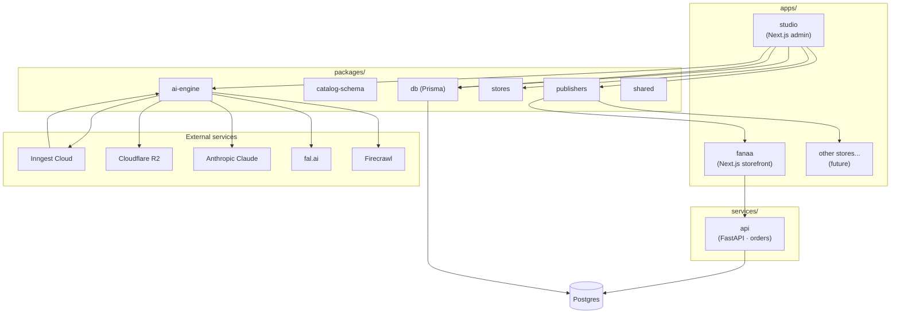
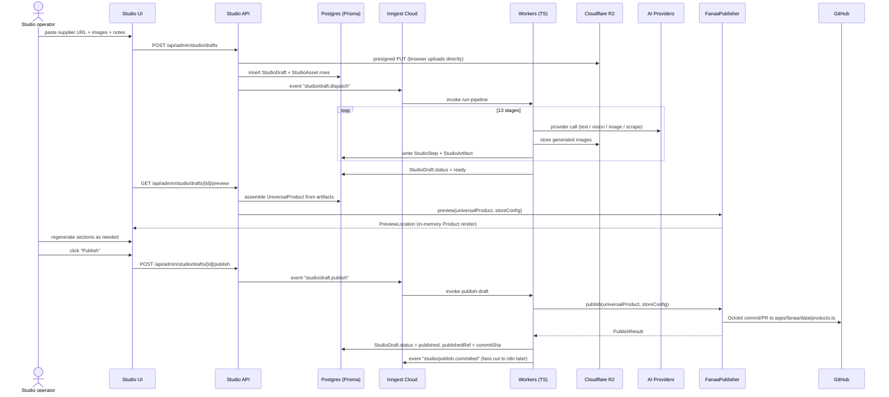
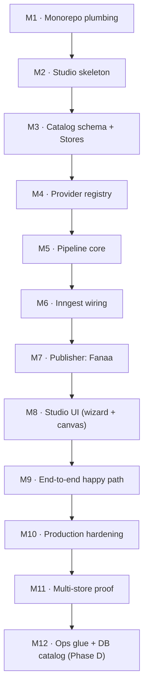

# Platform Architecture — Master Document

> **Status**: Authoritative · **Version**: 1.0 · **Last revised**: 2026-05-21
> **Scope**: Internal multi-store AI ecommerce production platform.
> **Audience**: Anyone implementing, operating, reviewing, or extending the platform.
>
> This document is the **single source of truth** for the platform's
> architecture. Every implementation task references it. When an
> implementation contradicts this document, the document wins — fix the
> implementation OR open a `docs/architecture/decisions/` ADR to amend
> the document. Do not silently diverge.

---

## Table of contents

1. [Executive summary](#1-executive-summary)
2. [Architectural principles](#2-architectural-principles)
3. [Glossary](#3-glossary)
4. [Current state — frozen snapshot](#4-current-state--frozen-snapshot)
5. [Target architecture — one paragraph](#5-target-architecture--one-paragraph)
6. [Monorepo strategy](#6-monorepo-strategy)
7. [Folder structure](#7-folder-structure)
8. [Store model — multi-store from day one](#8-store-model--multi-store-from-day-one)
9. [Universal Product schema](#9-universal-product-schema)
10. [Publisher abstraction](#10-publisher-abstraction)
11. [AI generation pipeline](#11-ai-generation-pipeline)
12. [Provider system](#12-provider-system)
13. [Database & schema strategy](#13-database--schema-strategy)
14. [Storage strategy](#14-storage-strategy)
15. [Queue & worker strategy](#15-queue--worker-strategy)
16. [Security strategy](#16-security-strategy)
17. [Scaling strategy](#17-scaling-strategy)
18. [Deployment strategy](#18-deployment-strategy)
19. [Draft / preview / publish flow](#19-draft--preview--publish-flow)
20. [Anti-patterns — explicit non-goals](#20-anti-patterns--explicit-non-goals)
21. [Migration phases](#21-migration-phases)
22. [Implementation roadmap](#22-implementation-roadmap)
23. [Decision log](#23-decision-log)
24. [Future extensibility](#24-future-extensibility)
25. [Appendix — open questions](#25-appendix--open-questions)

---

## 1. Executive summary

We are building an **internal multi-store AI ecommerce production
platform**. From day one the codebase is a **monorepo** that hosts
multiple storefronts (`apps/fanaa/`, future `apps/<store>/`) and a
**central AI Studio** (`apps/studio/`) that generates structured product
content and publishes it into each store through a **publisher
abstraction**.

The AI Studio is **niche-aware** and **store-aware**: it takes a
supplier URL, 1–5 supplier images, and optional positioning notes, and
produces a publish-ready, Arabic-first product object tuned to the
target store's brand, niche, and templates. The same Studio can publish
to Fanaa today, to a sibling beauty/wellness store tomorrow, and — when
the publisher interface is implemented — to Shopify, TikTok Shop, or
any external system later.

**The existing Fanaa storefront is sacred.** All migration work is
**infrastructure-first**: code moves into the monorepo verbatim, no
business logic is rewritten, no PDP / checkout / thank-you / analytics
/ tracking / order behaviour changes. The monorepo migration must be
indistinguishable to Saudi end-users.

**Infrastructure decisions (final):**

- **Monorepo tooling**: `pnpm` workspaces + Turborepo
- **AI Studio runtime**: Next.js App Router (separate app from Fanaa)
- **Queue**: Inngest Cloud (durable step functions)
- **Object storage**: Cloudflare R2 (zero egress, S3-compatible)
- **Database**: PostgreSQL via Prisma (admin) + SQLAlchemy (orders) —
  single instance, multi-schema
- **Reasoning + Arabic copywriting**: Anthropic Claude 3.5 Sonnet
- **Image generation**: fal.ai (Flux Pro 1.1 + Recraft v3 for Arabic
  text in image)
- **URL scraping**: Firecrawl
- **OpenAI**: fallback only, never primary

---

## 2. Architectural principles

These are **non-negotiable**. Every implementation decision must satisfy
all eight. If a decision can't, escalate it as an ADR before
implementing.

1. **Production storefront is sacred.** Fanaa's storefront, checkout,
   upsell, thank-you, tracking, pixels, webhooks, Sheets sync, and
   admin analytics behave **identically** before and after every
   platform change. End-to-end smoke tests pass at every phase
   boundary.
2. **Infrastructure-first migration.** Code moves into the monorepo
   structure unchanged. Refactors, rewrites, and "while we're in
   there" cleanups are explicitly forbidden during migration phases.
3. **Multi-store from day one.** No code references Fanaa by name in
   the AI engine, providers, publishers, schemas, prompts, or worker
   logic. The Fanaa store is a **config**, not a special case.
4. **Universal output, store-specific rendering.** The AI generates a
   **Universal Product** — a normalized, store-agnostic shape.
   Publishers transform Universal Product into store-native shapes.
5. **Provider lock-in is a defect.** No code outside
   `packages/ai-engine/providers/` ever imports an AI vendor SDK
   directly. All provider calls go through the registry.
6. **Durable workflows over fire-and-forget.** Every generation step is
   a retryable, replayable Inngest step. No `asyncio.create_task`-style
   ghosts for anything that must succeed.
7. **Drafts and preview gate every publish.** No content goes live
   without preview + human approval. Auto-publish is a footgun.
8. **Cost ceilings are first-class.** Every draft has a hard cost
   budget. A misbehaving prompt cannot run up a $50 image bill
   overnight.

---

## 3. Glossary

| Term | Meaning |
|------|---------|
| **Platform** | The full monorepo: apps + services + packages. |
| **Storefront** | A customer-facing site (e.g. `apps/fanaa/`). |
| **Studio** | The internal AI production app (`apps/studio/`). |
| **Store** | A logical brand (Fanaa, Trendora, …) with its own niche, brand, templates, R2 bucket, and publisher. Storefront ↔ Store is 1:1. |
| **StoreConfig** | The single object describing a store — id, niche, brand, locale, currency, publisher, R2 bucket. |
| **BrandProfile** | Visual + tonal brand attributes (palette, fonts, voice). |
| **NicheProfile** | Category-specific tuning (beauty/wellness vs. fashion vs. electronics). |
| **Universal Product** | The canonical AI output schema. Store-agnostic. |
| **Publisher** | Adapter that materialises a Universal Product into a store-native shape. |
| **Pipeline** | The 13-stage AI generation process. |
| **Run** | One execution of the pipeline against one draft. |
| **Step** | One stage of a run (research, copy, image-gen, etc.). |
| **Artifact** | The output of a step — versioned, regeneratable. |
| **Asset** | A binary in R2 — uploaded supplier image OR generated image. |
| **Draft** | A `StudioDraft` row aggregating runs, artifacts, and assets. |
| **PR-publish** | Publishing by committing to `apps/<store>/data/products.ts` via the GitHub API (Octokit). |

---

## 4. Current state — frozen snapshot

Captured 2026-05-21. Use as the "before" boundary for migration.

### Repository layout (today)

```
mystores/                                     monorepo root (single repo)
├─ app/                                       Next.js 15 storefront (App Router)
│  ├─ admin/                                  Admin analytics (JWT-gated)
│  ├─ products/[slug]/                        Generic PDP
│  ├─ sugarbear/                              Bespoke landing for p_004
│  └─ thank-you/[orderId]/                    COD confirmation
├─ backend/                                   FastAPI orders service
│  └─ app/api/routes/{health,orders,geo,diagnostics}.py
├─ components/                                React UI
├─ data/products.ts                           Static catalog (4 SKUs)
├─ lib/                                       Storefront utilities (i18n, types, …)
├─ prisma/schema.prisma                       Admin analytics models
├─ docker-compose.yml                         3 services: web · api · postgres
└─ README.md
```

### Running services (today)

| Service | Container | Role |
|---------|-----------|------|
| `elfanaa_web` | Next.js 15 | Storefront + admin |
| `elfanaa_api` | FastAPI | Orders, pricing, pixels server-side |
| `elfanaa_database` | Postgres 16 | Both Prisma (admin) and SQLAlchemy (orders) |

### Not provisioned today

- ❌ Redis / queue
- ❌ Object storage (S3 / R2)
- ❌ AI provider keys
- ❌ Inngest
- ❌ Background workers
- ❌ DB-backed catalog (catalog is a TS file)

### Existing Prisma models (untouched by this migration)

`Visitor`, `Session`, `Event`, `OrderMirror`, `OrderMirrorItem`,
`TrafficQuality`, `AdminAudit`.

### Existing FastAPI SQLAlchemy models (untouched)

`Order`, `OrderItem`, `OrderEvent`.

### Existing admin nav (untouched)

```ts
[Overview, Orders, Funnel, Products, Geo, Traffic Quality, Settings]
```

---

## 5. Target architecture — one paragraph

A pnpm + Turborepo monorepo with **two app types** (storefronts at
`apps/<store>/` and a single Studio at `apps/studio/`), **two service
types** (`services/api/` FastAPI for orders, future workers if split),
and a **shared package layer** (`packages/`) that hosts the catalog
schema, AI engine, store registry, publisher registry, Prisma client,
and shared utilities. The AI Studio dispatches generation runs to
Inngest Cloud; workers call AI providers through a registry; outputs
are versioned in Postgres and stored in store-scoped R2 buckets. On
publish, the relevant **Publisher adapter** materialises the Universal
Product into the store's native shape (FanaaPublisher commits to
`apps/fanaa/data/products.ts`; future ShopifyPublisher posts to the
Shopify Admin API). The current Fanaa storefront is migrated into
`apps/fanaa/` byte-for-byte during phase A — no logic changes, only
moves.

### High-level system topology



---

## 6. Monorepo strategy

### Tooling

| Choice | Picked | Rejected | Reason |
|--------|--------|----------|--------|
| Package manager / workspaces | **pnpm** | npm, yarn | Fastest install, strictest dedup, best workspace ergonomics. |
| Task runner / caching | **Turborepo** | Nx, none | Free remote cache on Vercel; minimal config; first-class Next.js. |
| TypeScript config | **shared `tsconfig.base.json`** | per-package configs from scratch | Single strictness baseline; each package extends. |
| Lint / format | **shared ESLint + Prettier config in `packages/config/`** | per-package | Consistency. |
| Versioning | **fixed workspace versions, no Changesets yet** | Changesets, semver | We don't publish packages externally; internal-only. |

### Workspace boundaries

- **`apps/*`** — Deployable Next.js or static apps. May depend on any
  `packages/*`. **Never** depend on another `apps/*`.
- **`services/*`** — Non-Next.js services (FastAPI, future workers).
  Independent build/deploy.
- **`packages/*`** — Shared libraries. May depend on other
  `packages/*` but never on `apps/*` or `services/*`.
- **`infra/*`** — Dockerfiles, EasyPanel manifests, Inngest configs,
  R2 bucket policies. No application code.
- **`docs/*`** — This document and its companions. No code.
- **`scripts/*`** — One-off operational scripts (catalog seeding,
  embedding backfills, migrations).

### Cross-app dependency rules

- A storefront (e.g. `apps/fanaa/`) **must not** depend on the Studio
  package surface for runtime — only on its publisher's *output*
  (committed `data/products.ts`).
- The Studio **may** depend on `packages/stores/` to know how to
  generate for a given store, but **never** imports from
  `apps/<store>/` directly.
- This keeps each storefront deployable independently of Studio
  changes.

---

## 7. Folder structure

The full target structure after Phase A migration. Paths marked
`(NEW)` do not exist today; `(MOVED)` exists today and is relocated
verbatim; `(KEPT)` exists today and stays where it is.

```
mystores/
├─ apps/
│  ├─ fanaa/                            (MOVED — current Next.js storefront + admin)
│  │  ├─ app/                           ↳ today's app/ folder verbatim
│  │  ├─ components/                    ↳ today's components/
│  │  ├─ data/products.ts               ↳ today's catalog file
│  │  ├─ lib/                           ↳ today's lib/
│  │  ├─ public/                        ↳ today's public/
│  │  ├─ middleware.ts                  ↳ today's middleware
│  │  ├─ next.config.mjs                ↳ today's config (paths updated)
│  │  ├─ package.json                   ↳ depends on @platform/* packages
│  │  └─ tsconfig.json                  ↳ extends ../../tsconfig.base.json
│  │
│  └─ studio/                           (NEW — multi-store AI production app)
│     ├─ app/
│     │  ├─ (auth)/                     ↳ login flow
│     │  ├─ drafts/                     ↳ list + create
│     │  ├─ drafts/[draftId]/
│     │  │  ├─ page.tsx                 ↳ canvas (sections + regen)
│     │  │  ├─ preview/page.tsx         ↳ live preview iframe
│     │  │  ├─ publish/page.tsx         ↳ publish confirmation
│     │  │  └─ runs/[runId]/page.tsx    ↳ run timeline + step logs
│     │  ├─ stores/                     ↳ store registry view
│     │  ├─ assets/                     ↳ R2 asset browser
│     │  ├─ providers/                  ↳ provider health + cost view
│     │  └─ settings/
│     ├─ api/
│     │  └─ admin/studio/               ↳ wizard + run + publish endpoints
│     ├─ components/                    ↳ Studio-only UI
│     ├─ middleware.ts                  ↳ JWT gate (mirrors fanaa pattern)
│     ├─ next.config.mjs
│     └─ package.json
│
├─ services/
│  ├─ api/                              (MOVED — FastAPI orders, formerly backend/)
│  │  ├─ app/
│  │  ├─ requirements.txt
│  │  ├─ Dockerfile
│  │  └─ pyproject.toml
│  │
│  └─ workers/                          (OPTIONAL · phase D — split-out Inngest workers)
│
├─ packages/
│  ├─ catalog-schema/                   (NEW — Universal Product + extensions)
│  │  ├─ src/
│  │  │  ├─ universal.ts                ↳ UniversalProduct type
│  │  │  ├─ extensions/                 ↳ per-store extension types
│  │  │  ├─ niches/                     ↳ niche-specific shape additions
│  │  │  ├─ locales.ts                  ↳ LocalizedString helpers (lifted from lib/types.ts)
│  │  │  └─ index.ts
│  │  └─ package.json                   ↳ @platform/catalog-schema
│  │
│  ├─ ai-engine/                        (NEW — provider-agnostic pipeline)
│  │  ├─ src/
│  │  │  ├─ providers/
│  │  │  │  ├─ contracts.ts             ↳ TextProvider, ImageProvider, …
│  │  │  │  ├─ registry.ts              ↳ env-driven resolver + chain
│  │  │  │  ├─ anthropic.ts
│  │  │  │  ├─ openai.ts                ↳ fallback only
│  │  │  │  ├─ fal.ts
│  │  │  │  ├─ firecrawl.ts
│  │  │  │  └─ index.ts
│  │  │  ├─ pipeline/
│  │  │  │  ├─ research.ts
│  │  │  │  ├─ vision.ts
│  │  │  │  ├─ strategy.ts
│  │  │  │  ├─ structure.ts
│  │  │  │  ├─ copy.ts
│  │  │  │  ├─ creative-prompts.ts
│  │  │  │  ├─ image-gen.ts
│  │  │  │  ├─ image-post.ts
│  │  │  │  ├─ social-proof.ts
│  │  │  │  ├─ upsell-match.ts
│  │  │  │  └─ assemble.ts              ↳ → UniversalProduct
│  │  │  ├─ schemas/                    ↳ Zod schemas per stage output
│  │  │  ├─ prompts/
│  │  │  │  ├─ system/                  ↳ system prompts (parameterized by NicheProfile)
│  │  │  │  └─ user/                    ↳ per-stage builders
│  │  │  └─ index.ts
│  │  └─ package.json                   ↳ @platform/ai-engine
│  │
│  ├─ publishers/                       (NEW — publisher adapters)
│  │  ├─ src/
│  │  │  ├─ contracts.ts                ↳ Publisher interface
│  │  │  ├─ registry.ts                 ↳ resolve by storeId
│  │  │  ├─ fanaa/
│  │  │  │  ├─ index.ts                 ↳ FanaaPublisher
│  │  │  │  ├─ to-fanaa-product.ts      ↳ UniversalProduct → fanaa Product
│  │  │  │  └─ commit-products-ts.ts    ↳ Octokit write to apps/fanaa/data/products.ts
│  │  │  ├─ shopify/                    (PLACEHOLDER · phase D)
│  │  │  └─ tiktok-shop/                (PLACEHOLDER · phase D)
│  │  └─ package.json                   ↳ @platform/publishers
│  │
│  ├─ stores/                           (NEW — store config registry)
│  │  ├─ src/
│  │  │  ├─ contracts.ts                ↳ StoreConfig, BrandProfile, NicheProfile, Templates
│  │  │  ├─ registry.ts                 ↳ getStore(id) + listStores()
│  │  │  ├─ niches/
│  │  │  │  ├─ beauty-wellness.ts
│  │  │  │  ├─ fashion.ts                  (future)
│  │  │  │  └─ electronics.ts              (future)
│  │  │  └─ stores/
│  │  │     └─ fanaa.ts                 ↳ Fanaa StoreConfig instance
│  │  └─ package.json                   ↳ @platform/stores
│  │
│  ├─ workers/                          (NEW — Inngest functions)
│  │  ├─ src/
│  │  │  ├─ client.ts                   ↳ new Inngest({ id: "platform" })
│  │  │  ├─ functions/
│  │  │  │  ├─ run-pipeline.ts          ↳ orchestrator
│  │  │  │  ├─ regenerate-section.ts
│  │  │  │  ├─ retry-failed-step.ts
│  │  │  │  └─ publish-draft.ts
│  │  │  └─ middleware/
│  │  │     ├─ with-draft-lock.ts
│  │  │     ├─ with-cost-ceiling.ts
│  │  │     └─ with-store-context.ts
│  │  └─ package.json                   ↳ @platform/workers
│  │
│  ├─ prompts/                          (NEW — reusable prompt fragments)
│  │  ├─ src/
│  │  │  ├─ voice/                      ↳ tone + style fragments per BrandProfile
│  │  │  ├─ guardrails/                 ↳ safety, factuality, no-claims fragments
│  │  │  └─ contexts/                   ↳ Saudi cultural pack, GCC dialect notes
│  │  └─ package.json                   ↳ @platform/prompts
│  │
│  ├─ ui/                               (NEW — minimal shared admin primitives, OPTIONAL)
│  │  └─ src/                           ↳ Studio-shared only — storefront keeps its own
│  │
│  ├─ db/                               (MOVED — Prisma schema + client)
│  │  ├─ prisma/schema.prisma           ↳ today's prisma/schema.prisma
│  │  ├─ src/
│  │  │  ├─ client.ts                   ↳ PrismaClient singleton export
│  │  │  └─ types.ts                    ↳ re-exports for type ergonomics
│  │  └─ package.json                   ↳ @platform/db
│  │
│  ├─ shared/                           (NEW — small utilities)
│  │  ├─ src/
│  │  │  ├─ id/                         ↳ cuid / ulid helpers
│  │  │  ├─ logger/                     ↳ structured logger
│  │  │  ├─ env/                        ↳ Zod-validated env loader
│  │  │  ├─ result/                     ↳ Result<T,E> helpers
│  │  │  └─ index.ts
│  │  └─ package.json                   ↳ @platform/shared
│  │
│  └─ config/                           (NEW — shared eslint/prettier/tsconfig presets)
│     ├─ eslint/
│     ├─ prettier/
│     └─ tsconfig/
│
├─ infra/
│  ├─ docker/                           (MOVED — Dockerfiles per app/service)
│  │  ├─ fanaa.Dockerfile
│  │  ├─ studio.Dockerfile
│  │  └─ api.Dockerfile
│  ├─ docker-compose.yml                (MOVED — paths updated)
│  ├─ easypanel/                        (NEW — manifests per service)
│  ├─ inngest/                          (NEW — local dev config)
│  └─ r2/                               (NEW — bucket policy specs)
│
├─ docs/
│  └─ architecture/
│     ├─ PLATFORM.md                    (THIS DOCUMENT)
│     ├─ RUNBOOK.md                     (future)
│     ├─ MIGRATION-LOG.md               (future — append-only)
│     └─ decisions/                     (future — ADRs)
│
├─ scripts/                             (KEPT — top-level operational scripts)
├─ pnpm-workspace.yaml                  (NEW)
├─ turbo.json                           (NEW)
├─ tsconfig.base.json                   (NEW)
├─ package.json                         (root — workspace orchestration)
├─ README.md                            (KEPT — points to docs/architecture/PLATFORM.md)
└─ .env.example                         (KEPT — extended with new platform vars)
```

### Package naming convention

All shared packages use the `@platform/*` namespace:
`@platform/catalog-schema`, `@platform/ai-engine`, `@platform/publishers`,
etc. Apps depend on these by name in their `package.json`.

---

## 8. Store model — multi-store from day one

The Studio NEVER hardcodes Fanaa. A store is a config:

### `StoreConfig` (contract sketch, lives in `packages/stores/`)

```ts
type StoreId = string;          // "fanaa" | "trendora" | …
type NicheId =
  | "beauty_wellness"
  | "fashion"
  | "electronics"
  | "home"
  | "fitness"
  | string;                     // open string for future niches

type PublisherId =
  | "fanaa"
  | "shopify"
  | "tiktok_shop"
  | string;

type StoreStatus = "live" | "incubating" | "archived";

interface StoreConfig {
  id: StoreId;
  displayName: LocalizedString;

  status: StoreStatus;

  // Catalog character
  niche: NicheId;
  defaultLocale: Locale;          // "ar"
  supportedLocales: Locale[];     // ["ar", "en"]
  currency: string;               // "SAR"
  market: string;                 // "SA" (ISO 3166-1)

  // Branding + tone
  brand: BrandProfile;
  nicheProfile: NicheProfile;

  // Generation templates available for this store
  templates: StoreTemplates;

  // Publisher binding
  publisher: PublisherId;

  // Storage scope
  r2Bucket: string;               // "fanaa-assets"
  r2PublicBaseUrl: string;        // "https://cdn.elfanaa.com"

  // Routing
  domains: string[];              // ["elfanaa.com"]
  appWorkspace: string;           // "apps/fanaa"

  // Operational
  costCeilingPerDraftUsd: number; // default 5
  approvedProviders?: Partial<ProviderAllowlist>;  // override defaults
}
```

### `BrandProfile`

```ts
interface BrandProfile {
  name: LocalizedString;
  tagline: LocalizedString;
  palette: {
    bg: string;          // hex
    surface: string;
    ink: string;
    accent: string;
    accentSoft: string;
    success: string;
  };
  typography: {
    sans: string;
    display: string;
    arabic: string;
    arabicDisplay: string;
  };
  voice: {
    register: "luxury" | "playful" | "clinical" | "youthful" | "premium-utility";
    dialect: "MSA" | "Saudi" | "Khaleeji" | "Egyptian" | "Levantine";
    forbidden_words: string[];          // claims, superlatives, etc.
    house_style_notes: string;          // free-text "always do / never do"
  };
}
```

### `NicheProfile`

```ts
interface NicheProfile {
  id: NicheId;
  /** Section taxonomy this niche supports */
  sections: SectionKind[];
  /** Niche-specific Universal Product extensions (e.g. ingredients) */
  productExtensions: ProductExtensionKind[];
  /** Claims/legal guardrails — system prompt fragment */
  legalGuardrails: string;
  /** Realistic results-window for "when do results appear?" copy */
  expectationsModel: ExpectationsModel;
  /** Default ad-hook angles for this niche */
  defaultAngles: string[];
}
```

### `StoreTemplates`

```ts
interface StoreTemplates {
  /** Generic PDP route — store-specific template ID */
  defaultPdp: "fanaa.generic_pdp" | "fanaa.bespoke_landing" | string;
  /** Which sections are available */
  sectionLibrary: SectionKind[];
  /** Section ordering preferences per template */
  orderings: Record<string, SectionKind[]>;
}
```

### How Fanaa becomes a config

Fanaa today has:
- Generic PDP at `app/products/[slug]/page.tsx`
- Bespoke landing at `app/sugarbear/page.tsx`
- Arabic copy in `lib/i18n/dictionaries.ts` + `app/sugarbear/copy.ts`
- Brand palette in `styles/tokens.css`

These become **inputs** to a `StoreConfig` instance for Fanaa. Nothing
in `apps/fanaa/` reads from the Studio; nothing in the Studio reads
from `apps/fanaa/` (only its config in `packages/stores/`).

---

## 9. Universal Product schema

The single most important contract in the platform.

### Why universal?

If the AI engine outputs a Fanaa-shaped object, adding a second store
requires rewriting the engine. If the AI engine outputs a universal
shape, adding a second store requires writing a new **publisher**.
Publishers are small and replaceable; engines are large and not.

### Shape (canonical, lives in `packages/catalog-schema/`)

```ts
import type { LocalizedString, Money, Locale } from "./locales";

export interface UniversalProduct {
  // ── Identity ────────────────────────────────────────────────────
  /** Stable, generated. Format: `up_<cuid>`. */
  id: string;
  /** SEO slug generated from title. Store publishers may override. */
  slug: string;
  /** Niche this product was generated for. */
  niche: NicheId;
  /** Generating store context (for provenance, not store-coupling). */
  storeContext: StoreId;
  generationRunId: string;
  generatedAt: string;            // ISO-8601

  // ── Customer-facing core ───────────────────────────────────────
  title: LocalizedString;
  description: LocalizedString;
  headline?: LocalizedString;
  subheadline?: LocalizedString;

  // ── Value content ──────────────────────────────────────────────
  benefits: ProductBenefit[];        // 4–6 typical
  features?: ProductFeature[];       // optional, niche-specific
  ingredients?: ProductIngredient[]; // beauty/wellness niche
  specifications?: ProductSpec[];    // electronics/fashion niche
  certifications?: ProductCert[];    // SFDA, CE, …

  // ── Visual ─────────────────────────────────────────────────────
  images: ProductImage[];            // hero first, then gallery
  lifestyleImages?: ProductImage[];

  // ── Social proof ──────────────────────────────────────────────
  reviews: ProductReview[];          // 3–6 generated, realistic
  rating?: { value: number; count: number };

  // ── Conversion ────────────────────────────────────────────────
  faq: ProductFaq[];                 // 5–7 COD-objection-tuned

  // ── Pricing hints (publisher decides offers) ─────────────────
  priceHint: Money;                  // suggested unit price
  marginNotes?: string;              // internal: "supplier $X, ship $Y"

  // ── Ad / paid marketing ──────────────────────────────────────
  hooks: AdHook[];                   // 5 hooks for Meta/TikTok

  // ── Cross-sell suggestions ────────────────────────────────────
  upsellSuggestions?: string[];      // universal product IDs

  // ── Provenance ────────────────────────────────────────────────
  sources: {
    supplierUrl: string;
    scrapedAt: string;
    uploadedImages: string[];       // r2 keys
  };
}
```

Supporting types (`ProductBenefit`, `ProductFaq`, `ProductReview`, etc.)
mirror the current Fanaa `lib/types.ts` shapes but with `LocalizedString`
fields for every customer-facing string. Fanaa-specific fields (e.g.
`offerTiers`, `landingPath`, `stockLeft`) live in **publisher-specific
extensions**, not in the universal shape.

### Niche extensions

Each niche can extend the universal shape:

```ts
// packages/catalog-schema/src/niches/beauty-wellness.ts
export interface BeautyWellnessExtension {
  skinTypes?: ("oily" | "dry" | "combination" | "sensitive")[];
  concerns?: ("aging" | "hydration" | "pigmentation")[];
  routineSuggestion?: RoutineStep[];
}
```

The Studio runs niche-specific pipeline stages that populate these.
Publishers may or may not consume them.

---

## 10. Publisher abstraction

### Why a publisher abstraction?

Different stores live in different worlds. Fanaa stores its catalog in
a TypeScript file. A future Shopify store will use the Shopify Admin
API. A future TikTok Shop will use TikTok's catalog API. The
**Publisher** abstracts away "where does the live product live?".

### Contract (`packages/publishers/src/contracts.ts`)

```ts
export interface Publisher {
  /** Stable identifier — matches StoreConfig.publisher */
  id: PublisherId;

  /** Pre-flight validation. Catches schema mismatches before commit. */
  validate(opts: {
    universalProduct: UniversalProduct;
    storeConfig: StoreConfig;
  }): Promise<ValidationResult>;

  /**
   * Materialise the universal product into the store's native shape
   * and write/commit/post it to wherever the store reads from.
   */
  publish(opts: {
    draftId: string;
    universalProduct: UniversalProduct;
    storeConfig: StoreConfig;
    actor: string;            // admin email — for audit
  }): Promise<PublishResult>;

  /** Remove or hide a previously-published product. */
  unpublish(opts: {
    productId: string;
    storeConfig: StoreConfig;
    actor: string;
  }): Promise<UnpublishResult>;

  /** Render a preview in the store's actual chrome. */
  preview(opts: {
    universalProduct: UniversalProduct;
    storeConfig: StoreConfig;
  }): Promise<PreviewLocation>;
}

export interface PublishResult {
  storeId: StoreId;
  storeProductId: string;     // slug for Fanaa, gid for Shopify, etc.
  liveUrl: string;
  /** Git SHA for PR-publishers; null for API-publishers. */
  commitSha?: string;
  /** External system reference (Shopify product ID, etc.). */
  externalRef?: string;
  publishedAt: string;
}
```

### Reference implementation: `FanaaPublisher`

- **Materialise**: `UniversalProduct → Fanaa Product (lib/types.ts)`.
  Adds `landingPath` only if the chosen template is bespoke; computes
  `offerTiers` from `priceHint` via Fanaa's existing pricing rules;
  uses `LocalizedString` directly.
- **Write**: append/update the entry in `apps/fanaa/data/products.ts`
  via the Octokit REST API. Opens a PR if `STORE_PUBLISH_MODE=pr`,
  commits to main directly if `=direct`. Default is `pr` for safety.
- **Preview**: returns a Studio-internal URL that renders the actual
  `apps/fanaa/` PDP component tree against a `Product` object held in
  memory (no temporary commit).

### Future publishers (placeholders, not implemented yet)

| Publisher | Mechanism | Trigger |
|-----------|-----------|---------|
| `ShopifyPublisher` | Shopify Admin GraphQL `productCreate` | When the first Shopify-backed store is added. |
| `TikTokShopPublisher` | TikTok Shop Catalog API | Future. |
| `MetaCatalogPublisher` | Meta Commerce Catalog feed | Future — likely paired alongside a primary publisher rather than as a sole publisher. |

A store may have **one primary publisher** + N **broadcast publishers**
(future). The primary publisher owns the live URL; broadcast publishers
mirror the product to ad-platform catalogs.

---

## 11. AI generation pipeline

13 stages. Every stage is a typed Inngest `step.run()`. Every stage's
output is validated by a Zod schema. Every stage receives the
`StoreConfig` as context so prompts adapt automatically.

### Pipeline overview

```mermaid
flowchart LR
  I[Intake] --> R[Research]
  R --> V[Vision]
  V --> S[Strategy]
  S --> ST[Structure]
  ST --> C[Copy]
  C --> CP[Creative Prompts]
  CP --> IG[Image Gen]
  IG --> IP[Image Post-process]
  IP --> SP[Social Proof + FAQ + Hooks]
  SP --> UM[Upsell Match]
  UM --> A[Assemble Universal Product]
  A --> RDY[Ready for Preview]
```



### Stage-by-stage contract

| # | Stage | Lives in | Provider | Latency | Failure mode |
|---|-------|----------|----------|---------|--------------|
| 01 | Intake | `apps/studio/api/admin/studio/drafts/route.ts` | none (sync) | <800ms | Zod-reject on submit |
| 02 | Research / scrape | `ai-engine/pipeline/research.ts` | Firecrawl → Browserless fallback | 10–30s | If both fail, mark skipped; downstream uses only vision |
| 03 | Vision analysis | `ai-engine/pipeline/vision.ts` | Claude 3.5 vision (primary) | 8–15s | retry-once-higher-temp; skip on second fail |
| 04 | Strategy synthesis | `ai-engine/pipeline/strategy.ts` | Claude 3.5 | 12–20s | Zod-validated; auto-retry with "fix JSON" reprompt |
| 05 | Section structure | `ai-engine/pipeline/structure.ts` | Claude 3.5 | 6–10s | Fallback to `StoreConfig.templates.orderings.default` |
| 06 | Arabic copywriting | `ai-engine/pipeline/copy.ts` | Claude 3.5 (Arabic system prompt + BrandProfile.voice) | 25–45s | Validate AR codepoint coverage; rewrite if mixed-locale bleeds |
| 07 | Creative prompts | `ai-engine/pipeline/creative-prompts.ts` | Claude 3.5 | 5–10s | Always emits hero prompt; lifestyle prompts optional |
| 08 | Image generation | `ai-engine/pipeline/image-gen.ts` | fal.ai Flux Pro 1.1 (primary), Recraft v3 (text-in-image) | 20–60s parallel | Per-prompt 3× retry + provider fallback; partial success accepted |
| 09 | Image post-process | `ai-engine/pipeline/image-post.ts` | Sharp (in-worker) + optional fal.ai upscale | 3–8s | Skip variant on Sharp throw |
| 10 | Social proof + FAQ + hooks | `ai-engine/pipeline/social-proof.ts` | Claude 3.5 | 10–18s | Realistic-name + dialect validation; reject if generic |
| 11 | Upsell match | `ai-engine/pipeline/upsell-match.ts` | pgvector cosine over `StudioAsset.embedding` | <2s | Fallback to store best-sellers |
| 12 | Assembly | `ai-engine/pipeline/assemble.ts` | pure TS | <500ms | Validate against `UniversalProduct` schema |
| 13 | Ready | `workers/run-pipeline.ts` terminal step | DB transition | <200ms | terminal |

### Pipeline kernel (sketch)

```ts
export const runPipeline = inngest.createFunction(
  {
    id: "studio/run-pipeline",
    concurrency: { key: "event.data.draftId", limit: 1 },
    onFailure: notifyStudioEvent,
  },
  { event: "studio/draft.dispatch" },
  async ({ event, step }) => {
    const storeConfig = await step.run("load-store", () =>
      stores.get(event.data.storeId)
    );

    const research = await step.run("research", () =>
      pipeline.research(event.data.supplierUrl, storeConfig)
    );
    const vision = await step.run("vision", () =>
      pipeline.vision(event.data.uploadedAssetKeys, storeConfig)
    );
    const strategy = await step.run("strategy", () =>
      pipeline.strategy({ research, vision, storeConfig })
    );
    const structure = await step.run("structure", () =>
      pipeline.structure({ strategy, storeConfig })
    );
    const copy = await step.run("copy", () =>
      pipeline.copy({ strategy, structure, storeConfig })
    );
    const prompts = await step.run("creative-prompts", () =>
      pipeline.creativePrompts({ strategy, structure, storeConfig })
    );
    const images = await Promise.all(
      prompts.images.map((p, i) =>
        step.run(`image-${i}`, () => pipeline.imageGen(p, storeConfig))
      )
    );
    const processed = await step.run("image-post", () =>
      pipeline.imagePost({ images, storeConfig })
    );
    const social = await step.run("social-proof", () =>
      pipeline.socialProof({ strategy, storeConfig })
    );
    const upsells = await step.run("upsell-match", () =>
      pipeline.upsellMatch({ strategy, storeConfig })
    );
    const universal = await step.run("assemble", () =>
      pipeline.assemble({
        research, vision, strategy, structure, copy, prompts,
        images: processed, social, upsells, storeConfig,
      })
    );

    await step.run("mark-ready", () =>
      drafts.markReady(event.data.draftId, universal)
    );
  }
);
```

### Per-section regeneration

Each section is also exposed as a standalone Inngest function (e.g.
`regenerateCopy`, `regenerateImages`). The Studio UI shows a
"regenerate" button per section. The function runs the stage in
isolation, writes a new `StudioArtifact` version, and the draft's
preview rebuilds.

---

## 12. Provider system

### Contracts (`packages/ai-engine/src/providers/contracts.ts`)

```ts
export interface TextProvider {
  id: ProviderId;
  generate<T>(opts: {
    system: string;
    prompt: string;
    schema?: ZodSchema<T>;      // structured output when set
    temperature?: number;
    maxTokens?: number;
    storeId: StoreId;           // for cost attribution
    runId?: string;
  }): Promise<TextResult<T>>;
}

export interface VisionProvider {
  id: ProviderId;
  analyze<T>(opts: {
    images: ImageRef[];         // R2 keys or absolute URLs
    instructions: string;
    schema?: ZodSchema<T>;
    storeId: StoreId;
    runId?: string;
  }): Promise<VisionResult<T>>;
}

export interface ImageProvider {
  id: ProviderId;
  cost: { perImageUsd: number };
  generate(opts: {
    prompt: string;
    negative?: string;
    size: { w: number; h: number };
    referenceImages?: ImageRef[];
    storeId: StoreId;
    runId?: string;
  }): Promise<ImageResult>;     // { r2Key, bytes, seed, durationMs }
}

export interface ScraperProvider {
  id: ProviderId;
  fetch(url: string, opts?: ScrapeOptions): Promise<ScrapeResult>;
}

export interface EmbeddingProvider {
  id: ProviderId;
  embed(opts: { input: string; storeId: StoreId }): Promise<number[]>;
}
```

### Registry (`packages/ai-engine/src/providers/registry.ts`)

```ts
type ProviderChain<T> = {
  primary: T;
  fallbacks: T[];
};

export const registry = {
  text: resolveChain<TextProvider>("STUDIO_TEXT_PROVIDERS"),
  vision: resolveChain<VisionProvider>("STUDIO_VISION_PROVIDERS"),
  image: resolveChain<ImageProvider>("STUDIO_IMAGE_PROVIDERS"),
  scraper: resolveChain<ScraperProvider>("STUDIO_SCRAPER_PROVIDERS"),
  embedding: resolveChain<EmbeddingProvider>("STUDIO_EMBED_PROVIDERS"),
};
```

Each env var is a comma-separated chain: `anthropic,openai` means
Anthropic primary, OpenAI fallback. A `StoreConfig` can override the
chain via `approvedProviders`.

### Adapter table

| Capability | Adapter | Vendor | Status | Env keys |
|-----------|---------|--------|--------|----------|
| Text — reasoning + Arabic | `anthropic.ts` | Anthropic | Required | `ANTHROPIC_API_KEY` |
| Text — fallback | `openai.ts` | OpenAI | Fallback only | `OPENAI_API_KEY` |
| Vision | `anthropic.ts` (vision) | Anthropic | Required | (same) |
| Vision — fallback | `openai.ts` (vision) | OpenAI | Fallback only | (same) |
| Image — photo | `fal.ts` (Flux Pro 1.1) | fal.ai | Required | `FAL_KEY` |
| Image — Arabic text in image | `fal.ts` (Recraft v3) | fal.ai | Required | (same) |
| Scraper | `firecrawl.ts` | Firecrawl | Required | `FIRECRAWL_API_KEY` |
| Embedding | `openai.ts` (text-embedding-3-small) | OpenAI | Required | `OPENAI_API_KEY` |

OpenAI is **fallback only** for text and vision, **primary** for
embeddings (cheap, stable, multilingual enough). No other vendor
relationships are part of v1.

### Provider observability

Every provider call writes to `StudioStep`:

- `providerId` — which adapter
- `tokensIn`, `tokensOut` — billing
- `costCents` — pre-computed via adapter's price table
- `latencyMs`
- `attemptCount`
- `errorMessage` on fail

A `/admin/studio/providers` dashboard rolls these up.

---

## 13. Database & schema strategy

### One Postgres instance, two ORMs (unchanged)

- **Prisma** owns the admin/analytics schema and the new Studio schema.
- **SQLAlchemy** (FastAPI) owns the orders schema.
- They share the same Postgres database; tables are namespaced by
  prefix (`Studio*`, `Order*`, `Visitor`/`Session`/`Event`).

### New Studio tables (added to `packages/db/prisma/schema.prisma`)

```prisma
model StudioStore {
  id              String   @id              // matches StoreId in code
  displayName     String
  status          StudioStoreStatus
  configHash      String                    // SHA of last applied StoreConfig
  createdAt       DateTime @default(now())
  updatedAt       DateTime @updatedAt
  drafts          StudioDraft[]
  events          StudioEvent[]
  @@index([status])
}

enum StudioStoreStatus { live incubating archived }

model StudioDraft {
  id              String   @id @default(cuid())
  storeId         String
  store           StudioStore @relation(fields: [storeId], references: [id])
  slug            String                    // generated, unique per store
  title           String
  supplierUrl     String?
  notes           String?
  positioning     String?
  status          StudioDraftStatus @default(intake)
  template        String                    // matches StoreTemplates entry
  costCents       Int      @default(0)
  publishedAt     DateTime?
  publishedRef    String?                   // commitSha or externalRef
  createdBy       String                    // admin email
  createdAt       DateTime @default(now())
  updatedAt       DateTime @updatedAt
  runs            StudioRun[]
  assets          StudioAsset[]
  artifacts       StudioArtifact[]
  @@unique([storeId, slug])
  @@index([storeId, status])
  @@index([createdAt])
}

enum StudioDraftStatus {
  intake generating ready publishing published archived failed
}

model StudioRun {
  id              String   @id @default(cuid())
  draftId         String
  draft           StudioDraft @relation(fields: [draftId], references: [id])
  inngestRunId    String?                   // for replay deep-link
  status          StudioRunStatus @default(queued)
  costCents       Int      @default(0)
  startedAt       DateTime?
  finishedAt      DateTime?
  errorMessage    String?
  inputSnapshot   Json                      // for deterministic replay
  steps           StudioStep[]
  @@index([draftId])
  @@index([status])
}

enum StudioRunStatus { queued running succeeded failed cancelled }

model StudioStep {
  id              String   @id @default(cuid())
  runId           String
  run             StudioRun @relation(fields: [runId], references: [id])
  kind            String                    // "research" | "strategy" | …
  status          StudioStepStatus @default(pending)
  providerId      String?
  inputHash       String?                   // for content-addressed caching
  attemptCount    Int      @default(0)
  costCents       Int      @default(0)
  tokensIn        Int?
  tokensOut       Int?
  latencyMs       Int?
  startedAt       DateTime?
  finishedAt      DateTime?
  errorMessage    String?
  output          Json?
  @@index([runId, kind])
}

enum StudioStepStatus { pending running succeeded failed skipped }

model StudioArtifact {
  id                String   @id @default(cuid())
  draftId           String
  draft             StudioDraft @relation(fields: [draftId], references: [id])
  kind              String                  // section identifier
  locale            String?                 // "ar" | "en" | null
  version           Int      @default(1)
  isCurrent         Boolean  @default(true)
  payload           Json                    // structured output
  generatedByStepId String?
  createdAt         DateTime @default(now())
  @@unique([draftId, kind, locale, version])
  @@index([draftId, isCurrent])
}

model StudioAsset {
  id          String   @id @default(cuid())
  draftId     String
  draft       StudioDraft @relation(fields: [draftId], references: [id])
  source      StudioAssetSource
  r2Bucket    String                        // store-scoped bucket
  r2Key       String   @unique
  contentType String
  bytes       Int
  width       Int?
  height      Int?
  altAr       String?
  altEn       String?
  embedding   Unsupported("vector(1536)")?  // pgvector
  createdAt   DateTime @default(now())
  @@index([draftId, source])
}

enum StudioAssetSource { upload scraped generated }

model StudioEvent {
  id          String   @id @default(cuid())
  storeId     String?
  store       StudioStore? @relation(fields: [storeId], references: [id])
  draftId     String?
  kind        String                        // "draft.created" | "publish.committed" | …
  actor       String                        // email or "system"
  payload     Json?
  createdAt   DateTime @default(now())
  @@index([storeId, kind, createdAt])
  @@index([draftId, createdAt])
}
```

### Migration discipline

- Studio schema lands as an **additive** Prisma migration. Zero changes
  to existing analytics tables.
- FastAPI's SQLAlchemy schema is untouched.
- pgvector extension is added on the same Postgres instance.

---

## 14. Storage strategy

### Cloudflare R2

| Concern | Decision |
|---------|----------|
| Bucket per store | `<storeId>-assets` (e.g. `fanaa-assets`) |
| Bucket access | Private origin + public CDN on a store-owned subdomain |
| Public URL pattern | `https://cdn.<store>.com/<r2Key>` |
| Upload mode | Browser → presigned PUT (no bytes through Studio server) |
| Key naming | `studio/<draftId>/<sourceKind>/<ulid>.<ext>` |
| Lifecycle | Drafts archived >180 days → R2 lifecycle rule deletes assets |

### Why R2 not S3

- $0 egress (every `next/image` variant rewrite is free).
- S3-compatible API — every existing tool/SDK works.
- Single-org billing alongside the storefront's Cloudflare presence.

---

## 15. Queue & worker strategy

### Inngest Cloud (final)

- **Why Cloud and not self-hosted**: zero ops, free tier covers months
  of internal use, observability UI included.
- **Function organisation**: one `Inngest({ id: "platform" })` client in
  `packages/workers/src/client.ts`. Functions are imported by both:
  - `apps/studio/api/admin/inngest/route.ts` (webhook receiver)
  - Any future split-out worker app (Phase D)

### Concurrency rules

| Function | Concurrency key | Limit |
|----------|----------------|-------|
| `run-pipeline` | `draftId` | 1 (no parallel runs per draft) |
| `regenerate-section` | `draftId + sectionKind` | 1 |
| `image-gen` (sub-step) | `storeId` | 8 (per-store image fan-out cap) |
| `publish-draft` | `draftId` | 1 |

### Retries

| Step kind | Max attempts | Backoff |
|-----------|-------------|---------|
| Provider call (text/vision/image) | 3 | 1s → 5s → 25s |
| Sharp post-processing | 2 | linear |
| Octokit publish | 5 | exponential, jittered |
| Assemble | 1 | n/a (deterministic) |

### Replay

A failed run's UI exposes "Replay from step X" — Inngest's native
feature. Replaying is free if the step is a pure function of its
inputs (true for all stages except image gen, which is intentionally
non-deterministic and uses cached `seed` for partial determinism).

### Cost ceilings

`packages/workers/src/middleware/with-cost-ceiling.ts` wraps the
pipeline orchestrator. After each step it checks
`draft.costCents > storeConfig.costCeilingPerDraftUsd * 100` and
cancels with a `cost_exceeded` failure if so. Default `$5`.

### Why not pg-boss / graphile-worker

Initial recommendation included these as "zero new infra" options.
**Final decision is Inngest Cloud** because (a) the platform is already
adding Cloudflare R2 and AI vendor accounts so "zero new accounts" is
no longer a tiebreaker, and (b) Inngest's step-function model is a
direct match for the pipeline shape; graphile-worker would force us
to rebuild orchestration plumbing the team would otherwise spend on
prompts.

---

## 16. Security strategy

### Identity & auth

| Surface | Mechanism |
|---------|-----------|
| Fanaa admin | Existing JWT cookie (`ADMIN_AUTH_COOKIE` / `_fa_admin`). Unchanged. |
| Studio admin | Same JWT cookie scheme, separate cookie name (`_studio_session`) to allow simultaneous sessions across apps. |
| Inngest webhook → Studio | Inngest signing key in env (`INNGEST_SIGNING_KEY`) |
| Studio → providers | Per-provider API keys in env; no per-user credentials |
| Publish via PR | Single bot GitHub PAT with `repo` scope on this repository only |
| R2 uploads | Browser-side presigned PUTs; presign endpoint requires Studio JWT |

### Role separation

Studio defines roles in `StudioEvent.actor`. Initial role set:

- `studio:owner` — full publish, draft delete, provider config
- `studio:editor` — draft create + regenerate, no publish
- `studio:viewer` — read-only

Roles encoded in the JWT payload as `studio_role`. Middleware enforces
on every Studio API route.

### Provider key vault

Provider keys live **only** in env, **never** in DB. Studio operators
do not see keys; they see a `providers/` health page listing
configured providers and recent error rates.

### Audit log

`StudioEvent` is the audit trail. Every state transition (`draft.*`,
`run.*`, `step.*`, `publish.*`) writes an event with `actor`. Events
are immutable.

### Secrets in transit

- All inter-service HTTPS in prod (EasyPanel handles cert termination).
- No secrets in URLs, query strings, or logs (logger redacts
  `Authorization`, `set-cookie`, `apiKey` patterns by default).

---

## 17. Scaling strategy

| Resource | Today | At 10× | Mitigation |
|----------|-------|--------|-----------|
| Inngest concurrency | Default 200 | 1000+ | Configure per-function caps; throttle image-gen to 8 parallel per store |
| Provider RPS | Anthropic 50 RPS · fal.ai 10 RPS | Throttled | Adapter-level token-bucket; auto-degrade to fallback chain |
| Postgres writes | Analytics dominates | StudioEvent + StudioStep heavy | Partition `StudioEvent` at 1M rows; archive runs > 90 days |
| R2 bandwidth | $0 egress | Same | None needed — R2 chosen for this |
| Bundle size | Provider SDKs heavy | Bigger | Workers server-only; tree-shake adapters; never ship to client |
| `data/products.ts` line count | 4 SKUs / 800 LoC | 50 SKUs / 10000 LoC | Phase B → C: migrate Fanaa to DB-backed catalog (deferred) |
| Number of stores | 1 (Fanaa) | 5+ | Multi-store from day 1 — no scaling step needed for "add store" |

### Vertical limits

- **Single Postgres instance** is fine up to ~1M Studio events and
  ~50k drafts. Beyond that, move `Studio*` schema to a separate
  database within the same cluster (Prisma supports it via separate
  schemas).
- **Single Inngest project** holds many functions; no scaling action
  required.
- **Studio app** is stateless; horizontal scale by adding instances.

---

## 18. Deployment strategy

### EasyPanel (current platform)

Today: 3 containers (`web`, `api`, `database`). After Phase A: 4 (split
`web` → `fanaa` + `studio`). After Phase C: N storefronts + 1 studio +
1 api.

### Container plan

| Container | Source | Build |
|-----------|--------|-------|
| `fanaa` | `apps/fanaa/` | `infra/docker/fanaa.Dockerfile` |
| `studio` | `apps/studio/` | `infra/docker/studio.Dockerfile` |
| `api` | `services/api/` | `infra/docker/api.Dockerfile` |
| `database` | Postgres image | unchanged |
| Future store | `apps/<store>/` | per-store Dockerfile |

### Image build

Turborepo's remote cache speeds CI on shared package changes. Each
container's Dockerfile builds only the relevant workspace using
`pnpm deploy` semantics (or `pnpm --filter <app> deploy` to a thin
output folder).

### Per-deploy boundaries

- **Storefront changes** (`apps/fanaa/`) → deploy only `fanaa` container.
- **Studio changes** (`apps/studio/`) → deploy only `studio` container.
- **Shared package changes** (`packages/*`) → deploy all dependent
  containers (Turborepo's `--filter` graph gives the list).
- **API changes** (`services/api/`) → deploy only `api` container.
- **Schema changes** (`packages/db/prisma/`) → migration runs as part
  of `studio` container start (Studio owns the schema).

### Environment

- **Local dev**: pnpm at root; `pnpm dev` runs everything via Turborepo;
  Inngest dev server runs locally in a separate terminal.
- **Staging**: optional separate EasyPanel project pointing to a
  separate Postgres + R2 bucket; same Inngest project with `STUDIO_ENV=staging`.
- **Production**: current EasyPanel project, extended with new
  containers.

### Storefront-deploy invariance

Phase A's success criterion: changing **anything** in `apps/studio/`,
`packages/ai-engine/`, `packages/publishers/`, `packages/workers/`
**must not require a Fanaa storefront redeploy**. This is the firewall
that keeps the production storefront safe.

---

## 19. Draft / preview / publish flow



### Key invariants

- Preview never writes to disk in the storefront repo.
- Publish always writes via the publisher's mechanism (PR or API), never
  directly to a storefront app's filesystem at runtime.
- Status transitions: `intake → generating → ready → publishing →
  published`. `failed` is reachable from `generating` or `publishing`.
  No reverse transitions.
- An archived draft can never be republished — clone it instead.

### Regeneration semantics

- **Full re-run**: dispatch a new `studio/draft.dispatch`. Creates a
  new `StudioRun` row. All previous artifacts remain (versioned).
- **Section re-run**: dispatch `studio/section.regenerate` with the
  section kind. Creates one new artifact version; marks previous
  versions as `isCurrent = false`.

### Publish modes per store

`StoreConfig` exposes:

```ts
publishMode: "pr" | "direct";   // PR creates a GitHub PR; direct commits to main
publishBranchPrefix?: string;   // e.g. "studio/" for PR mode
publishAutoMerge?: boolean;     // PR mode only
```

Fanaa defaults to `pr` with `publishAutoMerge: false` — human review
remains a gate.

---

## 20. Anti-patterns — explicit non-goals

These are **not** decisions to revisit — they are commitments to
refuse. If anyone proposes one, point them at this section.

1. **Multi-app coupling**. `apps/fanaa/` and `apps/studio/` never
   import from each other at runtime. Cross-app contracts live only in
   `packages/*`.
2. **Hardcoded "Fanaa" anywhere outside `packages/stores/stores/fanaa.ts`
   and `apps/fanaa/`**. The engine, publishers, schemas, prompts, and
   workers all read from `StoreConfig`. No `if (storeId === "fanaa")`
   branches.
3. **n8n as the generation pipeline**. n8n is allowed for outbound ops
   glue only (Slack on publish, future Sheets sync). The 13-stage
   pipeline is TypeScript code in `packages/ai-engine/`.
4. **Direct vendor SDK imports in pipeline files**. `pipeline/copy.ts`
   never imports `@anthropic-ai/sdk`. All vendor calls go through the
   registry.
5. **Image bytes in Postgres**. Always R2 + foreign-key `r2Key`.
6. **A new Python worker service**. AI orchestration stays in
   TypeScript. FastAPI stays focused on orders.
7. **Auto-publish without preview**. Even on a confident draft, the
   publish button is a human click.
8. **Storefront writes to its own filesystem at runtime**. The
   storefront serves static (or ISR) content. All catalog mutations go
   through a publisher commit + redeploy.
9. **Cross-store data leakage**. R2 buckets, embeddings, and prompt
   logs are store-scoped. Studio never trains or re-uses one store's
   data on another store without explicit operator action.
10. **"Temporary" Fanaa-shaped fields in `UniversalProduct`**. If
    Fanaa needs a field universal doesn't have, it goes in the
    publisher's extension layer, not the universal shape.

---

## 21. Migration phases

Four phases, executed in strict order. **No phase begins until the
previous one is verified green.**

### Phase A — Monorepo skeleton (infrastructure-first, non-destructive)

**Goal**: Codebase reorganised into the target monorepo structure with
zero behavioural change.

**Scope**:
- Set up pnpm workspaces, Turborepo, `tsconfig.base.json`.
- Move `app/`, `components/`, `data/`, `lib/`, `public/`, `prisma/`,
  `middleware.ts`, `next.config.mjs`, etc. into `apps/fanaa/`.
- Move `backend/` into `services/api/`.
- Create empty `apps/studio/` Next.js scaffold (login + empty
  dashboard, JWT-protected).
- Create empty `packages/{catalog-schema, ai-engine, publishers,
  stores, workers, prompts, db, shared, config}` with stub exports.
- Update `infra/docker/*.Dockerfile` paths.
- Update EasyPanel manifests to point at new container builds.
- Update `.env.example` with new platform env vars.
- README points to `docs/architecture/PLATFORM.md`.

**Out of scope** (explicitly):
- Any storefront behaviour changes.
- Any Studio business logic.
- Any AI integration.

**Verification gate**:
- Storefront smoke test: every PDP loads identically; checkout flow
  unchanged; thank-you page renders; admin login + analytics work.
- API smoke test: orders endpoint unchanged.
- No new errors in logs.
- `pnpm install` and `pnpm build` complete cleanly.
- `pnpm dev` runs every workspace successfully.

### Phase B — Studio MVP (single store: Fanaa)

**Goal**: Generate one Fanaa product end-to-end through the pipeline,
preview it, publish it as a PR.

**Scope**:
- `packages/catalog-schema/`: `UniversalProduct` + Fanaa extension.
- `packages/stores/`: Fanaa `StoreConfig` complete.
- `packages/ai-engine/`: provider registry + Anthropic, fal.ai,
  Firecrawl, OpenAI adapters; full 13-stage pipeline.
- `packages/workers/`: `run-pipeline`, `regenerate-section`,
  `publish-draft` functions wired to Inngest Cloud.
- `packages/publishers/fanaa/`: `FanaaPublisher` with PR-mode publish.
- `apps/studio/`: intake wizard, draft list, draft canvas,
  per-section regenerate, preview route, publish action.
- R2 bucket `fanaa-assets` provisioned + CDN subdomain set up.
- Inngest Cloud project created + signing key in env.
- Provider keys provisioned in env.
- Prisma migration applied: all `Studio*` tables created.

**Verification gate**:
- Generate one supplier URL → live Fanaa SKU (manually approved PR).
- All 13 stages complete in < 5 minutes.
- Total cost per draft < $1 (target $0.40).
- Per-section regenerate works for at least: copy, images, FAQ.
- Preview renders against the actual Fanaa PDP components.
- Storefront smoke test: still green.

### Phase C — Multi-store enablement

**Goal**: Demonstrate the system is genuinely multi-store by adding a
second store from configuration only.

**Scope**:
- Choose second store (placeholder: `apps/trendora/`). Could be a
  parallel Saudi store in fashion, fitness, or kids — pick the next
  business priority.
- `apps/<store>/` scaffolded as a Next.js storefront (copy structure
  from `apps/fanaa/`, replace branding/copy).
- `packages/stores/stores/<store>.ts`: new StoreConfig.
- `packages/publishers/<store>/`: if Trendora is also TS-file-backed
  (likely), use a parameterized version of `FanaaPublisher`; otherwise
  new publisher.
- Studio UI: store switcher; drafts scoped to the active store.

**Verification gate**:
- Generate one product for store 2 with zero code changes inside
  `packages/ai-engine/`. (If engine changes are needed, the abstraction
  failed and we fix it before declaring phase done.)
- Fanaa storefront still smoke-test green.
- Store 2 storefront loads and renders the published product.

### Phase D — Ops + external publishers + DB catalog (when business demands)

**Goal**: Take Studio from internal MVP to a daily production tool.

**Scope** (any subset, as priorities dictate):
- n8n outbound glue: Slack notifications on publish/fail; Sheets
  append for audit trail; Meta Catalog feed sync.
- Embedding-based upsell match across the multi-store catalog.
- Phase-out of `data/products.ts` per store — DB-backed catalog with
  codegen for SSG.
- ShopifyPublisher / TikTokShopPublisher when first relevant store
  needs them.
- A/B testable copy variants on publish.
- Studio role expansion (editor / viewer roles fully enforced).

**Verification gate per scope item**: same — storefront smoke test
green; relevant publisher round-trips data; ops glue does its job.

---

## 22. Implementation roadmap

The roadmap is **the order in which work happens**. Each milestone
ships independently. Each milestone has a verification gate. **No
milestone is "started" until its predecessor is "verified green"** —
this is the firewall.

### Dependency diagram



### Milestones detail

| ID | Title | Owns | Verification |
|----|-------|------|--------------|
| **M1** | Monorepo plumbing | pnpm workspace, Turborepo, tsconfig base, move Fanaa to `apps/fanaa/`, FastAPI to `services/api/`, Prisma to `packages/db/` | Fanaa smoke test green; CI builds all workspaces |
| **M2** | Studio skeleton | New `apps/studio/` with JWT-gated login + empty dashboard, same auth pattern as Fanaa admin | Studio login works; redirects unauth users; no Studio routes affect Fanaa |
| **M3** | Catalog schema + Stores | `packages/catalog-schema/` (UniversalProduct + Fanaa extension); `packages/stores/` (StoreConfig contract + Fanaa StoreConfig); types only, no logic | TS builds; no runtime usage yet |
| **M4** | Provider registry | `packages/ai-engine/providers/` (contracts + Anthropic + fal.ai + Firecrawl + OpenAI adapters); env-driven registry | Health-check script calls each provider with a 1-token ping |
| **M5** | Pipeline core | `packages/ai-engine/pipeline/*` (13 stage functions, Zod schemas, prompt builders); pure TypeScript, no Inngest yet | Unit tests per stage with mocked providers |
| **M6** | Inngest wiring | `packages/workers/` (Inngest client + run-pipeline + regenerate + publish functions); webhook route in `apps/studio/api/admin/inngest/route.ts` | End-to-end test: dispatch run, observe steps in Inngest cloud UI |
| **M7** | Publisher: Fanaa | `packages/publishers/fanaa/` (UniversalProduct → Fanaa Product mapping; Octokit PR writer); preview function returning in-memory rendered Product | Manual: write a hand-crafted UniversalProduct, publish, open PR, merge, see new SKU on Fanaa |
| **M8** | Studio UI | Intake wizard, draft list, draft canvas with per-section regenerate, preview route, publish flow | UI works against M7 publisher |
| **M9** | E2E happy path | Connect intake → workers → publisher; SSE progress streaming; cost ceiling middleware | One real supplier URL → live Fanaa SKU in < 5 min, < $1, manual PR approval |
| **M10** | Production hardening | Idempotency keys, content-addressed step caching, full retry coverage, replay UI, provider health dashboard, asset browser | 10 drafts end-to-end without manual intervention |
| **M11** | Multi-store proof | Add `apps/<store>/`, StoreConfig, publisher; Studio store-switcher | Generate one product for store 2 with **no code changes in ai-engine**; Fanaa unchanged |
| **M12** | Ops + Phase D | n8n webhook on `publish.committed`; Slack/Sheets glue; (when needed) ShopifyPublisher; (when needed) DB-backed catalog migration | Per-scope-item smoke tests |

### Safest rollout order — explicit reasoning

- **M1 must be first** because every later milestone references the
  monorepo structure. Doing M1 last would force a giant retroactive
  refactor.
- **M3 (schemas) before M4 (providers)** because providers receive
  `storeId: StoreId` as a typed argument from M3.
- **M4 (providers) before M5 (pipeline)** because every pipeline stage
  calls a provider.
- **M5 (pipeline as pure functions) before M6 (Inngest wiring)** so
  pipeline stages are unit-testable without the queue layer.
- **M7 (publisher) before M8 (UI)** so the UI's publish button has
  something real to call.
- **M9 (end-to-end happy path) before M10 (hardening)** because
  hardening without an e2e path is premature optimisation.
- **M11 (multi-store proof) before M12 (ops glue)** because the
  abstraction must be proven before we invest in ecosystem
  integrations.

### When each phase is "done"

- **Phase A done** = M1 verified.
- **Phase B done** = M2 → M10 verified.
- **Phase C done** = M11 verified.
- **Phase D done** = scope items chosen for the milestone are
  individually verified; this phase has no fixed endpoint.

---

## 23. Decision log

ADRs (Architecture Decision Records) live in
`docs/architecture/decisions/` once we start changing things. The
foundational decisions are captured below; future amendments append
to that folder.

| # | Decision | Why | Rejected |
|---|----------|-----|----------|
| 1 | Monorepo from day 1 | Multi-store is a guaranteed need; deferring it means a painful split later | Multi-repo, polyrepo |
| 2 | pnpm + Turborepo | Best workspace ergonomics + free remote cache | Nx (overkill), yarn (slower), bun (newer) |
| 3 | Studio as a separate Next.js app, not inside fanaa | Storefront-deploy invariance; clean blast radius | Studio inside `apps/fanaa/app/admin/studio/` |
| 4 | Inngest Cloud for the queue | Step-function model fits pipeline shape; zero ops | graphile-worker (more boilerplate), n8n (wrong tool) |
| 5 | Universal Product schema | Multi-store requires it; cheaper than rewriting engine per store | Fanaa-shaped output, generic JSON |
| 6 | Publisher abstraction | Different stores live in different worlds (TS file vs Shopify API) | Hardcoded TS-file write path |
| 7 | Cloudflare R2 for assets | $0 egress, S3-compatible, single Cloudflare org | S3+CloudFront (expensive), Postgres (lethal) |
| 8 | Anthropic Claude primary | Best Arabic copywriting quality, best structured outputs | OpenAI primary (worse Arabic), Gemini (less mature for structured) |
| 9 | fal.ai for images | Multi-model platform; one API for Flux + Recraft | Replicate (good but more model fragmentation), Vertex Imagen (org friction) |
| 10 | PR-mode publish default | Human review gate without process overhead | Direct-to-main, manual copy-paste |
| 11 | One Postgres instance | At our scale, separation is premature | Two Postgres (Studio + Storefront) |
| 12 | TypeScript-only AI engine | Type safety end-to-end; no language boundary inside the pipeline | Python worker sibling, polyglot pipeline |

When this list changes, increment the document version at the top and
append an ADR to the decisions folder.

---

## 24. Future extensibility

### Where new things land

| New thing | Lands in |
|-----------|----------|
| New store (TS-file-backed) | `apps/<store>/` + `packages/stores/stores/<store>.ts` + reuse `FanaaPublisher` (parameterized) |
| New store (Shopify-backed) | `apps/<store>/` (or none if pure Shopify) + new `packages/publishers/shopify/` |
| New niche | `packages/stores/niches/<niche>.ts` + niche-specific pipeline stage tweaks in `ai-engine/` |
| New section type | Add to `SectionKind` enum + add a generator stage if needed + publisher knows how to render it |
| New AI provider | Adapter in `packages/ai-engine/providers/<vendor>.ts` + add to registry env |
| New image model from existing vendor | Extend the vendor adapter; no architecture change |
| New publisher target (Meta catalog) | `packages/publishers/<target>/` registered as a broadcast publisher |
| New role | Extend `studio_role` enum; update middleware |
| New analytics signal | Goes into existing `Event` model in Prisma (untouched analytics schema) |

### What's intentionally NOT abstracted (yet)

- **Pricing engine** stays per-store. The universal product has a
  `priceHint`; each store has its own offer logic. Premature
  unification would force the wrong shape.
- **Cart / checkout** stays per-store. Each storefront owns its
  conversion flow.
- **Pixel tracking** stays per-store. Each store has its own ad
  accounts.

When a second store proves these need sharing, lift them into
`packages/*` at that time — not before.

---

## 25. Appendix — open questions

These need a decision before M1 starts. Each must have a captured
answer in `docs/architecture/decisions/` once resolved.

1. **Inngest Cloud account**: same org as the engineering team, or a
   dedicated platform account?
2. **GitHub App vs PAT for publishing**: GitHub App is more secure
   long-term; PAT on a dedicated bot user is faster. Default: PAT, plan
   to migrate to App in Phase D.
3. **R2 organization**: do we add buckets to the same Cloudflare
   account as the storefront, or a dedicated platform account?
4. **Cost budget for the platform itself**: Inngest, R2, Anthropic,
   fal.ai, Firecrawl. Suggested initial monthly cap: $200 hard,
   $400 soft alert.
5. **PR auto-merge or manual?**: Suggested default — Fanaa PRs require
   manual merge for the first 30 published products, then revisit.
6. **Staging environment**: do we want one before M11, or stay
   prod-only? Suggested — stay prod-only until M11 then split.
7. **Inngest dev runtime in local docker-compose**: yes/no. Suggested
   — no, use Inngest dev server directly via `pnpm dev:inngest`.
8. **Studio domain**: `studio.elfanaa.com`? Separate domain entirely?

Capture answers as the platform proceeds. Do not let unanswered
questions block M1.

---

> **Authority**: When in doubt, this document is right and the code is
> wrong. Open an ADR, update the document, then change the code.

> **Maintenance**: This document is reviewed at the end of every
> milestone. Drift between code and document is a defect; fix the
> drift, not by tolerating it.
